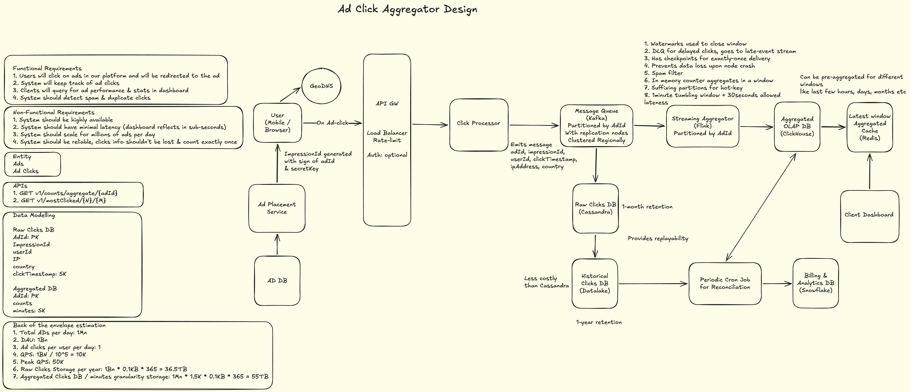

# Ad Click Aggregator — High Level Design

> **Target:** L4 roles at Google / Meta / Uber | 50–70 LPA
> **Difficulty:** High
> **Category:** Analytics & Data Systems

---

## Table of Contents

1. [Functional Requirements](#1-functional-requirements)
2. [Non-Functional Requirements](#2-non-functional-requirements)
3. [Back-of-Envelope Estimation](#3-back-of-envelope-estimation)
4. [High-Level Architecture](#4-high-level-architecture)
5. [Core Workflows](#5-core-workflows)
6. [Key Design Decisions](#6-key-design-decisions)
7. [Database Modelling](#7-database-modelling)
8. [Q&A — Interview Style](#8-qa--interview-style)
9. [Important Keywords](#9-important-keywords)
10. [Quick-Reference: NFRs to State Upfront](#10-quick-reference-nfrs-to-state-upfront)
11. [Concepts Checklist](#11-concepts-checklist)

---

## 1. Functional Requirements

### In Scope
- Track ad clicks from users across web and mobile clients
- Deduplicate clicks using impressionId — one impression = one click, regardless of spam
- Aggregate click counts in fixed windows: 1-minute, 1-hour, 1-day
- Expose aggregated click stats to advertiser dashboard (read path)
- Enforce prepaid budget in real-time — stop serving ads when budget is exhausted
- Support range queries over fixed windows (not sliding windows)
- Reconciliation pipeline to detect and correct aggregation drift

### Out of Scope
- Ad serving / placement (black box — system starts from click event arrival)
- Fraud detection (handled upstream; only clean clicks reach this system)
- Sliding window aggregations
- Click-through rate prediction or ML-based pricing
- Postpaid billing (prepaid CPC model only)

---

## 2. Non-Functional Requirements

| Requirement | Target |
|---|---|
| Availability | 99.99% (~1 hr downtime/year) |
| Write QPS (avg) | 10,000 clicks/sec |
| Write QPS (peak) | 50,000 clicks/sec (3–5× avg) |
| Aggregation lag | ≤ 3–5 seconds after 1-minute window closes |
| Dedup window | 24 hours (impressionId as dedup key) |
| Dashboard consistency | Eventually consistent |
| Billing consistency | Strong — within 0.01% tolerance |
| Raw click retention | 1 month (Cassandra) → 1 year (Datalake) |
| Aggregated data retention | Minute-level: 1 hr | Hourly: 24 hrs | Daily: 7 days |

### Key Consistency Decisions
- **Dashboard reads:** eventually consistent — stale by up to one window (≤ 65 seconds). Acceptable.
- **Budget enforcement:** strongly consistent — Redis counter is the enforcement gate, not ClickHouse.
- **Billing reconciliation:** runs hourly and daily against Datalake as source of truth.

---

## 3. Back-of-Envelope Estimation

### Given
- 1 billion ad clicks per day
- 100 million active ads
- Click event payload: ~200 bytes (adId, impressionId, userId, ipAddress, country, clickTimestamp)
- Response payload: ~100 bytes
- Dedup key: impressionId — 10 bytes per key, 24-hour TTL

### Write QPS
```
Avg QPS  = 1B / 100K seconds = 10,000 clicks/sec
Peak QPS = 10K × 5           = 50,000 clicks/sec
```

### Bandwidth
```
Ingress (avg)  = 200 bytes × 10K  = 2 MB/s
Ingress (peak) = 200 bytes × 50K  = 10 MB/s
Egress (avg)   = 100 bytes × 10K  = 1 MB/s
Egress (peak)  = 100 bytes × 50K  = 5 MB/s
```

### Storage — Raw Clicks
```
1 month = 200 bytes × 1B clicks/day × 30 days = 6 TB
```

### Storage — Dedup Store (Redis)
```
1B clicks/day × 10 bytes/key = 10 GB  → comfortably fits in Redis
```

### Storage — Aggregated Data
```
Per window entry: ~200 bytes (adId, window_start, click_count, ver)
Entries per window = 100M active ads

Minute-level (last 1 hr):  100M × 200B × 60  = 1.2 TB  → too large for in-memory
Hourly (last 24 hrs):      100M × 200B × 24  = 480 GB
Daily (last 7 days):       100M × 200B × 7   = 140 GB

Practical note: Not all 100M ads receive clicks in every window.
Active-window density is ~10% → effective storage 10× lower.
Minute-level: ~120 GB | Hourly: ~48 GB | Daily: ~14 GB
```

---

## 4. High-Level Architecture



### Component Legend

| Component | Technology | Reason |
|---|---|---|
| Load Balancer + Rate Limiter | L7 LB (e.g. Nginx/Envoy) | Absorb peak 50K QPS; protect Click Processor from spam bursts |
| GeoDNS | AWS Route53 / Cloudflare | Route users to nearest regional cluster; reduces latency |
| Click Processor | Stateless API service | Validates impressionId, checks Redis dedup, emits to Kafka |
| Redis (dedup) | Redis Cluster (quorum=3) | Exact membership check for impressionId; 10GB, 24hr TTL |
| Kafka | Apache Kafka, partitioned by adId | Durable event bus; decouples ingest from processing; replayable |
| Flink | Apache Flink | Stateful streaming aggregation; watermarks; exactly-once via checkpoints |
| Cassandra | Apache Cassandra | Write-heavy raw click store; wide-column; time-series access pattern |
| ClickHouse | ClickHouse (ReplacingMergeTree) | OLAP; columnar; fast aggregation reads; idempotent writes via MergeTree |
| Redis (cache + budget) | Redis Cluster | Hot window cache for dashboard; budget counter for billing enforcement |
| Datalake | S3 / GCS + Parquet | Source of truth for reconciliation; 1-year retention; low cost |
| Snowflake | Snowflake | Billing records + long-horizon analytics; SQL-native |
| Reconciliation Cron | Scheduled batch job | Detects drift between Datalake and ClickHouse; corrects Redis + Snowflake |

---

## 5. Core Workflows

### 5.1 Click Ingest Path (Write Path)

```
1. User clicks ad → browser fires GET /click?impressionId=X&adId=Y to nearest region via GeoDNS
2. Load Balancer rate-limits by IP; forwards to Click Processor
3. Click Processor validates impressionId signature (signed by Ad Placement Service with adId + secretKey)
4. Redis SET NX on impressionId with 24hr TTL
   → Key exists: duplicate. Drop silently. Return 200 (idempotent response).
   → Key absent: proceed.
5. Click Processor emits event to Kafka topic `ad-clicks`
   Payload: { adId, impressionId, userId, clickTimestamp, ipAddress, country }
   Partition key: adId
6. Two independent Kafka consumer groups consume in parallel:
   → Consumer A: Raw Click Writer → writes to Cassandra
   → Consumer B: Flink Aggregator
```

**Why Kafka between Processor and storage?**
Decouples spiky ingest (50K peak QPS) from downstream consumers. Kafka absorbs bursts; Cassandra and Flink consume at their own pace. Also provides replayability — critical for reconciliation and crash recovery.

### 5.2 Streaming Aggregation Path (Flink)

```
1. Flink consumes from Kafka `ad-clicks` topic, partitioned by adId
   → Each Flink task slot owns one partition — no cross-partition shuffle needed
2. Flink applies 1-minute tumbling window with 30-second allowed lateness
   → Watermark closes the window at: window_end + 30 seconds
3. Within each window, Flink maintains an in-memory counter per adId
4. DAG pipeline inside Flink:
   [Kafka Source] → [Spam Filter] → [Custom Business Filters] → [Aggregator] → [Sink]
5. On window close, Flink emits aggregate: { adId, window_start, click_count, ver=processing_ts }
6. Flink writes to ClickHouse via ReplacingMergeTree (idempotent on adId + window_start)
7. Flink also updates Redis cache with latest window aggregate for hot adIds
8. Flink checkpoints to durable storage (S3) every 30 seconds
   → On crash/restart: resume from last checkpoint with exactly-once guarantee
```

**Late arrival policy:** Clicks arriving after the 30-second lateness window are counted in the next 1-minute window. Dashboard is eventually consistent; billing reconciliation corrects any window-attribution drift at the daily level.

**Flink checkpoint vs max.poll.interval.ms:** For long-running aggregation windows, Kafka's `max.poll.interval.ms` can expire before Flink commits the offset. Mitigation: set `max.poll.interval.ms` generously (e.g. 5 minutes), or use a cron-based retry job for windows that fail to commit.

### 5.3 Dashboard Read Path

```
1. Client Dashboard queries aggregated click counts for adId + time range
2. API checks Redis cache for latest window data (hot adIds pre-warmed)
   → Cache hit: return immediately
   → Cache miss: query ClickHouse with FINAL modifier
3. ClickHouse query:
   SELECT adId, sum(click_count)
   FROM ad_aggregates FINAL
   WHERE adId = ? AND window_start >= ? AND window_start < ?
   GROUP BY adId
4. Result returned to dashboard (eventually consistent — stale by at most one window)
```

### 5.4 Prepaid Budget Enforcement Path

```
1. Advertiser recharges → budget converted to click count:
   available_clicks = budget_amount / cost_per_click
   Stored in Redis: KEY=budget:{adId}, VALUE=available_clicks
   Also stored in Ads DB as source of truth for reconstruction

2. On every verified click (after Redis dedup passes):
   Redis DECR budget:{adId}
   → If result >= 0: click is within budget, proceed
   → If result < 0: budget exhausted
     → Fire event to Ad Placement Service: stop generating impressions for adId
     → Ad Placement Service double-checks budget:{adId} on every impression fanout

3. DynamoDB outbox table checkpointed every few seconds:
   { adId, remaining_clicks, checkpoint_ts }
   → Used for fast Redis reconstruction on crash (avoids full Kafka replay)

4. On Redis crash:
   → Quorum (3 nodes) prevents single-node failure
   → Load latest checkpoint from DynamoDB outbox
   → Replay Kafka clicks since checkpoint_ts to get exact remaining_clicks
   → Reconstruct Redis counter — bounded to seconds of drift
   → Ad serving continues during reconstruction (overspend accepted within 0.01% SLA)
```

### 5.5 Reconciliation Path

```
1. Cron job runs hourly and daily
2. For each (adId, time_window):
   expected = Datalake raw click count  (source of truth)
   actual   = ClickHouse aggregate + DLQ discard count
   delta    = expected - actual
3. If delta != 0:
   → Adjust remaining_clicks in Redis by delta for affected adIds
   → Update billing record in Snowflake with corrected click count
   → Log discrepancy for audit trail
4. Cassandra → Datalake archival:
   Nightly job moves raw clicks older than 1 month from Cassandra to Datalake (S3/Parquet)
   Datalake retains 1 year
```

---

## 6. Key Design Decisions

### 6.1 Dedup Key: impressionId vs (userId + adId)

| Option | Pros | Cons |
|---|---|---|
| impressionId (chosen) | Generated once per impression by Ad Placement Service; exact dedup with no false positives; simple Redis SET NX | Relies on Ad Placement Service to guarantee uniqueness |
| (userId + adId) hash | No dependency on upstream | Same user seeing the same ad twice (different sessions) would be incorrectly deduped |

**Verdict:** impressionId. The Ad Placement Service already owns impression lifecycle — it's the natural source of the dedup key. The (userId + adId) approach conflates dedup with fraud detection, which is explicitly out of scope.

---

### 6.2 Partition Key: adId vs random

| Option | Pros | Cons |
|---|---|---|
| adId (base) | Ordering within adId; Flink task affinity; no shuffle | Hot partitions for viral/large-brand ads |
| Random | Perfect distribution | Loses ordering; Flink must shuffle across partitions to aggregate |
| Salted adId (chosen) | Hot adId spread across N partitions; merge N partial aggregates in Flink | Slightly more complex merge logic |

**Verdict:** Salted adId for detected hotkeys. Base adId for normal-volume ads. Hotkeys detected dynamically from the last-minute Redis/ClickHouse aggregate — top X% by click volume get salt applied automatically.

---

### 6.3 Aggregated Storage: ClickHouse vs Cassandra vs DynamoDB

| Property | ClickHouse | Cassandra | DynamoDB |
|---|---|---|---|
| Columnar reads | ✅ Excellent | ❌ Row-oriented | ❌ Row-oriented |
| Aggregation queries | ✅ Native SUM/COUNT/GROUP BY | ❌ Manual | ❌ Manual |
| Write throughput | ✅ High (append) | ✅ Very high | ✅ High |
| Idempotent writes | ✅ ReplacingMergeTree | ❌ Manual dedup | ⚠️ Conditional writes |
| Time-range scans | ✅ Efficient with ORDER BY | ✅ With sort key | ⚠️ Requires GSI |
| Cost at 182 GB | ✅ Low | ⚠️ Medium | ⚠️ Can be expensive |

**Verdict:** ClickHouse. It is the only option where GROUP BY adId over a time range is native, cheap, and fast. ReplacingMergeTree gives idempotent writes out of the box. Cassandra is the right choice for the raw click store (write-heavy, time-series), but wrong for aggregation reads.

---

### 6.4 Window Type: Tumbling vs Sliding

| Property | Tumbling (chosen) | Sliding |
|---|---|---|
| Complexity | Low — one window per period | High — each event belongs to multiple windows |
| State size | O(adIds × windows) | O(adIds × windows × slide_factor) |
| Use case | Fixed period reporting (1 min, 1 hr, 1 day) | Moving averages, real-time trend detection |
| Latency | ≤ window_size + watermark_lateness | Same but more frequent outputs |

**Verdict:** Tumbling windows. Business requirement explicitly stated fixed windows only. Sliding windows are dramatically more expensive in Flink state and ClickHouse storage.

---

## 7. Database Modelling

### 7.1 Dedup Store — Redis

**Why Redis for this entity?**
Dedup requires a sub-millisecond existence check on every click in the hot ingest path. Redis SET NX is O(1) and returns atomically — no read-then-write race. Cassandra or DynamoDB would add 5–10ms latency here, unacceptable at 50K peak QPS.

**Schema**
```
KEY:   impressionId  (string, ~36 bytes UUID)
VALUE: 1             (presence flag)
TTL:   86400 seconds (24 hours)
```

**Access Patterns**
- Write: SET NX impressionId 1 EX 86400 → on every click, 50K/sec peak
- Read: implicit in SET NX (atomic check-and-set)

**Sizing**
```
1B clicks/day × 10 bytes/key = 10 GB
Redis Cluster with 3 nodes (quorum) → ~4 GB per node including replication overhead
```

**Consistency:** Strong — SET NX is atomic within a Redis node. Cross-node consistency via quorum.

---

### 7.2 Raw Clicks — Cassandra

**Why Cassandra for this entity?**
Raw clicks are write-heavy (10K avg / 50K peak QPS), time-series in nature, and accessed primarily by time range per adId. Cassandra's wide-column model maps directly: partition by adId, sort by clickTimestamp. Write throughput is the primary axis — Cassandra is purpose-built for this.

**Schema**
```
Table: raw_clicks
PK:    adId          (partition key)
SK:    clickTimestamp (sort key, DESC)
Fields:
  impressionId  UUID
  userId        String
  ipAddress     String
  country       String
  clickTimestamp Timestamp
  ttl           30 days
```

**Access Patterns**
- Write: INSERT per click → 10K–50K/sec
- Read: SELECT WHERE adId = ? AND clickTimestamp > ? (reconciliation queries, audit)
- Archival: nightly job reads all rows older than 30 days → moves to Datalake

**Partition Key:** adId — distributes writes across nodes by ad. Hotspot risk for viral adIds — mitigated by Cassandra's consistent hashing and virtual nodes (vnodes). Very high-volume adIds can be sub-partitioned with a date bucket: `adId#YYYY-MM-DD`.

**Sort Key:** clickTimestamp DESC — enables efficient time-range reads without full partition scan.

**Consistency level:** QUORUM on writes (at-least-once delivery), LOCAL_ONE on reads (archival jobs can tolerate stale).

**Scaling:** 6 TB/month → Cassandra cluster sized for 2× headroom = 12 TB usable. TTL auto-expires rows at 30 days.

---

### 7.3 Aggregated Counts — ClickHouse

**Why ClickHouse for this entity?**
Aggregated counts are read by dashboard queries that GROUP BY adId over time ranges. Columnar storage makes these scans 10–100× faster than row-oriented stores. ReplacingMergeTree provides idempotent writes natively — Flink retries don't cause double-counting without any application-level dedup logic.

**Schema**
```
Table: ad_aggregates
Engine: ReplacingMergeTree(ver)
ORDER BY: (adId, window_start)

Fields:
  adId          String
  window_start  DateTime
  window_type   Enum('minute', 'hour', 'day')
  click_count   UInt64
  ver           UInt64    -- Flink processing timestamp (monotonic version)
```

**Access Patterns**
- Write: Flink emits one row per (adId, window) on window close → idempotent on retry via ReplacingMergeTree
- Read: SELECT adId, sum(click_count) FROM ad_aggregates FINAL WHERE adId = ? AND window_start BETWEEN ? AND ? GROUP BY adId

**Dedup Mechanism:** `ReplacingMergeTree(ver)` keeps the row with the highest `ver` for each `(adId, window_start)` key during background merges. `FINAL` modifier forces dedup at read time — mandatory for correctness-sensitive dashboard queries.

**Partitioning:** ClickHouse partitions by `toYYYYMM(window_start)` — keeps each month's data in its own part for efficient range pruning and TTL expiry.

**Consistency:** Eventual at write time (async merge). Strong at read time with `FINAL`. Dashboard SLA accepts eventual consistency.

**Scaling:** ~182 GB effective (10% active-window density). Grows linearly with active ad count.

---

### 7.4 Budget Counter — Redis

**Why Redis for this entity?**
Budget enforcement requires an atomic DECR operation on every verified click in the hot path. The operation must be sub-millisecond and race-condition-free. Redis DECR is atomic at the single-key level — no distributed lock needed. No other store provides this combination of throughput and atomicity.

**Schema**
```
KEY:   budget:{adId}    (string)
VALUE: remaining_clicks (integer, decremented per click)
TTL:   until campaign end or manual expiry
```

**Access Patterns**
- Write: DECR budget:{adId} → on every verified click, 50K/sec peak
- Read: GET budget:{adId} → Ad Placement Service check on every impression fanout
- Reconstruct: SET budget:{adId} remaining_clicks → on Redis restart from DynamoDB checkpoint

**Recovery:** DynamoDB outbox table `(adId, remaining_clicks, checkpoint_ts)` checkpointed every few seconds. On crash: load checkpoint → replay Kafka clicks since checkpoint_ts → reconstruct exact counter. Bounds drift to seconds.

**Consistency:** Strong within Redis node. Quorum (3 nodes) prevents split-brain.

---

### 7.5 Datalake — S3 / Parquet

**Why Datalake for this entity?**
Long-horizon retention (1 year) at lowest cost. Parquet columnar format enables efficient reconciliation queries (SELECT count WHERE adId = ? AND date = ?) without scanning every row. S3 is infinitely scalable — no capacity planning needed.

**Schema**
```
Partitioned by: year= / month= / day= / adId_prefix=
Format: Parquet, Snappy compression
Fields: same as raw_clicks (adId, impressionId, userId, clickTimestamp, ipAddress, country)
```

**Access Patterns**
- Write: nightly Cassandra → Datalake archival job
- Read: reconciliation cron queries by (adId, date) partition → partition pruning avoids full scan

**Consistency:** Eventual — archival runs nightly. Reconciliation queries run after archival is confirmed complete.

---

## 8. Q&A — Interview Style

---

### Q1 — Deduplication: how does the system prevent a user from counting the same click multiple times?

**Answer:**

The dedup key is the `impressionId`. The Ad Placement Service generates one `impressionId` per (user, ad) impression — even if the user clicks the same ad multiple times, the same `impressionId` is reused. Dedup therefore reduces to: have we seen this `impressionId` before?

The Click Processor performs a `SET NX` (set if not exists) on the `impressionId` in Redis with a 24-hour TTL. If the key exists → duplicate, drop silently, return 200 (idempotent response). If absent → new click, proceed to Kafka.

**Why Redis over a Bloom filter?** Bloom filters have false positives — they may flag a legitimate new `impressionId` as already seen, silently dropping a real click. Redis SET NX gives exact membership with zero false positives at the cost of slightly more memory (10 GB for 1B clicks/day — well within a standard Redis cluster).

**Why 24-hour dedup window?** Matches the billing cycle. A click from yesterday should never cancel a click today. At 1B clicks/day × 10 bytes/key = 10 GB — comfortably within Redis.

---

### Q2 — Billing enforcement: how does the bidding engine know in real-time that an advertiser's budget is exhausted?

**Answer:**

Prepaid CPC model. At recharge time, budget is converted to click count: `available_clicks = budget / cost_per_click`. This counter is stored in Redis keyed by `budget:{adId}`.

Every verified click atomically decrements the counter via Redis `DECR`. When it hits zero:
1. An event is fired to Ad Placement Service to stop generating impressions for that `adId`.
2. Ad Placement Service double-checks `budget:{adId}` on every impression fanout as a safety gate — prevents serving during any replication lag window.

ClickHouse aggregates are for **dashboard reporting only**. Redis is the **enforcement gate**. These are intentionally separate read paths.

**Follow-up — Redis crash recovery:**

Three layers: (1) Redis quorum (3 nodes) prevents single-node loss. (2) DynamoDB outbox table checkpointed every few seconds with `(adId, remaining_clicks, checkpoint_ts)` — on restart, load latest checkpoint and reconstruct counter within seconds. (3) Full Kafka replay from billing start timestamp as final fallback for complete reconstruction.

**Follow-up — overspend during outage:**

Ad serving is not blocked — blocking penalises the advertiser for our failure. Overspend during the window is accepted within the 0.01% SLA. After recovery, replay Kafka clicks from the exact outage window, compute overspend delta per `adId`, deduct from remaining budget. Exact Kafka replay is preferred over estimated avg-rate × downtime because it produces a precise count — critical for high-CPC advertisers with bursty traffic.

---

### Q3 — Late-arriving clicks: what happens when a click arrives after the Flink watermark + 30s lateness window has expired?

**Answer:**

Count the late-arriving click in the **next 1-minute window**.

**Why not discard?** Discarding reduces total click count, which undercounts billing — unfair to the platform and potentially inaccurate for advertisers. It also requires a DLQ + separate reconciliation path, adding operational overhead.

**Why not reopen the window?** Stateful window recovery in Flink is expensive and operationally complex. It also invalidates already-written ClickHouse rows for that window, requiring a re-write with a new `ver`.

**Why next window works here:** Dashboard counts are eventually consistent by design. Billing reconciliation operates at daily granularity and catches window-attribution drift via the Datalake comparison. A click counted in the wrong minute does not affect total daily budget consumption.

---

### Q4 — ClickHouse idempotency: Flink retries a write for the same (adId, window). How does ClickHouse not double-count?

**Answer:**

ClickHouse uses the `ReplacingMergeTree` engine with a `ver` column set to the Flink processing timestamp.

```sql
CREATE TABLE ad_aggregates (
    adId         String,
    window_start DateTime,
    click_count  UInt64,
    ver          UInt64   -- Flink processing timestamp
)
ENGINE = ReplacingMergeTree(ver)
ORDER BY (adId, window_start);
```

When Flink retries and writes the same `(adId, window_start)` twice, ClickHouse accepts both rows. During background merges, it keeps only the row with the highest `ver`. The latest Flink write always wins.

**The critical gotcha:** Dedup is asynchronous — duplicates may coexist between merges. Dashboard reads must use the `FINAL` modifier to force dedup at query time:

```sql
SELECT adId, sum(click_count)
FROM ad_aggregates FINAL
WHERE window_start >= now() - INTERVAL 1 HOUR
GROUP BY adId;
```

Without `FINAL`: fast but may return transiently inflated counts.
With `FINAL`: correct counts, slight read overhead — mandatory for dashboard correctness.

**The three MergeTree variants:**

| Engine | Use case |
|---|---|
| ReplacingMergeTree | Dedup by key — keep latest version |
| CollapsingMergeTree | Mutable state via +1/-1 sign rows |
| AggregatingMergeTree | Pre-aggregation natively in ClickHouse |

---

### Q5 — Hot partitions: adId partitioning at 50K peak QPS. Which ads cause hotspots and how do you mitigate?

**Answer:**

High-volume advertisers (large brands, viral campaigns) generate disproportionate click volume — their `adId` becomes a hot Kafka partition, overloading the consumer and the downstream Flink task for that key.

**Detection (dynamic, closed-loop):** Use the last-minute aggregated window already cached in Redis/ClickHouse to identify `adId`s in the top X% of click volume. The system detects its own hotkeys automatically — no manual list, no pre-configuration.

**Mitigation — salted partitioning:**
1. On write to Kafka: append random salt suffix to hot `adId` partition key → `adId_0`, `adId_1`, ..., `adId_N`. Traffic spreads across N partitions.
2. Flink tasks are keyed on the salted value — each task slot handles one salted partition, maintaining parallelism.
3. After per-partition aggregation, Flink strips the salt and sums all N partial counts → emits one final `(adId, window)` aggregate to ClickHouse.

Salt factor N should scale with the hotkey's click rate relative to average partition load. A 10× hotkey → N = 10.

---

### Q6 — Reconciliation: what discrepancy does the cron job look for and what is the remediation?

**Answer:**

The cron job compares Datalake raw click count (source of truth, 1-year retention) against ClickHouse aggregated count + DLQ discard count for the same `(adId, time_window)`.

**What a discrepancy means:** Clicks were lost in the Flink aggregation path — dropped due to processing exceptions, miscounted window boundaries, or DLQ routing failures. Flink checkpoints cover exactly-once on restart. Kafka retention (7 days) covers consumer lag. The cron job catches residual edge cases neither mechanism covers.

**Remediation:**
1. Compute: `delta = datalake_count - (clickhouse_count + dlq_count)` per `(adId, window)`
2. Adjust `remaining_clicks` in Redis for affected `adId`s by the delta
3. Update billing record in Snowflake with corrected click count
4. Log discrepancy for audit trail

**Cadence:** Hourly to catch short-term drift. Daily to catch accumulated skew across the full billing cycle.

---

## 9. Important Keywords

### Ingest & Dedup
- **impressionId** | Unique identifier generated by Ad Placement Service per (user, ad) impression. The system's natural idempotency key — one impression, one click, regardless of spam. Stored in Redis with 24hr TTL for dedup.
- **SET NX** | Redis atomic "set if not exists" operation. Exact membership check with zero false positives. The dedup gate in the Click Processor.
- **Bloom Filter** | Probabilistic data structure with false positives but no false negatives. Considered but rejected as dedup mechanism — a false positive silently drops a real click.

### Streaming & Aggregation
- **Tumbling Window** | Non-overlapping fixed-size time windows (1 min, 1 hr, 1 day). Each event belongs to exactly one window. Simpler state and lower storage than sliding windows.
- **Watermark** | Flink mechanism to track event-time progress. Closes a window at `window_end + lateness_allowance` (30 seconds here). Handles out-of-order events from network delays.
- **Allowed Lateness** | Grace period (30 seconds) after watermark before a window is finalized. Events arriving within this window are still counted in the correct bucket.
- **Flink Checkpoint** | Periodic snapshot of Flink operator state to durable storage (S3). Enables exactly-once recovery on task restart — resuming from last checkpoint without reprocessing committed events.
- **DAG Aggregation** | Flink pipeline expressed as a Directed Acyclic Graph: source → spam filter → business filters → aggregator → sink. Enables composable, parallelizable processing stages.

### Storage
- **ReplacingMergeTree** | ClickHouse engine that deduplicates rows with the same ORDER BY key during background merges, keeping the row with the highest `ver` value. Solves Flink retry double-counting without application-level dedup.
- **FINAL** | ClickHouse query modifier that forces deduplication at read time, before merges complete. Mandatory for correctness-sensitive reads on a ReplacingMergeTree table.
- **ver column** | Monotonic version field (Flink processing timestamp) passed to ReplacingMergeTree. Determines which row wins when duplicates are merged — highest ver survives.
- **Wide-column store** | Cassandra's data model — rows can have variable columns, and data is sorted within partitions by sort key. Ideal for time-series data like raw click events.

### Billing & Enforcement
- **CPC (Cost Per Click)** | Billing model where advertisers pay per verified click. Budget expressed as click count = budget / CPC rate.
- **DECR (Redis)** | Atomic integer decrement. Used to track remaining_clicks per adId without race conditions. Returns the new value — if negative, budget is exhausted.
- **DynamoDB Outbox Checkpoint** | Periodic durable snapshot of `(adId, remaining_clicks, checkpoint_ts)` used to fast-reconstruct the Redis budget counter after a crash, without replaying the full Kafka log.
- **Prepaid enforcement** | Budget counter in Redis is the gate, not ClickHouse. Ad Placement Service checks Redis on every impression fanout. Enforcement is real-time; reporting is eventual.

### Reliability & Reconciliation
- **Kafka Replayability** | Kafka retains events for 7 days by default. On Redis crash, Kafka can be replayed from any timestamp to reconstruct exact click counts — used as the final recovery fallback.
- **Datalake as Source of Truth** | Raw clicks archived to S3/Parquet (1-year retention) are the authoritative record. Reconciliation cron always compares derived stores (ClickHouse, Snowflake) against the Datalake count.
- **Salted Partitioning** | Appending a random suffix (`adId_N`) to hot Kafka partition keys to distribute load. Partial aggregates are merged downstream after stripping the salt.
- **DLQ (Dead Letter Queue)** | Holds events that could not be processed (e.g. clicks that arrived after the watermark + lateness window). Counted in reconciliation to avoid treating them as missing clicks.

---

## 10. Quick-Reference: NFRs to State Upfront

```
System:             Ad Click Aggregator

Availability:       99.99% (~1 hr downtime/year)
Avg Write QPS:      10,000 clicks/sec
Peak Write QPS:     50,000 clicks/sec
Aggregation lag:    ≤ 3–5 seconds after 1-minute window closes
Dedup window:       24 hours (impressionId key, Redis, 10 GB)
Dashboard:          Eventually consistent (stale ≤ 1 window = ~65s)
Billing:            Strongly consistent — within 0.01% tolerance
Window types:       Fixed — 1 min, 1 hr, 1 day (no sliding windows)

Retention:
  Raw clicks        → 1 month (Cassandra) then 1 year (Datalake)
  Minute aggregates → 1 hour
  Hourly aggregates → 24 hours
  Daily aggregates  → 7 days

Scale:
  Active ads        → 100 million
  Storage (raw)     → 6 TB/month
  Storage (dedup)   → 10 GB (Redis)
  Storage (aggs)    → ~182 GB effective
```

---

## 11. Concepts Checklist

- [x] impressionId as natural idempotency key — one per (user, ad) from Ad Placement Service
- [x] Redis SET NX for exact dedup — zero false positives, 24hr TTL, 10 GB footprint
- [x] Kafka partitioned by adId — per-ad ordering, Flink task affinity, replayable
- [x] Tumbling window vs sliding window — fixed windows chosen, lower state and storage cost
- [x] Flink watermarks — close 1-minute windows with 30-second allowed lateness
- [x] Flink checkpoints — exactly-once recovery on restart, snapshotted to S3
- [x] Late-arrival policy — count in next window; billing reconciliation corrects drift
- [x] Hot partition detection — closed-loop via own Redis/ClickHouse last-minute aggregate
- [x] Salted partitioning — N salted keys on write, merge N partial aggregates in Flink
- [x] ClickHouse ReplacingMergeTree — async dedup on merge, `ver` column, `FINAL` on reads
- [x] CollapsingMergeTree — mutable state via +1/-1 sign rows (know the distinction)
- [x] AggregatingMergeTree — pre-aggregation natively in ClickHouse (know the distinction)
- [x] Two separate read paths — Redis for billing enforcement, ClickHouse for dashboard
- [x] Prepaid CPC enforcement — Redis DECR counter, fire event to Ad Placement at zero
- [x] Redis crash recovery — quorum (3 nodes) + DynamoDB outbox checkpoint + Kafka replay
- [x] DynamoDB outbox as fast checkpoint — bounds Redis reconstruction to seconds of drift
- [x] Kafka as recovery source of truth — exact event replay during outage window
- [x] Datalake as reconciliation source of truth — raw clicks, 1-year retention, Parquet
- [x] Reconciliation cron — Datalake vs ClickHouse + DLQ, adjust Redis + Snowflake on drift
- [x] Wide-column Cassandra for raw clicks — partition by adId, sort by clickTimestamp DESC
- [x] FINAL modifier in ClickHouse — mandatory for dedup correctness before background merges complete