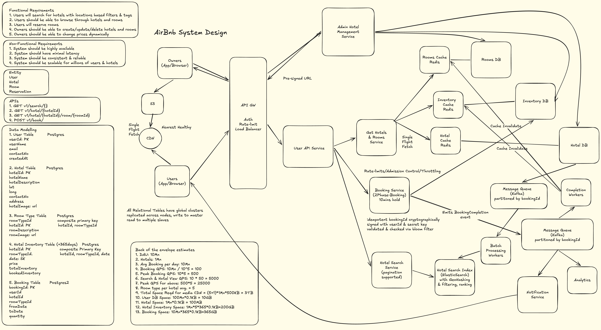

# Airbnb — System Design

**Session Score:** 8.6 / 10 · Strong L4 Pass  
**Target:** L4 at Google / Meta / Uber · 50–70 LPA

---

## Table of Contents

1. [Functional Requirements](#1-functional-requirements)
2. [Non-Functional Requirements](#2-non-functional-requirements)
3. [Back-of-Envelope Estimation](#3-back-of-envelope-estimation)
4. [High-Level Architecture](#4-high-level-architecture)
5. [Core Workflows](#5-core-workflows)
6. [Key Design Decisions](#6-key-design-decisions)
7. [Database Modelling](#7-database-modelling)
8. [Q&A — Interview Style](#8-qa--interview-style)
9. [Important Keywords](#important-keywords)
10. [Quick-Reference: NFRs to State Upfront](#quick-reference-nfrs-to-state-upfront)
11. [Concepts Checklist](#concepts-checklist)

---

## 1. Functional Requirements

### In Scope
- Hotel admins can create, update, and remove hotels, room types, and listings
- Admins set pricing per room type; guests cannot override price
- Admins upload photos for hotels and room types
- Users can search hotels by location, amenity, date range, and price range
- Users can view hotel and room type details
- Users can make a reservation (prepaid only, payment at booking time)
- Users can cancel a reservation (refund handled by Payment Gateway)
- Users can rate and review a hotel after checkout
- Search returns ranked, paginated results with availability filtering

### Out of Scope
- Payment processing internals — Payment Gateway is a blackbox
- Post-paid / pay-at-hotel bookings
- Host dynamic pricing algorithms (hosts set price, we store and serve it)
- Real-time chat between guests and hosts
- Multi-room or group bookings (single room type per booking)

---

## 2. Non-Functional Requirements

| Requirement | Target |
|---|---|
| Availability | 99.99% (~52 min downtime/yr) |
| Search latency | p90 < 1s · p99 < 2s |
| Booking correctness | No double bookings — zero tolerance |
| Booking durability | Bookings, listings, hotels must not be lost once created |
| Concurrent booking safety | Atomic, serialized writes on shared inventory |
| Scalability | Handle 500M users, 5M listings, 25K peak search QPS |
| Search consistency | Eventual — 3–5s lag for index updates is acceptable |
| Booking consistency | Strong — SELECT FOR UPDATE on inventory rows |
| Review consistency | Eventual — slight staleness on ratings/reviews acceptable |

### Key Consistency Decisions

- **Booking path:** Strong consistency required. Inventory reads and writes in the booking flow use the primary DB only — never a read replica. Correctness depends on exact counts.
- **Search index:** Eventually consistent via Kafka → Elasticsearch pipeline. Hotel metadata changes reflected within 3–5s.
- **Ratings/reviews:** Eventually consistent. DynamoDB counters updated asynchronously via Kafka workers. Redis review cache refreshed lazily.

---

## 3. Back-of-Envelope Estimation

### Given
- 500M registered users
- 5M active hotel listings
- 5 room types per hotel on average
- 30-day advance reservation window (inventory rows per hotel = 30 × 5 = 150 rows)
- DAU = 100M (20% of registered)
- 5 searches per user per day
- Search : booking ratio = 100:1
- Average booking stay = 3 days
- Peak factor = 5×
- Read : write = 10:1

### QPS

```
Average search QPS  = 100M × 5 / 100K seconds = 5K/s
Peak search QPS     = 5K × 5 = 25K/s

Average booking QPS = 25K / 100 = 250/s  (search:booking = 100:1)
Peak booking QPS    = 250 (already peak-factored via search)

Average review QPS  = 250 × 30% = 75/s
```

### Storage

```
User DB        = 500M × 200 bytes          = 100 GB
Hotel DB       = 5M × 200 bytes            = 1 GB
RoomType DB    = 5M × 5 × 200 bytes        = 5 GB
Inventory DB   = 5M × 5 × 30 × 200 bytes  = 150 GB
Booking DB     = 100M DAU × 5 searches/day / 100 (ratio) / 3 (avg days) × 200 bytes
               = ~33 GB/day = ~400 GB/year

S3 media       = 5M hotels × 5 room types × 5 photos × 500 KB = 62 TB
```

### Bandwidth

```
Peak request bandwidth  = (25K + 250 + 75) × 200 bytes ≈ 5 MB/s
Peak response bandwidth = 25K × 20 results × 200 bytes ≈ 100 MB/s
```

---

## 4. High-Level Architecture



### Component Legend

| Component | Technology | Reason |
|---|---|---|
| Geo DNS | Route53 / Cloudflare | Latency-based routing to nearest region |
| CDN | Cloudflare / CloudFront | Pull model for hotel photos from S3 |
| API Gateway | Kong / AWS ALB | JWT auth, rate limiting, load balancing |
| Admin Mgmt Service | Go / Node.js | Hotel/room CRUD, pre-signed S3 URL generation |
| Booking Service | Go / Java | Two-phase lock, state machine, expiry cleanup |
| Search Service | Stateless service | Elastic query → rank → hydrate pipeline |
| Engagement Service | Go | Ratings, reviews, Kafka event publisher |
| Hotel Cache | Redis | Hotel metadata; high TTL (changes infrequently) |
| RoomType Cache | Redis | Room type details; high TTL |
| Inventory Cache | Redis | Available counts per roomTypeId+date; low TTL |
| Elasticsearch | Elasticsearch 8.x | Full-text + geospatial search; returns IDs only |
| Hotel Kafka | Apache Kafka | Hotel/room update events → Elastic index workers |
| Booking Kafka | Apache Kafka | Post-booking async events (payment, notification) |
| Engagement Kafka | Apache Kafka | Rating/review events partitioned by hotelId |
| S3 | AWS S3 | 62 TB photo storage; accessed via pre-signed URLs |
| Payment GW | Stripe / Razorpay | Blackbox prepaid payment and refund processor |

---

## 5. Core Workflows

### 5.1 Admin Listing Flow

1. Admin sends hotel metadata (name, lat/lon, amenities, tags) via `POST /admin/hotels` through API GW (admin JWT)
2. Admin Mgmt Service validates and writes to Hotel Table (Postgres) in a single transaction
3. Hotel Cache and RoomType Cache invalidated synchronously post-write
4. Hotel update event published to Hotel Kafka, partitioned by `hotelId`
5. Index Workers consume the event and upsert the hotel document into Elasticsearch — search reflects update within 3–5s (eventual consistency acceptable for metadata)
6. For photo uploads: Admin Mgmt Service generates a **pre-signed S3 URL** scoped to the exact key (`hotels/{hotelId}/rooms/{roomTypeId}/{filename}`), expiry 15 minutes. Client uploads directly to S3 — bypasses application server entirely
7. CDN pulls from S3 on first user request (pull model) and caches at edge PoP

> **Why pre-signed URLs?** Avoids routing large binary uploads through the application server. Each URL is scoped to a single S3 key — no broader access granted. Client has 15 minutes to upload; URL expires and cannot be reused.

---

### 5.2 Search Flow

1. User submits query (text, location, date range, price range, amenities) via API GW
2. API GW validates JWT, checks rate limit (`Redis INCR per userId+IP`), routes to Search Service
3. Search Service builds a compound Elasticsearch query:
    - `multi_match` on `name^3`, `description`, `tags^2` (BM25 scoring)
    - `geo_distance` filter within user-specified radius
    - `term` filter: `is_available: true`
    - `range` filter on `price_min` / `price_max`
4. Elasticsearch returns ranked document IDs + match scores
5. Search Service re-ranks by combined signal: `0.4 × matchScore + 0.3 × geoScore + 0.2 × ratingScore + 0.1 × availabilityScore`
6. Results paginated (cursor-based) and hydrated in parallel from:
    - **Hotel Cache** → hotel name, location, amenities (cache-aside; TTL=24h)
    - **RoomType Cache** → room details (TTL=12h)
    - **Inventory Cache** `key=roomTypeId+date` → availability boolean (TTL=5min)
7. Assembled response (~20 results × 200 bytes ≈ 4 KB) returned to client

> **Cache miss strategy:** Cache-aside on all three caches. On miss → fetch from Postgres → populate cache → return. DB is always source of truth; Redis failure degrades performance, not correctness.

---

### 5.3 Booking Flow

1. User selects room type and dates → Booking Service generates an **idempotent bookingId** (UUID, server-generated before any DB write)
2. Transaction begins:
   ```sql
   SELECT * FROM inventory
     WHERE room_type_id = $1
       AND date BETWEEN $2 AND $3
     ORDER BY date ASC   -- deterministic lock order, prevents deadlock
     FOR UPDATE;         -- pessimistic row-level lock
   ```
3. Inside transaction: verify `available_count > 0` for all dates → decrement each row → insert booking row with `status=LOCKED`, `lockId=UUID`, `lockUntil=now+10min` → COMMIT
4. Inventory Cache invalidated synchronously
5. User completes payment via Payment GW (client-side redirect). Booking Service transitions state: `LOCKED → PAYMENT_INITIATED → PAYMENT_COMPLETED → BOOKING_CONFIRMED`
6. On lock expiry (lockUntil exceeded before payment): either lazy cleanup (on read) or cron every 60s reclaims the lock — both use state-check-inside-lock pattern to prevent double inventory increment (see Q2)
7. `onBookingConfirmed` event fired to Booking Kafka (async) for downstream: Payment GW charge confirmation, Notification Service, Engagement eligibility tracking

> **Why pessimistic lock over optimistic?** Lock is held for milliseconds only (not the entire payment flow). Under peak contention for popular listings, optimistic locking causes high retry storms. Short pessimistic lock + virtual waiting room for viral listings is the right combination.

---

### 5.4 Cancellation Flow

1. User hits cancel → Booking Service validates booking belongs to user and status is `BOOKING_CONFIRMED`
2. Single atomic transaction:
    - Increment `available_inventory_count` for each booked date (SELECT FOR UPDATE on inventory rows)
    - Update booking status to `REFUND_INITIATED`
    - Write refund event to `outbox` table (same transaction — **transactional outbox pattern**)
    - COMMIT
3. Inventory Cache invalidated synchronously
4. Background outbox poller reads unpublished outbox rows and publishes to Booking Kafka
5. Payment GW consumer retries refund with exponential backoff (`1s → 2s → 4s → 8s → …`)
6. After max retries → message lands in DLQ for manual intervention
7. On successful refund: booking transitions to `REFUND_COMPLETED`

> **Why outbox pattern?** If Kafka is down at cancellation time, a direct publish would lose the refund event even though inventory was already restored. The outbox table persists the intent to publish in the same DB transaction — the event is guaranteed to eventually be published.

> **Key insight:** Inventory is restored synchronously in step 2 — availability becomes visible to new bookers immediately, independent of the payment refund timeline.

---

### 5.5 Ratings & Reviews Flow

1. User submits rating after checkout → Engagement Service validates:
    - User has a `BOOKING_CONFIRMED` record for this hotelId with `bookedTo < now`
    - User has not already reviewed this hotel (dedup check)
2. Event published to Engagement Kafka, **partitioned by hotelId** — ensures all events for the same hotel are processed sequentially by the same worker
3. Rating Worker:
    - Checks dedup table (`PK: eventId`, TTL: 7 days) — if already processed, skip
    - Increments `totalRating` and `ratingCount` in DynamoDB atomically
4. Review Worker: appends review document to DynamoDB (`PK=hotelId`, `SK=createdAt#reviewId`)
5. Redis review cache (`reviews:{hotelId}:top10`, `rating:{hotelId}`) updated lazily on miss or via periodic background sync (every 5 min for popular hotels)

> **Why store totalRating + ratingCount instead of running average?** Running average requires read-modify-write. Sum+count allows pure incremental writes — no read needed. Average is computed on read: `totalRating / ratingCount`.

---

## 6. Key Design Decisions

### 6.1 Pessimistic vs Optimistic Locking for Booking

| Property | Pessimistic (SELECT FOR UPDATE) | Optimistic (version + CAS) |
|---|---|---|
| Contention behavior | Serialize at DB row lock | Retry on conflict |
| Lock duration | Milliseconds (one transaction) | None — but retries on conflict |
| Throughput under high contention | Degrades predictably | Degrades exponentially (retry storms) |
| Risk of lost update | None | None if implemented correctly |
| DB support | Native Postgres | Requires version field + conditional update |
| Best for | Moderate-to-high contention, short critical section | Low contention, long think-time workflows |
| **Verdict** | ✅ **Chosen** | ❌ Rejected for booking path |

**Verdict:** Lock is held for milliseconds only. Under peak contention (popular listing), pessimistic lock serializes cleanly. Optimistic lock would cause retry storms at 250 peak booking QPS hitting the same inventory row.

---

### 6.2 SAGA vs Single DB Transaction for Inventory + Booking Write

| Property | SAGA | Single Transaction |
|---|---|---|
| When to use | Multiple services, multiple DBs | Same DB, multiple tables |
| Rollback mechanism | Compensating transactions | Postgres native rollback |
| Complexity | High — need compensating actions for each step | Low — BEGIN / COMMIT |
| Consistency guarantee | Eventual (between services) | Atomic (within DB) |
| Applicable here? | ❌ Inventory and Booking are in same Postgres DB | ✅ |
| **Verdict** | ❌ Over-engineered for this case | ✅ **Chosen** |

**Verdict:** Inventory Table and Booking Table share the same Postgres instance. A single `BEGIN / COMMIT` transaction atomically decrements inventory and creates the booking row. SAGA is the right pattern for cross-service flows (booking + payment + notification) — not for within-DB writes.

---

### 6.3 Elasticsearch Update Strategy for Availability

| Property | Update on every booking | Zero-crossing threshold events |
|---|---|---|
| Write frequency to Elastic | 250 writes/sec (every booking) | ~12 writes/sec (~5% of bookings cross zero) |
| Staleness risk | None | Elastic shows stale availability between zero-crossings |
| Complexity | Simple | Requires zero-crossing detection in Booking Service |
| Search accuracy | Exact | Correct for fully-booked filter; fine-grained count from cache |
| **Verdict** | ❌ Unnecessary write amplification | ✅ **Chosen** |

**Verdict:** Search only needs to know if a listing is **available or not** for the `is_available` filter. Exact counts are hydrated from Inventory Cache at display time. Only boundary-crossing events (0↔1) need to propagate to Elastic.

---

### 6.4 Virtual Waiting Room for Viral Listings

| Property | No admission control | FIFO virtual waiting room |
|---|---|---|
| Concurrency behavior | All requests hit DB simultaneously | Requests serialized before DB |
| Lock contention | High — connection pool exhaustion | None — orderly sequential writes |
| DB load under spike | Unbounded | Bounded — one booking at a time per room |
| User experience | Random failures / timeouts | Predictable queue position |
| Implementation complexity | None | Redis sorted set + position token |
| **Verdict** | ❌ Fails under viral load | ✅ **Chosen for high-demand listings** |

**Verdict:** For listings with booking QPS > 100/s (detected via Redis sliding window), engage virtual waiting room. Users get queue position tokens with 5-minute TTL. Booking Service processes FIFO. DB sees zero lock contention.

---

## 7. Database Modelling

### 7.1 User Table — PostgreSQL

**Why Postgres?**  
Users are queried by `userId` (auth, booking validation) and by `email` (login). These are simple point lookups that map naturally to a B-tree primary key. No complex fan-out or high-write-rate patterns — relational DB is sufficient and gives us ACID guarantees.

**Schema**

| Field | Type | Size |
|---|---|---|
| userId | UUID (PK) | 16 bytes |
| userName | VARCHAR(100) | ~50 bytes |
| email | VARCHAR(255) | ~50 bytes |
| contact | VARCHAR(20) | ~15 bytes |
| createdAt | TIMESTAMP | 8 bytes |
| **Total** | | ~200 bytes/row |

**Access Patterns**
- Read: `SELECT * WHERE userId = ?` → PK lookup (auth, booking owner validation)
- Read: `SELECT * WHERE email = ?` → unique index on email (login)
- Write: `INSERT` on signup · `UPDATE` on profile change (low frequency)

**PK:** `userId` — distributes users evenly. UUID ensures no sequential hotspot (vs auto-increment).

**Sharding:** Single region — 100 GB total, fits comfortably on one Postgres instance with read replicas. No sharding needed at this scale.

**Consistency:** Strong consistency on auth path (always hit primary). Read replicas acceptable for profile display pages.

**Scale:** 500M rows × 200 bytes = 100 GB. Read RPS ~25K (proportional to search QPS for session validation). Write RPS ~low (signups + profile updates).

---

### 7.2 Hotel Table — PostgreSQL

**Why Postgres?**  
Hotel data is written infrequently (admin CRUD) and read via `hotelId` point lookups during hydration. Relational model with foreign keys to RoomType makes sense. Data volume is small (1 GB for 5M hotels).

**Schema**

| Field | Type | Notes |
|---|---|---|
| hotelId | UUID (PK) | |
| hotelName | VARCHAR(200) | |
| locationLat | DOUBLE | |
| locationLong | DOUBLE | |
| description | TEXT | |
| tags | TEXT[] | e.g. ["beachfront","pool"] |
| contact | VARCHAR(50) | |
| createdAt | TIMESTAMP | |

**Access Patterns**
- Read: `SELECT * WHERE hotelId = ?` → PK lookup (hydration from Search Service)
- Write: `INSERT/UPDATE` by admin (low frequency, ~few hundred/day globally)

**PK:** `hotelId` (UUID). No hotspot risk — admin writes are low-cardinality.

**Sharding:** Not needed. 5M hotels × 200 bytes = 1 GB.

**Consistency:** Eventual for search display (cache-aside with 24h TTL). Strong for admin confirmation response.

---

### 7.3 RoomType Table — PostgreSQL

**Why Postgres?**  
Room types have a parent-child relationship with hotels (`hotelId` FK). Queries are "get all room types for hotel X" — a range scan on `hotelId` index. Postgres handles this natively.

**Schema**

| Field | Type | Notes |
|---|---|---|
| roomTypeId | UUID (PK) | |
| hotelId | UUID (FK, index) | Parent hotel |
| roomName | VARCHAR(100) | |
| description | TEXT | |
| capacity | INT | |
| amenities | TEXT[] | |
| basePrice | DECIMAL | Host-set price |

**Access Patterns**
- Read: `SELECT * WHERE hotelId = ?` → secondary index on hotelId (fetch all room types for a hotel)
- Read: `SELECT * WHERE roomTypeId = ?` → PK lookup (hydration)
- Write: `INSERT/UPDATE` by admin (low frequency)

**PK:** `roomTypeId`. **Index:** `hotelId` for the hotel → rooms access pattern.

**Scale:** 5M hotels × 5 room types = 25M rows × 200 bytes = 5 GB.

---

### 7.4 Inventory Table — PostgreSQL

**Why Postgres?**  
Inventory is the most write-critical table. The booking path requires `SELECT FOR UPDATE` — pessimistic row-level locking. DynamoDB's conditional writes (optimistic locking) would cause retry storms under peak contention. Postgres's native transaction semantics make it the only viable choice here.

**Schema**

| Field | Type | Notes |
|---|---|---|
| roomTypeId | UUID (PK, composite) | |
| date | DATE (PK, composite) | One row per room type per day |
| totalInventoryCount | INT | Set by admin |
| availableInventoryCount | INT | Decremented on booking, incremented on cancellation |

**Access Patterns**
- Read: `SELECT * WHERE roomTypeId = $1 AND date BETWEEN $2 AND $3` → composite PK range scan (availability check during search)
- Write: `SELECT FOR UPDATE` + `UPDATE availableInventoryCount = availableInventoryCount - 1` (booking)
- Write: `UPDATE availableInventoryCount = availableInventoryCount + 1` (cancellation)

**PK:** Composite `(roomTypeId, date)`. One row per room type per day. Enables range scan for multi-night bookings with a single query. Row-level lock granularity: one lock per night booked.

**Hotspot:** A viral room type under peak demand will have all booking requests competing on the same rows. Mitigated by:
1. Short pessimistic lock (milliseconds) — contention is serialized, not compounded
2. Virtual waiting room for listings with booking QPS > 100/s — eliminates contention at the DB layer

**Consistency:** Strong — always hit primary. Never use read replicas for inventory reads in the booking path.

**Archival:** Past-date rows (date < today) archived to Snowflake/Clickhouse nightly. Hot table contains only current + future 30-day window.

**Scale:** 5M hotels × 5 room types × 30 days = 750M rows × 200 bytes = 150 GB.

---

### 7.5 Booking Table — PostgreSQL

**Why Postgres?**  
Booking rows require state machine transitions with strong consistency. The `lockId` and `lockUntil` fields power the two-phase booking lock. Multi-table transactions (inventory + booking) within the same Postgres instance make ACID guarantees trivial.

**Schema**

| Field | Type | Notes |
|---|---|---|
| bookingId | UUID (PK) | Idempotency key — generated before first DB write |
| bookedBy | UUID (FK → users) | |
| hotelId | UUID (FK → hotels) | |
| roomTypeId | UUID (FK → room_types) | |
| bookedFrom | DATE | |
| bookedTo | DATE | |
| bookingStatus | ENUM | See state machine below |
| lockId | UUID | Identifies this specific lock instance |
| lockUntil | TIMESTAMP | Expiry for two-phase lock |
| createdAt | TIMESTAMP | |

**Booking State Machine**
```
INITIATED → LOCKED → PAYMENT_INITIATED → PAYMENT_COMPLETED → BOOKING_CONFIRMED
                                                                      │
                                                              REFUND_INITIATED
                                                                      │
                                                    REFUND_COMPLETED / CANCELLED
```

**Access Patterns**
- Read: `SELECT * WHERE bookingId = ?` → PK lookup (status check, idempotency)
- Read: `SELECT * WHERE bookedBy = ?` → index on `bookedBy` (user's booking history)
- Read: `SELECT * WHERE bookingStatus='LOCKED' AND lockUntil < NOW()` → index on `(bookingStatus, lockUntil)` (cron expiry scan)
- Write: `INSERT` on booking creation (250 peak QPS)
- Write: `UPDATE bookingStatus` on state transitions

**Indexes:**
- `bookedBy` — user's booking history queries
- `(hotelId, roomTypeId)` — host-side "who is booked for my hotel" queries
- `(bookingStatus, lockUntil)` — cron job scanning for expired locks

**Consistency:** Strong — all booking writes hit primary.

**Archival:** BOOKING_CONFIRMED and CANCELLED rows older than 1 year moved to Snowflake/Clickhouse. Hot table contains active + recent bookings only.

**Scale:** ~33 GB/day new bookings × 365 = ~400 GB/year before archival.

---

### 7.6 Rating/Review Table — DynamoDB

**Why DynamoDB?**  
Rating aggregation is a pure increment pattern (`totalRating += N`, `ratingCount += 1`) — no joins, no transactions required. Kafka partitioning by `hotelId` ensures sequential writes per hotel, eliminating concurrent write conflicts. DynamoDB's high write throughput and horizontal scalability make it ideal for this workload.

**Schema — Ratings**

| Field | Type | Notes |
|---|---|---|
| hotelId | String (PK) | |
| totalRating | Long | Running sum of all ratings |
| ratingCount | Long | Total number of ratings |
| avgRating | (computed) | `totalRating / ratingCount` on read |

**Schema — Reviews**

| Field | Type | Notes |
|---|---|---|
| hotelId | String (PK) | |
| createdAt#reviewId | String (SK) | Enables latest-first range query |
| userId | String | |
| rating | Int | |
| reviewText | String | |

**Access Patterns**
- Read: `GET hotelId` → avg rating for display (hydrated into search results)
- Read: `QUERY PK=hotelId ORDER BY SK DESC LIMIT 10` → latest reviews
- Write: `UPDATE totalRating += N, ratingCount += 1` → Rating Worker (sequential per hotelId via Kafka)

**Hotspot:** All writes for a popular hotel go to the same PK. Mitigated by Kafka partitioning — only one worker touches a given hotel's row at a time. No concurrent writes = no hotspot contention.

**Consistency:** Eventual — slight staleness in ratings is acceptable.

**Deduplication:** Worker checks `dedup` table (`PK: eventId`, TTL: 7 days) before updating. DynamoDB conditional write (`attribute_not_exists(eventId)`) makes the dedup atomic.

---

## 8. Q&A — Interview Style

---

### Q1 — How do you prevent double booking for the last available room when two users try to book simultaneously?

**Answer:**

Use **SELECT FOR UPDATE** on the inventory rows for the requested date range with **ORDER BY date ASC** to ensure deterministic lock acquisition order — no deadlock possible since both requests always attempt rows in the same sequence.

Inside the transaction: verify `available_count > 0` for all dates → decrement counts atomically → insert booking row with `status=LOCKED`, `lockUntil=now+10min`, `lockId=UUID` — all in a single Postgres `BEGIN / COMMIT` transaction.

Two concurrent requests for the same last room **serialize at the row lock** — one wins, the other sees `count=0` after acquiring the lock and returns 409 Conflict.

A pre-generated **idempotent bookingId** (UUID, server-generated before any DB write) prevents duplicate booking creation from double-clicks or network retries:
```sql
INSERT INTO bookings (booking_id, ...)
ON CONFLICT (booking_id) DO NOTHING;
```

**Follow-up: Why not use optimistic locking (version field + CAS) instead?**

Optimistic locking works well under low contention. But under peak demand for popular listings, many concurrent requests hitting the same inventory row would cause high conflict/retry rates — exponential degradation at high QPS. Since the pessimistic lock is held for milliseconds only (just the inventory decrement + booking insert), it's the right tool here. Optimistic locking is better suited for long think-time workflows where lock held = user thinking time.

**Follow-up: What's the lock scope — one row per date or one row per room type?**

One row per `(roomTypeId, date)` combination — the Inventory Table PK is composite `(roomTypeId, date)`. A 3-night stay acquires locks on 3 rows. This is fine — locks are held for milliseconds, and ORDER BY date ASC eliminates any deadlock risk between overlapping date range requests.

---

### Q2 — A user holds a booking lock but doesn't complete payment. How does cleanup work, and how do you prevent double inventory increment?

**Answer:**

Two cleanup paths run concurrently:
1. **Lazy cleanup** — on any read of a booking where `status=LOCKED` and `lockUntil < now`, trigger cleanup inline
2. **Cron job** — every 60 seconds, scans `WHERE bookingStatus='LOCKED' AND lockUntil < NOW()` and processes expired bookings

The race condition: both paths find the same expired booking simultaneously — both try to increment inventory → double increment.

**Fix — state check inside lock:**

Both paths must acquire `SELECT FOR UPDATE` on the booking row before acting. Inside the lock:
- If `status=LOCKED` and expired → transition to CANCELLED, increment inventory rows, COMMIT
- If `status=CANCELLED` (already cleaned up) → exit, do nothing

This is what makes the handler **idempotent**: the state transition itself is the guard. First executor finds LOCKED → acts. Second executor finds CANCELLED → no-op. Key principle: **check current state inside the lock, not before acquiring it**.

**Follow-up: Why not use Redis TTL for lock expiry instead of cron?**

Redis TTL is ephemeral — Redis restart or eviction = expiry events lost permanently. Booking state requires **durable** expiry. Postgres with cron guarantees the cleanup will happen even after a Redis outage. The 60-second lag is an acceptable tradeoff. A hybrid is possible (Redis TTL triggers an early-check notification, Postgres cron is the safety net) but adds operational complexity.

---

### Q3 — Walk me through your Inventory Table schema — PK, SK, consistency level, and hotspot analysis.

**Answer:**

**Technology:** PostgreSQL (required for SELECT FOR UPDATE — DynamoDB doesn't support it natively)

**Schema:** Composite PK `(roomTypeId, date)` → `totalInventoryCount INT`, `availableInventoryCount INT`

**Access patterns:**
- Read: range scan `WHERE roomTypeId=X AND date BETWEEN fromDate AND toDate` → maps directly to composite PK
- Write: `SELECT FOR UPDATE` + `UPDATE availableInventoryCount -= 1` inside transaction (booking); `+= 1` (cancellation)

**Hotspot analysis:**  
A viral room type (popular beach house during New Year weekend) will have all booking requests competing on the same `(roomTypeId, date)` rows. Two mitigations:
1. Short pessimistic lock (milliseconds) — contention serializes cleanly, DB handles it
2. **Virtual waiting room** for listings with booking QPS > 100/s — serialize requests *before* they hit the DB, eliminating contention entirely

**Consistency:** Always hit primary. Inventory reads in the booking path must be strongly consistent — never a read replica.

**Archival:** Past-date rows archived to Snowflake/Clickhouse nightly. Hot table = current + future 30-day window only.

**Follow-up: Why Postgres over DynamoDB for Inventory?**

Inventory requires `SELECT FOR UPDATE` — pessimistic row-level locking — which DynamoDB doesn't support natively. DynamoDB's `ConditionExpression` (optimistic locking via conditional writes) would work in principle, but under peak contention (250+ concurrent booking attempts for the same room) would cause massive retry storms — every failed condition check triggers a retry, compounding the load. Postgres's `SELECT FOR UPDATE` serializes cleanly with predictable, bounded behavior.

---

### Q4 — A famous beachfront villa goes live during a long weekend. 50,000 users try to book simultaneously. How does your system handle this?

**Answer:**

Without admission control, 50K concurrent requests simultaneously hit `SELECT FOR UPDATE` on the same inventory rows — Postgres connection pool exhausts, lock queue grows unbounded, DB saturates.

**Solution: Virtual Waiting Room (FIFO queue at API entry)**

Detection: monitor `booking_qps:{listingId}` via Redis sliding window (10s). If QPS > 100/s → engage waiting room mode for that listing.

Flow:
1. User hits `/book` → assigned a queue position token: `ZADD waitqueue:{listingId} <timestamp> <userId>`
2. Response: `{ position: 247, estimated_wait: "4 min" }` — user polls
3. Background worker pops users from queue (`ZPOPMIN`) and admits them one at a time to the booking flow
4. Each user gets a 5-minute admission token to complete their booking
5. Token TTL: if user abandons (closes tab), token expires, next user is promoted

Result: DB sees **zero concurrent writes** on the same inventory rows. Orderly sequential bookings. No lock contention.

**Key insight:** Pessimistic locking serializes at the DB layer *after* contention already exists — wasted connections, wasted compute. FIFO queue serializes *before* requests touch the DB — eliminates contention entirely.

**Follow-up: How do you detect that a listing needs the waiting room vs normal flow?**

Two detection modes:
1. **Static flag** — host marks listing as "high demand" at creation time (predictable events: concerts, holidays)
2. **Dynamic detection** — `INCR booking_attempt:{listingId} EX 10` in Redis; if counter exceeds threshold within the 10s window, atomically engage waiting room mode

Static is simpler; dynamic catches unexpected virality. Both can coexist — static for known events, dynamic as a safety net.

---

### Q5 — How do you keep search results fresh when hotel availability changes due to bookings?

**Answer:**

Two data types in search results have different freshness requirements:

**Hotel metadata** (name, location, amenities): Admin update → Postgres write → invalidate Redis cache → publish to Hotel Kafka (partitioned by `hotelId`) → Index Workers upsert Elasticsearch document. Acceptable lag: 3–5s (eventual consistency).

**Availability** (`is_available` field in Elastic): Don't update Elastic on every booking — that would be 250 writes/sec of unnecessary Elastic churn. Instead use **threshold-based (zero-crossing) events** only:
- Room becomes fully booked (`availableCount` hits 0): fire `HotelAvailabilityEvent{hotelId, isAvailable:false}` → Index Worker sets `is_available=false` in Elastic
- Cancellation restores last room (`availableCount` goes 0→1): fire event → `is_available=true`

This reduces Elastic writes from 250/sec (every booking) to ~12/sec (only ~5% of bookings cause a zero-crossing).

**Fine-grained availability display** (exact counts): hydrated from Inventory Cache `key=roomTypeId+date` at search hydration time — not stored in Elastic.

**Follow-up: What's the partition key for Hotel Kafka and why?**

`hotelId`. Ensures all update events for the same hotel are routed to the same Kafka partition → same Index Worker → sequential processing. Maintains correct update ordering for a hotel's Elasticsearch document (e.g., if admin renames hotel and updates description in quick succession, events are applied in order). No hotspot risk since hotel metadata updates are admin-driven and low-frequency.

---

### Q6 — You said you use SAGA pattern for the inventory decrement + booking row creation. Is that correct?

**Answer:**

No — this is a **single atomic Postgres transaction**, not SAGA.

SAGA is the right pattern for **distributed transactions across multiple independent services with separate databases** — where you need compensating transactions for rollback because you can't `ROLLBACK` across service boundaries.

In the booking write path: Inventory Table and Booking Table are in the **same Postgres database**. The entire operation — decrement inventory + insert booking row — executes in a single `BEGIN / COMMIT`. If the server crashes mid-transaction, Postgres rolls back both writes atomically on recovery. No compensating transactions needed, no SAGA overhead.

SAGA *is* the right pattern for cross-service flows in this system — for example:
- Booking confirmation → Payment charge → Host notification → Guest email
- Cancellation → inventory restore (Booking DB) + refund trigger (Payment GW) + notification (Notification Service)

These span multiple services with independent databases. Each step needs a compensating action (reverse the charge, un-send the notification) if a downstream step fails.

**Follow-up: When would you actually use SAGA in Airbnb's system?**

The refund flow is the clearest example: `REFUND_INITIATED` state is the saga coordinator. If Payment GW fails, the compensating transaction is to retry (via DLQ) rather than re-booking the room. The transactional outbox ensures the refund event survives even if Kafka is down at the moment of cancellation.

---

### Q7 — Walk me through the booking state machine and what DB fields support it.

**Answer:**

**States:**
```
INITIATED → LOCKED → PAYMENT_INITIATED → PAYMENT_COMPLETED
→ BOOKING_CONFIRMED → REFUND_INITIATED → REFUND_COMPLETED / CANCELLED
```

**Fields supporting each transition:**

| Field | Role |
|---|---|
| `bookingId` | Idempotency key — prevents duplicate booking creation on retry |
| `bookingStatus` | Current state — enforced in application code + DB enum |
| `lockId` | UUID for this specific lock instance — used in expiry cleanup to identify which lock to release |
| `lockUntil` | Timestamp — scanned by cron; checked in lazy cleanup; state check inside lock prevents double increment |

**Indexes for operational queries:**
- `(bookingStatus, lockUntil)` → cron job: `WHERE status='LOCKED' AND lockUntil < NOW()`
- `bookedBy` → user's booking history page
- `(hotelId, roomTypeId)` → host-side "who is staying at my property" queries

**Invalid transitions are rejected at the service layer** — e.g., you cannot transition from CANCELLED to PAYMENT_INITIATED. The state machine is enforced in code, not just in the DB.

**Follow-up: What happens if the server crashes between decrementing inventory and inserting the booking row?**

Both operations are inside a single `BEGIN / COMMIT` transaction. Server crash = in-flight transaction is rolled back by Postgres on recovery (WAL-based crash recovery). Inventory is restored to its pre-decrement value. The booking row is never inserted. The idempotent `bookingId` ensures a retry from the client creates a fresh booking rather than conflicting with a partially-written one.

---

### Q8 — Two users submit ratings for the same hotel simultaneously. How do you prevent a lost update on the rating counter?

**Answer:**

Kafka is **partitioned by `hotelId`** for the ratings topic. All rating events for the same hotel are routed to the same partition → consumed sequentially by the same Rating Worker instance.

Since only one worker processes a given hotel's ratings at any time, there are **no concurrent writes** to that hotel's `totalRating` and `ratingCount` fields in DynamoDB. Serialization is enforced at the Kafka layer — not the DB layer. This eliminates the lost update problem entirely without needing DynamoDB conditional writes.

**Rating schema:** DynamoDB `PK=hotelId`, fields `totalRating (Long)`, `ratingCount (Long)`. Average = `totalRating / ratingCount` computed on read. Storing sum+count rather than running average avoids read-modify-write — writes are pure increments.

**Review gate (fraud prevention):** Engagement Service validates that `userId` has a `BOOKING_CONFIRMED` record for `hotelId` with `bookedTo < now` before accepting the submission. Prevents fake reviews from users who never stayed.

**Redis cache:** Top 10 reviews and avg rating cached per hotel (`reviews:{hotelId}:top10`, `rating:{hotelId}`). Updated lazily on miss or via background sync every 5 min. Eventual consistency is acceptable for ratings display.

**Follow-up: What if the Rating Worker crashes mid-processing? Won't the event be reprocessed and double-counted?**

Kafka at-least-once delivery means the event can be redelivered on worker restart. Fix: deduplication table (`PK: eventId`, TTL: 7 days). Worker checks before updating: `ConditionExpression: attribute_not_exists(eventId)` — DynamoDB conditional write makes the dedup check and the rating update atomic. If eventId already exists → skip silently.

---

### Q9 — What signals do you use to rank search results, and how does ML personalization fit in?

**Answer:**

**Base ranking signals (deterministic, no ML):**

| Signal | Source | Approximate weight |
|---|---|---|
| BM25 match score | Elasticsearch | 0.4 |
| Geo distance | geo_distance query | 0.3 |
| Avg rating | Rating Cache | 0.2 |
| Availability score | Inventory Cache | filter + 0.1 |
| Price in range | User filter | hard filter |
| Tag overlap | amenities match | boost |

**ML personalization layer (optional, not on critical path):**  
Store user preference signals in a feature store (past search categories, booking history, price sensitivity, amenity preferences). At search time, re-rank Elastic results with a learned model. Two deployment modes:
- **Offline pre-compute** — compute user affinity scores for all listing categories nightly; apply as a ranking multiplier at query time (cheap, slightly stale)
- **Online scoring** — lightweight model inference on the top-50 Elastic results at query time (fresh, adds ~50ms latency)

For an L4 interview: calling out ML as a layer that can be added without touching the core search pipeline is the right framing. Do not block the base design on the ML layer.

**Follow-up: How do you handle personalization for new users with no history (cold start)?**

Default to: geo-based popularity (most-booked hotels in the searched area), seasonal demand signals, and general category defaults (beach/mountain/city). Once user has 2–3 interactions (searches or bookings), transition to personalized ranking using their emerging preference profile.

---

### Q10 — The payment gateway is down when a user cancels. How do you ensure the refund eventually happens?

**Answer:**

Use the **transactional outbox pattern** to guarantee the refund event survives Kafka downtime:

**Step 1 — Cancellation transaction (single atomic Postgres commit):**
```sql
BEGIN;
  UPDATE inventory SET available_count += 1 WHERE ...;  -- SELECT FOR UPDATE
  UPDATE bookings SET status='REFUND_INITIATED' WHERE booking_id=?;
  INSERT INTO outbox (event_id, event_type, payload, published=false) VALUES (...);
COMMIT;
```
All three writes are atomic. If any fails, all roll back.

**Step 2 — Outbox poller:**  
Background process: `SELECT * FROM outbox WHERE published=false ORDER BY created_at`. For each row: publish to Booking Kafka. On Kafka ack: `UPDATE outbox SET published=true`. Polling interval: 1–5 seconds.

**Step 3 — Payment GW consumer:**  
Retries failed refund calls with exponential backoff: 1s → 2s → 4s → 8s → 16s → 32s → max retries.

**Step 4 — DLQ:**  
After max retries: message lands in Dead Letter Queue. Ops team investigates and manually triggers refund or escalates to Payment GW support.

**Why this matters:** Without the outbox, a direct Kafka publish in the cancellation handler would be lost if Kafka is down — inventory is restored, but the user never gets their refund. The outbox decouples the intent to publish from Kafka availability.

**User experience:** User is told "refund initiated" immediately after step 1 commits. Actual credit arrival depends on Payment GW SLA (typically 3–5 business days).

**Follow-up: Why not write the refund event to Kafka directly in the cancellation handler?**

If Kafka is down at the moment of cancellation, the direct publish fails — the event is permanently lost. The inventory increment has already committed to Postgres, but no refund ever fires. The outbox pattern persists the *intent to publish* durably in the same DB transaction. The event will be published when Kafka recovers, regardless of when that is.

---

## Important Keywords

### Booking & Concurrency

| Keyword | Meaning in This System |
|---|---|
| **SELECT FOR UPDATE** | Postgres row-level pessimistic lock used in booking transaction. Locks `(roomTypeId, date)` rows for all requested nights in ORDER BY date ASC sequence — milliseconds only, not held during payment flow. |
| **Two-phase booking lock** | Phase 1: lock inventory rows + decrement counts + create LOCKED booking in one atomic transaction. Phase 2: user completes payment → Booking Service transitions to CONFIRMED. |
| **Idempotent bookingId** | UUID generated server-side before first DB write. `INSERT ON CONFLICT DO NOTHING` prevents duplicate booking rows from client retries or double-clicks. |
| **Lock expiry cleanup** | `lockUntil` timestamp on booking row. Two cleanup paths: lazy (on read) and cron (every 60s). Both use state-check-inside-lock — only the first executor finds LOCKED, all subsequent find CANCELLED and exit. |
| **Virtual waiting room** | FIFO queue at API entry for listings with booking QPS > 100/s. Users get Redis sorted set position tokens (TTL 5min). Booking Service processes FIFO. Eliminates DB lock contention before it starts. |

### Search & Elasticsearch

| Keyword | Meaning in This System |
|---|---|
| **BM25 scoring** | Elasticsearch default relevance ranking. Applied to `name^3`, `description`, `tags^2`. Combined with geo_distance and availability signals for final ranking. |
| **Zero-crossing event** | Availability update to Elastic fires ONLY when `availableCount` transitions 0→1 (cancellation) or N→0 (fully booked). Not on every booking decrement. Reduces Elastic writes from 250/sec to ~12/sec. |
| **Document ID hydration** | Elastic returns hotel IDs only — no data stored in Elastic except for search/filter fields. Search Service fetches Hotel Cache, RoomType Cache, Inventory Cache in parallel to assemble the full response. |
| **geo_point field** | Elasticsearch native field type for lat/lon. Powers `geo_distance` filter queries ("all hotels within 50km"). Stored per hotel document at index time. |

### Caching

| Keyword | Meaning in This System |
|---|---|
| **Cache-aside (lazy load)** | On cache miss: fetch from Postgres, populate cache, return. Used for all three Redis caches. DB is source of truth — Redis failure degrades latency, not correctness. |
| **TTL split by volatility** | Hotel Cache = 24h (rarely changes), RoomType Cache = 12h (moderate), Inventory Cache = 5min (changes with every booking). Calibrated to each entity's change frequency. |
| **Synchronous cache invalidation** | On every DB write (admin update, booking commit), the corresponding Redis key is invalidated before the response returns. Prevents serving stale data on immediate re-read. |

### Async & Event Patterns

| Keyword | Meaning in This System |
|---|---|
| **Transactional outbox** | Refund event written to `outbox` table in the same Postgres transaction as the inventory increment and booking state update. Background poller publishes to Kafka. Guarantees at-least-once delivery even if Kafka is down at cancellation time. |
| **Kafka partition by hotelId** | Hotel update events: ensures Elasticsearch receives updates in order per hotel. Rating events: ensures sequential counter increments — no concurrent DynamoDB writes to same hotel's totalRating row. |
| **Exponential backoff + DLQ** | Failed refund events retried with doubling intervals. After max retries, message lands in Dead Letter Queue for manual review. Booking stays in REFUND_INITIATED until resolved. |
| **SAGA vs single transaction** | SAGA for cross-service flows (booking + payment + notification across separate DBs). Single atomic transaction for same-DB writes (inventory decrement + booking row creation — same Postgres instance). |

### Data Modelling

| Keyword | Meaning in This System |
|---|---|
| **Composite PK (roomTypeId, date)** | Inventory Table primary key. One row per room type per night. Enables date-range scan in a single query. SELECT FOR UPDATE locks one row per night booked. |
| **totalRating + ratingCount pattern** | DynamoDB stores running sum and count instead of average. Average = sum/count on read. Enables pure incremental writes — no read-modify-write cycle on each new rating submission. |
| **Booking state machine** | INITIATED→LOCKED→PAYMENT_INITIATED→PAYMENT_COMPLETED→BOOKING_CONFIRMED→REFUND_INITIATED→REFUND_COMPLETED/CANCELLED. State transitions enforced in application code. Invalid transitions rejected at service layer. |
| **Booking archival** | Historical bookings (CONFIRMED + CANCELLED older than 1 year) moved to Snowflake/Clickhouse nightly. Hot Postgres table contains only active + recent bookings — keeps query performance high. |

---

## Quick-Reference: NFRs to State Upfront

```
Availability        : 99.99% (~52 min downtime/year)
Search latency      : p90 < 1s · p99 < 2s
Booking correctness : Zero double bookings — strong consistency required
Durability          : Bookings, listings, hotels must not be lost once written
Peak search QPS     : 500M × 20% DAU × 5 searches / 100K sec × 5 peak = 25K/s
Peak booking QPS    : 25K / 100 (search:booking ratio) = 250/s
Peak review QPS     : 250 × 30% = 75/s
Write : Read ratio  : 1:10
Storage (hot DB)    : ~256 GB structured + 62 TB media (S3)
Booking consistency : Strong (SELECT FOR UPDATE, primary DB only)
Search consistency  : Eventual (~3–5s lag via Kafka → Elasticsearch)
Review consistency  : Eventual (async Kafka workers, Redis cache TTL)
Archival            : Old bookings + past inventory → Snowflake/Clickhouse
```

---

## Concepts Checklist

- [ ] Two-phase booking lock with SELECT FOR UPDATE
- [ ] Idempotent bookingId (server-generated UUID before first DB write)
- [ ] Deterministic lock order (ORDER BY date ASC) — no deadlock risk
- [ ] Booking state machine (INITIATED → LOCKED → CONFIRMED → REFUNDED)
- [ ] Lock expiry cleanup — state check inside lock (lazy + cron, idempotent)
- [ ] Virtual waiting room for viral listings (Redis ZADD + FIFO admission)
- [ ] SAGA vs single DB transaction — when to use each
- [ ] Transactional outbox pattern (refund event durability)
- [ ] Exponential backoff + DLQ for payment retries
- [ ] Elasticsearch compound query (BM25 + geo_distance + availability filter)
- [ ] Zero-crossing availability events to Elasticsearch (threshold, not every booking)
- [ ] Document ID hydration from Hotel / RoomType / Inventory Cache
- [ ] Cache-aside pattern with TTL split by entity volatility (24h / 12h / 5min)
- [ ] Synchronous cache invalidation on DB writes
- [ ] Pre-signed S3 URL for media upload (scoped to exact key, 15min expiry)
- [ ] CDN pull model for hotel photos from S3
- [ ] Kafka partitioned by hotelId (hotel events + rating events — why it matters)
- [ ] DynamoDB totalRating + ratingCount pattern (sum+count over running average)
- [ ] Rating deduplication via eventId dedup table (DynamoDB conditional write)
- [ ] Review gate — must have BOOKING_CONFIRMED with bookedTo < now
- [ ] Inventory Table composite PK (roomTypeId, date) — one row per night
- [ ] Booking Table indexes — (bookingStatus, lockUntil) for cron scan
- [ ] Archival strategy — Snowflake/Clickhouse for historical bookings and inventory
- [ ] Strong consistency for booking path (primary DB only — no read replicas)
- [ ] Eventual consistency acceptable for search, ratings, reviews