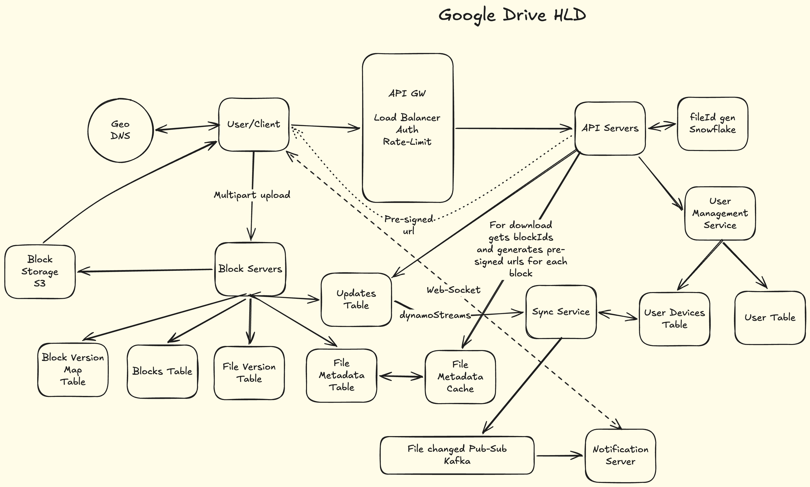

# Google Drive — High Level Design

## Functional Requirements

- File upload (chunked, up to 5GB per file)
- File edit with delta sync (only changed blocks uploaded)
- File sharing with permission management (view / edit)
- File sync across all devices of a user in real-time
- File versioning (max 10 versions per file)
- Hard delete (two-phase: mark → async cleanup)
- Directory / folder structure with inherited permissions

---

## Non-Functional Requirements

| Requirement | Target |
|---|---|
| Upload latency (avg files) | p90 < 5s |
| Upload latency (files < 1GB) | p99 < 30s |
| Sync notification latency | p99 < 2–3s |
| Availability | 99.99% (~1hr downtime/year) |
| Durability | 11 nines (S3 standard) |
| Read consistency | Strong (file reads after upload) |
| Deletion / ACL consistency | Strongly consistent, immediate |
| Notification delivery | Eventually consistent |
| Max file size | 5 GB |
| Max storage per user | 15 GB (free tier) |
| File versions | Max 10, hard delete |
| Bandwidth | Delta sync via CDC; lazy pre-signed URLs for large files |
| Storage cost | Cross-user dedup via blockHash; cold tiering to Glacier after 90 days |

---

## Back-of-Envelope Estimation

```
DAU:                  100M
Userbase:             1B
Avg file size:        500 KB
Daily uploads/user:   2
Read/write ratio:     4:1
Chunk size:           4 MB

Upload QPS:           100M × 2 / 100K = 2,000
Peak Upload QPS:      2,000 × 3 = 6,000

Read QPS:             8,000
Peak Read QPS:        24,000

Upload Bandwidth:     2,000 × 500KB = 1 Gbps
Read Bandwidth:       4 Gbps (absorbed by CDN)

User Metadata:        1B × 200B = 200 GB
File Metadata:        100M × 2 × 365 × 10yr × 0.5KB = 365 TB
File Metadata w/ versions (avg 2.5): 365 × 2.5 = ~900 TB

S3 Storage:           100M × 2 × 365 × 10yr × 500KB = 365 PB
S3 Cost:              365 × 10^6 GB × $0.02/GB/month = ~$7.3M/month

Cross-user dedup:     1000 users upload identical file (100 blocks)
                      → store 100 blocks instead of 100,000 (99.9% saving)
```

---

## Architecture


### Component Table

| Component | Technology | Role | Key Config |
|---|---|---|---|
| API Gateway | Kong / AWS ALB | Auth, rate-limiting, load balancing | 100 req/min/IP |
| API Servers | Stateless service | Pre-signed URL gen, orchestration | Horizontal scale |
| Snowflake | Internal ID gen | Generates fileId, versionId chronologically | 64-bit, time-sorted |
| Block Storage | AWS S3 | Stores raw file blocks, keyed by blockHash | 11-nine durability |
| Blocks Table | DynamoDB | Dedup registry, referenceCount per block | PK=blockHash |
| Files Table | DynamoDB | File metadata, current version pointer | PK=userId SK=fileId |
| File Versions | DynamoDB | Version history, capped at 10 per file | PK=fileId SK=versionId |
| Block Version Mapper | DynamoDB | Maps versionId → ordered block list | PK=versionId SK=blockOrder |
| Updates Table | DynamoDB | Change feed for cursor-based sync | PK=userId SK=timestamp#fileId |
| File Metadata Cache | Redis | Cache file metadata, invalidated via DynamoDB Streams | Key=fileId |
| Permissions Table | PostgreSQL | File/folder ACL, never cached | PK=permissionId |
| Sync Service | Internal service | Reads DynamoDB Streams, routes change events | Consumes Updates Table stream |
| Kafka | Apache Kafka | Pub-sub for sync notifications | Partitioned by userId |
| Notification Server | Internal service | Maintains WebSocket per device, routes via Redis sticky sessions | WS per device |
| Geo DNS | Route53 | Routes user to nearest region | Latency-based routing |

---

## DB Modelling

### Users — PostgreSQL
```
userId        PK, Snowflake UUID
email         unique, indexed
userName
storageUsed   atomic counter (bytes) — ACID needed for quota enforcement
storageQuota  default 15GB
createdAt

Shard key: userId
Cache: Redis, TTL 1hr, invalidate on update
Why Postgres: Multi-row ACID needed for storageUsed quota checks
```

### Files — DynamoDB
```
PK: userId
SK: fileId

fileName
isDirectory       boolean (folders and files share this table)
parentId          folder this lives in (null = root)
currentVersionId  pointer to latest committed version
checksum          SHA-256 of latest version
size              bytes
createdAt
modifiedAt
isDeleted         Phase 1 delete flag

GSI: PK=userId, SK=parentId#fileId  → directory listing

Strong consistency: ConsistentRead=true
Optimistic locking: ConditionExpression on currentVersionId for writes
```

### File Versions — DynamoDB
```
PK: fileId
SK: versionId  (Snowflake = chronologically ordered)

createdBy
createdAt
size
checksum

Query latest 10: PK=fileId, SK desc, LIMIT 10
Version cap: enforce asynchronously — count versions, delete oldest when > 10
```

### Blocks — DynamoDB
```
PK: blockHash  (SHA-256 of block content)

size
s3Path         s3://bucket/blocks/{blockHash}
referenceCount atomic counter — dedup across users
createdAt

Insert race: attribute_not_exists(blockHash) on PutItem
             → fallback to atomic UpdateItem increment if block exists
Uniform distribution: SHA-256 = zero hotspot risk
```

### Block Version Mapper — DynamoDB
```
PK: versionId
SK: blockOrder  (0, 1, 2, ...)

blockHash

Read: PK=versionId, SK asc → ordered block list for download/reconstruct
Write: all blocks for one version on same partition → acceptable (DynamoDB
       adaptive capacity handles; 250 parallel writes for 1GB file is fine)
```

### Updates Table — DynamoDB
```
PK: userId
SK: modifiedTimestamp#fileId  (composite for uniqueness)

fileId
fileVersion
modifiedBy
deviceId
changeType    CREATED | MODIFIED | DELETED

Cursor query: PK=userId, SK > lastSyncCursor
DynamoDB Streams enabled → triggers Sync Service on every write
```

### Permissions — PostgreSQL
```
permissionId  PK
fileId        indexed
userId        indexed
grantedBy
permissionType  VIEW | EDIT
inheritedFrom   null (direct) | ancestorFileId (inherited from folder)
createdAt

Never cached — must be strongly consistent for revocation
Cascade delete: synchronous on folder permission revocation (rare, high priority)
Why Postgres: ACID for permission changes; relational structure for cascade logic
```

---

## Core Workflows

### 1. File Upload Flow

```
1. Client chunks file locally using CDC (Content-Defined Chunking)
   └─ Rolling hash (Rabin fingerprint) finds natural chunk boundaries
   └─ Each chunk: compute SHA-256 blockHash

2. Client sends all blockHashes to API Server
   └─ POST /upload/init { fileId, blockHashes[] }

3. API Server checks Blocks Table (DynamoDB)
   └─ Returns list of missing blockHashes only (dedup check)
   └─ Generates one pre-signed S3 URL per missing blockHash
      (URL scoped to exact object key = blockHash — cannot be appended to)

4. Client uploads ONLY missing blocks directly to S3
   └─ Batched parallel upload: 100 blocks per batch, sequential batches
   └─ Example: 1GB file = 250 blocks → 3 batches of 100 + 1 batch of 50

5. For each block landing in S3:
   └─ PutItem with ConditionExpression="attribute_not_exists(blockHash)"
   └─ On ConditionalCheckFailed → UpdateItem atomic increment referenceCount

6. Once all blocks confirmed in S3:
   └─ API Server fires TransactWriteItems (single atomic DynamoDB transaction):
      a. Write new row to File Versions table
      b. Update currentVersionId on Files table (with ConditionExpression on prev version)
      c. Write rows to Block Version Mapper (versionId + blockOrder + blockHash)

7. Transaction commits → DynamoDB Stream fires on Updates Table
   └─ Sync Service consumes stream event
   └─ Publishes to Kafka (partitioned by userId)
   └─ Notification Server routes to all online devices via WebSocket
   └─ Offline devices self-heal via cursor-based pull on reconnect
```

**Critical failure points:**
- Pre-signed URL expires mid-upload → regenerate URL for that batch, retry
- TransactWriteItems fails → client retries with same blockHashes (idempotent)
- Kafka delivery failure → message is at-least-once, Sync Service deduplicates

---

### 2. File Download Flow

```
1. Client requests file download
   └─ GET /files/{fileId} → fetch file row (DynamoDB, ConsistentRead=true)
   └─ Check permissions table (Postgres, never cached)

2. API Server fetches block list (application-level join, no DB joins):
   a. Fetch file row → get currentVersionId
   b. Query BlockVersionMapper PK=currentVersionId → all (blockOrder, blockHash)
   c. For small files: generate all pre-signed URLs upfront
      For large files: lazy generation — return first 10 block URLs,
                       client requests next batch as it nears completion

3. Client receives ordered list of (blockOrder, blockHash, presignedUrl)
   └─ Compares blockHashes with locally cached blocks
   └─ Downloads ONLY blocks not already present locally
   └─ Assembles file in blockOrder sequence

Pre-signed URL TTL: 12 hours (covers slow connections, large files)
```

---

### 3. Delta Sync Flow (Edit)

```
1. User edits file → paragraph change affects 1 block (4MB chunk)

2. Client re-chunks file using CDC
   └─ Fixed chunking FAILS: inserting bytes shifts ALL subsequent boundaries
   └─ CDC uses rolling hash → only affected chunk gets new blockHash
   └─ All other chunks retain original blockHash

3. Client sends new blockHashes to API Server
   └─ Server returns only missing hashes (unchanged blocks already in S3)
   └─ Client uploads only 1 changed block (4MB instead of 1GB)

4. TransactWriteItems: new FileVersion + updated currentVersionId + new BlockVersionMapper rows
   └─ New version reuses existing blockHash references for unchanged blocks
   └─ Zero re-upload, zero re-storage for unchanged blocks
```

---

### 4. Conflict Resolution Flow

```
Two devices edit same file simultaneously:

1. Device A commits first
   └─ TransactWriteItems with ConditionExpression: currentVersionId = V1
   └─ Succeeds → currentVersionId = V2A

2. Device B's commit arrives
   └─ ConditionExpression: currentVersionId = V1 → FAILS (ConditionalCheckFailedException)

3. Device B client performs 3-way merge:
   Base:   V1 (common ancestor — stored locally)
   Theirs: V2A (winner's version — fetch from server)
   Mine:   V2B (Device B's pending changes)

4. Block-level merge:
   No block overlap → auto-merge → commit V2B with condition currentVersionId = V2A
   Block overlap → surface conflict prompt to user → manual resolution → commit

Key: Device B must commit against V2A (not V1) — server is at V2A now
```

---

### 5. Delete Flow (Two-Phase)

```
Phase 1 — Synchronous (hot path, fast):
1. TransactWriteItems:
   a. Set isDeleted=true on Files table row
   b. Write DELETE event to Updates Table
2. DynamoDB Stream fires → devices notified immediately via WebSocket
3. File is now inaccessible — all reads/writes return 404/forbidden
   └─ Optimistic lock condition: any write attempt fails (file marked deleted)

Phase 2 — Async cleanup (background worker):
1. Cleanup worker consumes DELETE event from DynamoDB Stream (at-least-once)
2. Idempotency: before processing each block —
   └─ Check idempotency table (PK=eventId+blockHash, TTL=7 days)
   └─ If row exists → skip (already processed)
   └─ If not → TransactWriteItems: insert idempotency row + decrement referenceCount
3. If referenceCount hits 0 → delete block from S3 + remove Blocks row
4. Delete all BlockVersionMapper rows for each versionId
5. Delete all FileVersion rows
6. Delete File row

Why DynamoDB for idempotency (not Redis): Redis is ephemeral — a crash loses the log,
causing double-decrements that corrupt referenceCount and trigger premature S3 deletion.
```

---

### 6. Sync on Reconnect (Offline → Online)

```
Device comes back online:
1. Client sends lastSyncCursor to Sync Service via WebSocket startup
2. Sync Service queries Updates Table:
   └─ PK=userId, SK > lastSyncCursor
   └─ Returns all change events since last sync
3. Client applies deltas, downloads only missing blocks
4. Updates lastSyncCursor to latest event timestamp

No notification backlog needed — cursor-based pull self-heals all missed events
```

---

## Key Design Decisions

### Why DynamoDB over Postgres for most tables?

| Concern | DynamoDB | Postgres |
|---|---|---|
| Scale | Horizontal, managed | Manual sharding at 365TB |
| Access patterns | Key-value + range scans (perfect fit) | Joins needed = not the case here |
| Strong consistency | ConsistentRead=true (opt-in per query) | Default strong consistency |
| Transactions | TransactWriteItems (cross-table, same region) | ACID native |
| Operational burden | Fully managed | Requires DBA at this scale |

**Verdict:** DynamoDB for everything except Users (quota ACID) and Permissions (relational cascade + strict consistency).

---

### CDC vs Fixed-Size Chunking

| Approach | Boundary Shift on Insert | Delta Upload Size | Verdict |
|---|---|---|---|
| Fixed chunks | Yes — ALL subsequent blocks shift | Entire file re-uploaded | Bad |
| CDC (Rabin fingerprint) | No — boundaries are content-defined | Only changed block(s) | Good |

---

### Pre-signed URL Model

| Model | How It Works | Bandwidth Saving | Verdict |
|---|---|---|---|
| Client-side hash first | Client sends hashes → server checks dedup → returns URLs for missing blocks only | Yes — skips existing blocks | Chosen |
| Block Server proxy | Client → Block Server → S3 | No — all bytes traverse Block Server | Wasteful |

**Key constraint:** Pre-signed URLs are scoped to exact S3 object key at generation time. Cannot append dynamic paths — signature would be invalid.

---

### Optimistic Locking vs Pessimistic Locking

| Approach | Mechanism | Concurrency | Verdict |
|---|---|---|---|
| Pessimistic | Row-level lock held during upload | Serializes all writes | Too slow for Drive |
| Optimistic | ConditionExpression on currentVersionId | Parallel writes, loser retries | Chosen |

---

### Idempotency Store: DynamoDB vs Redis

| Store | Durability | Crash Recovery | Verdict |
|---|---|---|---|
| Redis | Ephemeral — data lost on crash | Double-decrement possible | Dangerous for cleanup |
| DynamoDB | Durable — TTL 7 days | Replay-safe | Chosen |

---

## Q&A — Interview Questions

### Q1: Walk me through the complete file upload flow end-to-end.

**Tags:** Core | Hard

**Answer:**

Client first chunks the file locally using **CDC (Content-Defined Chunking)** with a rolling Rabin fingerprint hash to find natural chunk boundaries (avoids boundary shift on insertion). Each chunk gets a **SHA-256 blockHash** computed locally.

Client sends all block hashes to the API Server (`POST /upload/init { fileId, blockHashes[] }`). Server checks the **Blocks Table** in DynamoDB — returns only missing hashes (dedup check). Server then generates one **pre-signed S3 URL per missing blockHash** — URLs are scoped to exact object keys, cannot be dynamically appended.

Client uploads only missing blocks directly to S3 in **batched parallel uploads** (100 blocks per batch). Each block write to DynamoDB uses `attribute_not_exists(blockHash)` conditional insert; losing writer falls back to atomic `UpdateItem` increment on `referenceCount`.

Once all blocks land, API Server fires a **`TransactWriteItems`** across Files, FileVersions, and BlockVersionMapper tables atomically (no SAGA needed — all same DynamoDB instance). DynamoDB Stream on Updates Table triggers Sync Service → Kafka → Notification Server → WebSocket push to online devices.

**Follow-ups:**

**Q: Why not use Block Server as a proxy for uploads?**
A: All bytes would traverse the Block Server — wasting bandwidth and adding latency. Client-side hashing + direct S3 upload via pre-signed URLs means only missing blocks hit the network. Block Server as proxy eliminates the bandwidth NFR.

**Q: Pre-signed URL is generated for fileId — client appends hashId. Is that valid?**
A: No. Pre-signed URLs are signed against a specific S3 object key at generation time. Appending a dynamic `hashId` changes the URL path, invalidating the HMAC signature. S3 returns 403. Correct model: client sends hashes first, server generates one URL per missing blockHash.

**Q: Why TransactWriteItems instead of SAGA for the commit step?**
A: SAGA is for distributed transactions across separate microservices requiring compensating rollbacks. Files, FileVersions, and BlockVersionMapper are all DynamoDB — `TransactWriteItems` handles up to 100 items atomically across multiple tables in one region. One operation, no compensating logic needed.

---

### Q2: How does your system ensure only changed blocks are uploaded when a user edits a file?

**Tags:** Algorithm | Medium

**Answer:**

**Fixed-size chunking fails for delta sync.** If a user inserts bytes at the start of a file, every subsequent chunk boundary shifts — all blocks look "changed" and the entire file re-uploads.

**CDC (Content-Defined Chunking)** uses a rolling hash (Rabin fingerprint) that slides over the file byte-by-byte and triggers a chunk boundary when the hash value matches a predefined pattern. Boundaries are determined by file content, not position. Insert bytes anywhere — only the affected region gets new chunk boundaries and a new `blockHash`. All other chunks retain their original hash.

**Upload flow for an edit:**
1. Client re-chunks file after edit using CDC
2. Computes blockHash for each chunk
3. Sends all hashes to API Server
4. Server returns only missing hashes (unchanged blocks already exist in S3)
5. Client uploads only changed blocks
6. New FileVersion created — reuses existing `blockHash` references in BlockVersionMapper for unchanged blocks

For a 1GB file with a single paragraph edit: typically 1 block (4MB) uploaded instead of 1GB.

**Follow-up:**

**Q: What is the typical chunk size and why 4MB?**
A: 4MB is a common sweet spot: large enough to minimize per-chunk metadata overhead, small enough that a single edit doesn't re-upload too much. For avg 500KB files, most files are smaller than one chunk — they upload as a single block. For large files (1GB+), 4MB chunks give 250 blocks for good parallelism.

---

### Q3: Two users edit the same file simultaneously. How do you handle conflicts?

**Tags:** Core | Hard

**Answer:**

**Optimistic locking** on the Files Table using DynamoDB `ConditionExpression`. Every write includes: `ConditionExpression: "currentVersionId = :expectedVersion"`.

First writer (Device A) commits → `currentVersionId` updates to V2A. Second writer (Device B) arrives with condition `currentVersionId = V1` → `ConditionalCheckFailedException`.

Device B client performs a **3-way merge**:
- **Base:** V1 (common ancestor — stored locally)
- **Theirs:** V2A (winner's version — fetched from server, only delta blocks downloaded)
- **Mine:** V2B (Device B's pending changes)

Block-level merge:
- **No block overlap** → auto-merge → commit V2B with `ConditionExpression: currentVersionId = V2A`
- **Block overlap (true conflict)** → surface conflict prompt to user → manual resolution → commit merged version

Device B must commit against V2A (not V1) — server is at V2A.

**Follow-up:**

**Q: What if the user is offline, edits a file, and comes back online — but the file was deleted while offline?**
A: Client tries to commit → `ConditionalCheckFailed` (file row has `isDeleted=true` or doesn't exist). Client surfaces "this file no longer exists" to the user. No zombie writes possible — deletion is just another version state enforced by the same optimistic lock condition.

---

### Q4: Walk me through the complete delete flow. How do you ensure storage is reclaimed without data loss?

**Tags:** Core | Hard

**Answer:**

**Two-phase delete** separates the consistency requirement (immediate access revocation) from the cleanup cost (async block reclamation).

**Phase 1 — Synchronous (hot path):**
`TransactWriteItems` atomically:
- Set `isDeleted=true` on Files table row
- Write DELETE event to Updates Table

DynamoDB Stream fires → Sync Service → Kafka → WebSocket → all online devices notified. File immediately inaccessible — all reads/writes rejected via conditional check.

**Phase 2 — Async cleanup (background worker):**
1. Cleanup worker consumes DELETE event (at-least-once from DynamoDB Streams)
2. **Idempotency:** before each block operation — check DynamoDB idempotency table (`PK: eventId+blockHash, TTL: 7 days`). If row exists → skip. If not → `TransactWriteItems`: insert idempotency row + decrement `referenceCount`
3. `referenceCount` hits 0 → delete from S3 + remove Blocks row
4. Delete BlockVersionMapper rows, FileVersion rows, File row

**Why DynamoDB for idempotency (not Redis):** Redis is ephemeral. A Redis crash loses the log — worker replays, double-decrements `referenceCount`, block hits 0 prematurely and gets deleted from S3 while other users' files still reference it. Data loss. DynamoDB is durable — replay-safe with TTL auto-cleanup.

**Follow-up:**

**Q: referenceCount for a block shared across 1000 users — what's the race condition on decrement?**
A: All 1000 deletion cleanup workers decrement the same `blockHash` row. DynamoDB `UpdateItem` with atomic `referenceCount = referenceCount - 1` handles concurrent decrements correctly — no lost updates. The S3 deletion only fires when a decrement results in `referenceCount = 0`, checked via a condition on the same operation.

---

### Q5: How does your sync mechanism work? How does a device know what it missed while offline?

**Tags:** Core | Medium

**Answer:**

**Online devices:** DynamoDB Stream on the Updates Table triggers on every file change write. Sync Service consumes the stream, publishes to Kafka (partitioned by `userId`). Notification Server maintains a **WebSocket connection per device**, keyed via **Redis sticky sessions** (`userId+deviceId → notificationServerId`). Kafka event routes only to the Notification Server holding the active WebSocket for that device. Offline devices have no active connection — event is not delivered.

**Offline → reconnect (cursor-based pull):**
1. Client sends `lastSyncCursor` (last processed `modifiedTimestamp`) on WebSocket startup
2. Sync Service queries Updates Table: `PK=userId, SK > lastSyncCursor`
3. Returns all change events since last sync
4. Client downloads only missing blocks, updates `lastSyncCursor`

No notification backlog needed. Devices self-heal via cursor pull — like `git pull` after being offline.

**Follow-up:**

**Q: Why Kafka between Sync Service and Notification Server? Why not direct call?**
A: Kafka decouples Sync Service from Notification Servers. A Notification Server going down doesn't block Sync Service. Kafka retains the event — when the server recovers or a new one spins up, it consumes from its last committed offset. Also enables fan-out: one Kafka event can reach multiple Notification Servers if a user has many active connections.

---

### Q6: Walk me through your DB modelling for Google Drive. Justify every choice.

**Tags:** DB Design | Hard

**Answer:**

| Entity | DB | PK | SK | Rationale |
|---|---|---|---|---|
| Users | PostgreSQL | userId | — | ACID needed for storageUsed quota enforcement |
| Files | DynamoDB | userId | fileId | Key-value + range scan; ConsistentRead=true for strong consistency |
| File Versions | DynamoDB | fileId | versionId | Chronological SK enables latest-10 query in one call |
| Blocks | DynamoDB | blockHash | — | Pure key-value; SHA-256 = perfect distribution, zero hotspot |
| Block Version Mapper | DynamoDB | versionId | blockOrder | SK=blockOrder gives ordered block list for download in one query |
| Updates Table | DynamoDB | userId | timestamp#fileId | Cursor query: SK > lastSyncCursor |
| Permissions | PostgreSQL | permissionId | — | Strong consistency for revocation; relational cascade for folders |

**DynamoDB strong consistency:** `ConsistentRead=true` reads from the leader node — DynamoDB is not eventually-consistent-only. This is a common misconception.

**Block Version Mapper shard key:** PK=`versionId` means all blocks for one version land on one DynamoDB partition. During parallel upload (250 blocks for 1GB file), 250 concurrent writes hit one partition. DynamoDB adaptive capacity handles this — unlike manually sharded Postgres where this would be a true hotspot.

**Follow-up:**

**Q: What's a GSI and why do you need one on the Files table?**
A: GSI (Global Secondary Index) creates a fully distributed alternate access path with its own throughput in DynamoDB. Files table PK=userId, SK=fileId enables fetching a specific file. But directory listing requires: "give me all children of folder X owned by user Y." GSI with PK=userId, SK=parentId#fileId enables this range scan. Without the GSI, you'd scan all files for a user and filter client-side — O(N) at 100K files per user.

---

### Q7: How do you handle folder permissions and inheritance? What happens when access is revoked?

**Tags:** Core | Medium

**Answer:**

**Permission storage:** Postgres `Permissions` table — never cached (must be strongly consistent for revocation).

```
permissionId, fileId, userId, grantedBy, permissionType (VIEW|EDIT),
inheritedFrom (null = direct grant, ancestorFileId = inherited from folder), createdAt
```

**Folder permission inheritance — three options:**

| Option | Write Cost | Read Cost | Verdict |
|---|---|---|---|
| Expand on write: insert row per child | O(N children) | O(1) | Bad for large folders |
| Traverse on read: walk parentId tree | O(1) | O(depth) per request | Bad for read-heavy |
| Inherited flag (materialized at write) | O(N children) — one-time | O(1) | Chosen (4:1 read/write) |

**Chosen:** `inheritedFrom` field materialized at write time. When folder is shared, insert one permission row per child file with `inheritedFrom=folderId`. Reads are O(1) — just check if row exists for `userId+fileId`.

**Revocation:** Synchronous cascade delete on folder revocation — delete all permission rows with `inheritedFrom=folderId`. Rare operation, acceptable latency. Strongly consistent because permissions are never cached.

---

### Q8: How do you handle cross-user deduplication and storage cost at Exabyte scale?

**Tags:** Scale | Medium

**Answer:**

**Cross-user dedup via content-addressable storage:** Block key in S3 and DynamoDB is `blockHash` (SHA-256 of content). If 1,000 users upload the same 1GB file (100 blocks each = 100,000 total), only 100 unique blocks are stored. Storage saving: 99.9%.

`referenceCount` on the Blocks table tracks how many file versions reference each block. Block is only deleted from S3 when `referenceCount` hits 0 (last reference removed).

**Cold storage tiering:** An analytics system tracks `lastAccessedAt` per block. A daily cron job moves blocks not accessed in 90 days from S3 Standard to S3 Glacier. Glacier costs ~$0.004/GB/month vs $0.023/GB/month for S3 Standard — ~6x cheaper for cold data. At 365PB total, even tiering 30% of data to Glacier saves ~$1M/month.

**Follow-up:**

**Q: Can dedup cause a privacy issue — user B can infer that user A uploaded the same file?**
A: Yes, this is a known theoretical attack (convergent encryption timing side-channel). In practice, Google Drive uses client-side hash verification before confirming dedup — the system confirms block existence without revealing who uploaded it. For high-security environments, per-user encryption keys eliminate dedup but destroy storage savings. Standard Drive accepts this tradeoff.

---

## Important Keywords

### Chunking & Storage
| Term | Definition in this system |
|---|---|
| CDC (Content-Defined Chunking) | Uses rolling Rabin fingerprint hash to find natural chunk boundaries in file content. Prevents boundary shift when bytes are inserted — only truly changed blocks get new SHA-256 hashes and need re-uploading. Typical chunk size: 4MB. |
| blockHash | SHA-256 of a 4MB block's content. Serves as both the S3 object key and DynamoDB Blocks table PK. Enables dedup: same content → same hash → stored once regardless of how many users upload it. |
| referenceCount | Atomic counter on each block row. Incremented when a new file version references the block; decremented on version/file deletion. S3 block deleted only when referenceCount hits 0. |
| Pre-signed URL | S3 URL containing temporary HMAC signature scoped to exact object key at generation time. Client uses these to upload/download blocks directly to S3. TTL=12hr for downloads; URL cannot be modified (signature invalid). |
| Content-Addressable Storage | Storage model where object key = hash of content. Two users uploading identical file get identical keys → automatic dedup. Used for all blocks in this system. |

### Sync & Notifications
| Term | Definition in this system |
|---|---|
| lastSyncCursor | Client-side timestamp/sequence number of the last processed change event. On reconnect, client sends this to Sync Service to fetch all missed changes via `PK=userId, SK > lastSyncCursor` on Updates Table. |
| DynamoDB Streams | Ordered log of all writes to a DynamoDB table. Used here to: (1) trigger Sync Service on Updates Table writes, (2) invalidate File Metadata Cache in Redis on file changes. At-least-once delivery. |
| Redis Sticky Sessions | Maps `userId+deviceId → notificationServerId` in Redis. Ensures Kafka events for a user route to the exact Notification Server holding that device's WebSocket connection. Avoids broadcast storms. |
| WebSocket | Persistent bidirectional connection between device and Notification Server. Used for real-time file change events. On disconnect, cursor-based pull on reconnect handles missed events. |

### Consistency & Concurrency
| Term | Definition in this system |
|---|---|
| Optimistic Locking | DynamoDB `ConditionExpression: "currentVersionId = :expected"` on every file write. First writer wins. Loser gets ConditionalCheckFailedException and must rebase on winner's version before retrying. No locks held — high concurrency. |
| TransactWriteItems | DynamoDB atomic multi-table write operation. Used to atomically commit: Files row update + FileVersions insert + BlockVersionMapper inserts — all or nothing. Up to 100 items, single region. Replaces SAGA for same-DB transactions. |
| attribute_not_exists | DynamoDB condition used on Block inserts: `ConditionExpression="attribute_not_exists(blockHash)"`. Prevents duplicate inserts when two users upload the same block simultaneously. Losing writer falls back to atomic increment. TOCTOU-safe. |
| ConsistentRead=true | DynamoDB read option that reads from the leader node (not a replica). Provides strong consistency for file reads — client sees file immediately after upload. Not eventually consistent. Common misconception: DynamoDB is always eventually consistent. |

### Delete & Cleanup
| Term | Definition in this system |
|---|---|
| Two-Phase Delete | Phase 1: synchronous mark (`isDeleted=true`) — file immediately inaccessible. Phase 2: async cleanup — decrement referenceCount, reclaim S3 storage. Separates consistency requirement (immediate) from cleanup cost (background). |
| Idempotency Table | DynamoDB table (`PK: eventId+blockHash, TTL: 7 days`) used by cleanup workers to prevent double-decrements on block referenceCount when DynamoDB Streams replays events. Chosen over Redis because Redis is ephemeral — crash loses idempotency log. |
| Forward Recovery SAGA | SAGA pattern used for block cleanup — not rollback SAGA. Steps proceed forward (decrement → delete S3 → remove rows). Idempotency table ensures replays skip already-processed steps without reversing completed work. |

### DB Design
| Term | Definition in this system |
|---|---|
| Partition Key (PK) | DynamoDB's shard key — determines which physical partition stores the data. Hash of PK assigns the partition. In Files table: PK=userId means all of a user's files are co-located on one partition for efficient directory listing. |
| Sort Key (SK) | Determines physical sort order within a partition — not a query-time sort like SQL ORDER BY. In File Versions: SK=versionId (Snowflake) gives chronological ordering; `LIMIT 10 DESC` returns latest 10 versions efficiently. |
| GSI (Global Secondary Index) | Alternate distributed access path in DynamoDB with its own throughput. Files table GSI: PK=userId, SK=parentId#fileId — enables directory listing (`give me all children of folder X for user Y`) without full-table scan. |
| Snowflake ID | 64-bit time-sorted ID generator used for fileId and versionId. Chronological ordering makes Snowflake IDs ideal as DynamoDB Sort Keys for time-based range queries (e.g., latest versions, recent changes). |

---

## Quick-Reference NFR Block

```
Upload latency:       p90 < 5s (avg files) | p99 < 30s (files < 1GB)
Download latency:     p99 < 2s (CDN cached) | lazy URL gen for large files
Sync notification:    p99 < 2-3s (eventual, WebSocket)
Read consistency:     Strong (ConsistentRead=true on DynamoDB)
Delete/ACL:           Strongly consistent, immediate (Phase 1 synchronous)
Availability:         99.99% (~1hr downtime/year)
Durability:           11 nines (S3 standard)
Storage:              ~365 PB raw | ~99.9% saving via cross-user dedup
Cost optimisation:    Cold tier to Glacier after 90 days (~6x cheaper)
Versions:             Max 10 per file | hard delete
Chunk size:           4MB | CDC boundaries
Dedup:                blockHash (SHA-256) — content-addressable
Idempotency:          DynamoDB table (eventId+blockHash, TTL 7d)
Batch upload:         100 parallel blocks per batch, sequential batches
```

---

## Concepts Checklist

### Must Know Cold
- [ ] CDC vs fixed-size chunking — why boundary shift breaks delta sync
- [ ] Pre-signed URL mechanics — scoped to exact S3 key, cannot append
- [ ] DynamoDB `attribute_not_exists` conditional insert + atomic increment fallback
- [ ] `TransactWriteItems` — when to use vs SAGA
- [ ] DynamoDB `ConsistentRead=true` — not eventually-consistent-only
- [ ] Two-phase delete — why sync mark + async cleanup
- [ ] Idempotency table in DynamoDB (not Redis) for cleanup workers
- [ ] 3-way merge — base/theirs/mine for conflict resolution
- [ ] Optimistic locking with `ConditionExpression` on currentVersionId
- [ ] Block Version Mapper PK=versionId SK=blockOrder — ordered block reconstruction

### DB Modelling Patterns
- [ ] PK = partition key = shard key in DynamoDB
- [ ] SK = sort key = physical storage order within partition (not query-time)
- [ ] GSI = alternate distributed access path, own throughput
- [ ] Snowflake IDs as SK = chronological range queries
- [ ] Permissions in Postgres (never DynamoDB) — relational cascade, ACID

### Architecture Patterns
- [ ] Content-addressable storage (key = hash of content) for dedup
- [ ] DynamoDB Streams for event-driven cache invalidation
- [ ] Redis sticky sessions for WebSocket routing
- [ ] Cursor-based sync (lastSyncCursor) for offline reconnect
- [ ] `inheritedFrom` field for folder permission inheritance at write time
- [ ] Cold storage tiering to Glacier at 90 days
- [ ] Batched parallel upload (100 blocks/batch) for large file latency