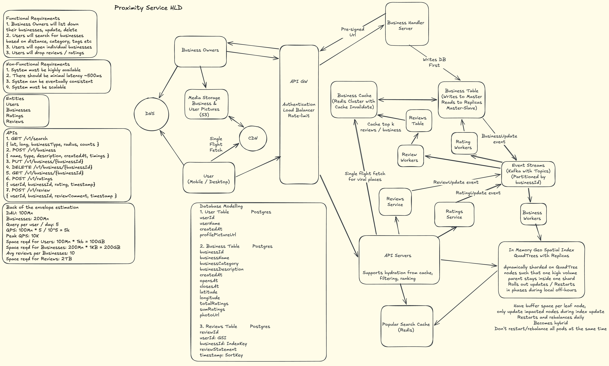

# Proximity Service — System Design

## Table of Contents
1. [Functional Requirements](#1-functional-requirements)
2. [Non-Functional Requirements](#2-non-functional-requirements)
3. [Back-of-Envelope Estimation](#3-back-of-envelope-estimation)
4. [High-Level Architecture](#4-high-level-architecture)
5. [Core Workflows](#5-core-workflows)
6. [Key Design Decisions](#6-key-design-decisions)
7. [Database Modelling](#7-database-modelling)
8. [Q&A — Interview Style](#8-qa--interview-style)
9. [Important Keywords](#9-important-keywords)
10. [Quick-Reference: NFRs to State Upfront](#10-quick-reference-nfrs-to-state-upfront)
11. [Concepts Checklist](#11-concepts-checklist)

---

## 1. Functional Requirements

### In Scope
- Business owner can create, update, and delete business listings
- User can search for businesses near a given location (lat, long) with a custom radius (max 20km)
- User can search by name, category, and tags (full-text search)
- User can view individual business detail pages
- Businesses have a pre-computed aggregate rating and top reviews
- Users can submit ratings and reviews for businesses
- Media (photos) served via CDN

### Out of Scope
- Review moderation / flagging system
- Dynamic radius expansion (if no results found, we show empty — no auto-expand)
- Real-time review sentiment analysis
- Flash deals or promotional features
- Social graph / friend activity on businesses

---

## 2. Non-Functional Requirements

| Requirement | Target |
|---|---|
| Search latency | p90 < 200ms, p99 < 2s |
| Availability | 99.9% (~8.7 hrs/year downtime) |
| Business data durability | 11 nines (Postgres + S3 replication) |
| Business update consistency | Eventual — 24hr SLA for location/LBS changes |
| Operational update consistency | Eventual — 5min max via cache TTL |
| Search index consistency | Eventual — 2–3s from DB write |
| Rating cache freshness | 15s TTL |
| Max search radius | 20km |
| Global deployment | Yes — multi-region with GeoDNS routing |

### Key Consistency Decisions
- **Business DB → QuadTree:** Async reseed every 24hrs (rolling restart at local midnight per region). Acceptable because business locations don't change frequently.
- **Business DB → Elasticsearch:** Async indexing pipeline, 2–3s lag. Acceptable for search freshness.
- **Business DB → Cache:** TTL-based invalidation, 5min max staleness. Covers operational changes (hours, closure status).
- **Ratings cache:** 15s TTL — short enough to reflect recent ratings, long enough to absorb spikes.

---

## 3. Back-of-Envelope Estimation

### Given
- DAU: 300M
- Total users: 1B
- Total businesses: 500M globally
- Avg searches per user per day: 3
- Business update rate: 10% of businesses per day
- Search result payload: ~1KB per business, top 20 results returned
- Business record size: ~500 bytes
- User record size: ~200 bytes
- Business photos: 5 photos × 500KB each

### QPS
```
Search QPS    = 300M × 3 / 100K = 9,000 avg
Peak Search   = 9,000 × 3 = 27,000

Write QPS     = 500M × 10% / 100K = 500 avg
Peak Write    = 500 × 3 = 1,500

Rating QPS    = Search QPS × 10% = 900 avg (10% of searchers rate)
Peak Rating   = 900 × 3 = 2,700

Review QPS    = Search QPS × 1% = 90 avg
Peak Review   = 90 × 3 = 270
```

**System is read-heavy (search:write ≈ 18:1)**

### Bandwidth
```
Request bandwidth  = 1KB × 9,000 = 9 MB/s avg | 27 MB/s peak
Response bandwidth = 20 × 1KB × 9,000 = 180 MB/s avg | 540 MB/s peak
```

### Storage
```
User DB       = 200B × 1B = 200 GB
Business DB   = 500B × 500M = 250 GB
Media (S3)    = 5 × 500KB × 500M = 1.25 PB
```

### QuadTree Memory Sizing
```
Assumption: 100-business threshold per leaf cell
           One country with max 10M businesses (worst case, e.g. India)

Leaf nodes       = 10M / 100 = 100K
Non-leaf nodes   = 100K / 3 ≈ 33K  (each non-leaf has ~3 children on avg)

Leaf node size   = 8B (id) + 32B (4 coordinates) + 100×8B (businessIds) = ~840B ≈ 1KB
Non-leaf size    = 8B (id) + 32B (coordinates) + 4×8B (childIds) = ~72B ≈ 100B

Total memory     = 100K × 1KB + 33K × 100B = 100MB + 3.3MB ≈ ~1GB per country instance
```

---

## 4. High-Level Architecture


### Component Legend

| Component | Technology | Reason |
|---|---|---|
| GeoDNS | AWS Route 53 / Cloudflare | Routes user to nearest regional cluster |
| API Gateway | Kong / AWS API GW | Auth, rate limiting, load balancing |
| LBS (Location-Based Service) | Custom service | Owns QuadTree + proximity search logic |
| QuadTree | In-memory (JVM heap) | Zero-I/O spatial lookup, fastest possible proximity search |
| Popular Cache | Redis | Pre-warmed cellId+category results, absorbs read amplification |
| Business Cache | Redis | businessId → hydrated business object, shields Postgres from reads |
| Business Management Service | Custom service | Owns CRUD for business data |
| Business DB | PostgreSQL (sharded) | Relational, ACID, strong consistency for source of truth |
| Search Index Workers | Custom async workers | Decouples Postgres writes from ES indexing |
| Elasticsearch | Elasticsearch | Inverted index for text, BKD tree for geo, doc values for sort/agg |
| Media Storage | S3 | Durable object storage for business photos |
| CDN | CloudFront (Global + Edge) | Low-latency media delivery |
| Flink | Apache Flink | Stream aggregation for popular cache TTL computation |

---

## 5. Core Workflows

### 5.1 Location-Based Search (Proximity Query)

```
User sends: POST /search
Body: { lat, long, radius, category, tags, countryCode }
```

1. **GeoDNS** routes request to nearest regional cluster based on user IP.
2. **API GW** authenticates JWT, applies rate limiting, forwards to LBS.
3. **LBS** checks **Popular Cache** (Redis key: `cellId:category`).
    - **Cache hit** → businessIds already resolved → go to step 7.
    - **Cache miss** → proceed to QuadTree traversal.
4. **QuadTree traversal:**
    - Walk from root to leaf node containing user's `(lat, long)`.
    - Walk upward until the bounding cell's bounding box fully encircles the requested radius.
    - Collect all candidate `businessIds` from that cell.
    - _Why upward traversal?_ Parent cells naturally include sibling subtrees covering neighbouring areas.
5. **Precise distance filter:** Apply Haversine formula at application layer to eliminate candidates outside the actual circle. The bounding cell is a square approximation — precision filtering removes false positives at cell edges.
6. **Popular Cache population:** LBS dispatches search event to Flink. Flink aggregates `referenceCount` per `cellId:category` in a tumbling window. Computes dynamic TTL proportional to popularity. Updates Redis atomically via Lua script.
7. **Hydration:** Batch fetch business objects from **Business Cache** (Redis key: `businessId`).
    - Cache miss per businessId → fall through to Postgres → repopulate cache.
    - Filter out any businesses where `isActive = false` (handles recently closed businesses not yet removed from QuadTree).
8. **Ranking:** Sort results by composite score: `f(distance, rating, tags_match)`.
9. **Return:** Top-K results (default 20). Media URLs point to edge CDN.

> **Why not hit Postgres directly on every search?**
> At 27k peak QPS, Postgres can't sustain that read load. Business Cache is the read layer. QuadTree is the spatial index. Postgres is the source of truth only — never in the hot read path.

### 5.2 Text-Based Search (Full-Text + Geo Query)

```
User sends: POST /search
Body: { query: "cafe", lat, long, radius, tags, countryCode }
```

1–2. Same GeoDNS + API GW path as above.
3. **LBS detects text component** in the request → routes to **Elasticsearch** instead of QuadTree.
4. **Elasticsearch query:** Combined `bool` query:
    - `must`: multi-match on `name`, `description`, `tags`, `category` (inverted index)
    - `filter`: `geo_distance` on `location` field within `radius` km of `(lat, long)` (BKD tree)
    - `sort`: by `_score` then `avgRating` (doc values)
5. Elasticsearch returns ranked `businessIds`.
6. **Hydration + return:** Same as steps 7–9 above.

> **Routing rule:** Text component present → Elasticsearch. Pure geo proximity → QuadTree. Never fan out to both for the same request.

### 5.3 Business Write Path (Create / Update)

1. Business owner requests **pre-signed S3 URL** for media uploads. Server generates URL scoped to exact S3 object key. Owner uploads directly to S3 — never through the API server.
2. Owner sends business data (text fields + S3 media keys) to **Business Management Service**.
3. **Synchronous Postgres write** — source of truth updated atomically.
4. **Cache invalidation:** Business Management Service deletes the `businessId` key from Business Cache. Next read will repopulate.
5. **Async ES indexing:** Search Index Worker picks up the change (CDC or event-based) and reindexes the document in Elasticsearch. Lag: 2–3 seconds.
6. **QuadTree update:** Only happens on next scheduled reseed (rolling restart, once per 24hrs). Acceptable per NFR — location data is eventually consistent within 24hrs.

### 5.4 QuadTree Reseed (Rolling Restart)

1. Scheduled at **local midnight** per regional cluster (avoids peak traffic window).
2. Target instance signals **health check endpoint** as unhealthy → Load Balancer stops routing new requests to it.
3. **ZooKeeper** deregisters instance from the service registry.
4. In-flight requests drain (graceful shutdown timeout).
5. Service restarts → reads all active business records from Postgres → rebuilds in-memory QuadTree.
6. Instance re-registers with ZooKeeper → LB resumes routing.
7. Move to next instance in the region. Only one instance restarted at a time.

> **Why not a hot reload?** QuadTree rebuild reads ~10M records per country from Postgres. Doing this while serving live traffic risks memory pressure and GC pauses on the JVM. A clean restart with drain is safer operationally.

### 5.5 Business Closure Propagation

| Layer | Update mechanism | Max staleness |
|---|---|---|
| Postgres | Synchronous write (`isActive = false`) | 0s (immediate) |
| Elasticsearch | Async index update | 2–3 seconds |
| Business Cache | TTL expiry | 5 minutes |
| QuadTree | Next reseed cycle | Up to 24 hours |
| User impact | Hydration filter catches `isActive = false` | 5 minutes max |

> **Defense in depth:** Even if QuadTree returns a closed business's ID for up to 24hrs, the hydration step reads from cache/DB and filters it out before it reaches the user. Worst-case user exposure: 5 minutes (cache TTL window).

### 5.6 Ratings and Reviews Write Path

1. User submits rating (1–5 stars) via `POST /businesses/{id}/ratings`.
2. **Business Management Service** atomically increments `ratingCount` and `totalRating` in Postgres using a single `UPDATE ... SET ratingCount = ratingCount + 1, totalRating = totalRating + {rating}`.
3. No read-modify-write cycle needed — `avgRating` is derived on read as `totalRating / ratingCount`.
4. Ratings cache (Redis, key: `businessId:ratings`, TTL 15s) is invalidated. Next read repopulates.
5. Review text stored in separate `Reviews` table (see DB Modelling). Not indexed in Elasticsearch.

---

## 6. Key Design Decisions

### 6.1 QuadTree vs Geohash vs S2 for Spatial Indexing

| Property | QuadTree | Geohash | S2 (Google) |
|---|---|---|---|
| Structure | Dynamic tree, adaptive subdivision | Fixed-size cells, string-encoded | Spherical geometry, hierarchical cell IDs |
| Density adaptation | Yes — denser areas get finer cells | No — fixed cell size everywhere | Yes — hierarchical levels |
| Boundary handling | Good with bounding box + Haversine filter | Boundary artifacts (cells don't align with circles) | Excellent — hexagonal-like cells |
| In-memory fit | Yes — ~1GB per country | Yes | Yes |
| String-based prefix search | No | Yes — useful for ES/DB indexing | No |
| Operational complexity | Medium | Low | High |
| Used by | Yelp-scale systems | Simpler geo lookups, Elasticsearch | Uber (H3), Google Maps |

**Verdict:** QuadTree chosen for its dynamic density adaptation and simplicity at Yelp-scale. For a system prioritising accuracy at long distances or handling diagonal boundaries precisely, H3 (Uber's hexagonal indexing) would be preferred.

### 6.2 Elasticsearch Only (Medium Scale) vs QuadTree + Elasticsearch

| Property | Elasticsearch Only | QuadTree + Elasticsearch |
|---|---|---|
| Geo index type | BKD tree (disk-backed) | In-memory pointer traversal |
| Latency at 27k QPS | Higher (disk I/O compounds) | Lower (zero I/O for proximity) |
| Update SLA | 2–3s (no 24hr reseed) | 24hr for LBS, 2–3s for text |
| Operational complexity | Low — one system | High — two systems |
| Best for | < 5M businesses, < 5k QPS | > 10M businesses, > 5k QPS |
| Cost | Lower infra cost | Higher (dedicated QuadTree servers) |

**Verdict:** For a regional or early-stage product, Elasticsearch geo-queries alone are sufficient and reduce ops burden significantly. At global Yelp scale (500M businesses, 27k peak QPS), the in-memory QuadTree is worth the complexity for the latency and throughput gains.

### 6.3 Shard Key: businessId vs countryCode vs geohashPrefix

| Shard Key | Distribution | Query locality | Hotspot risk | Stability |
|---|---|---|---|---|
| `businessId` (random) | Even | Poor — scatter-gather on every search | None | Stable |
| `countryCode` | Uneven | Good | High — India/US are massive shards | Stable |
| `quadTreeNodeId` (dynamic) | Medium | Good | Medium | Poor — splits cause row migration |
| `geohashPrefix` (fixed 4-char) | Even | Good — nearby businesses co-located | Low | Stable |

**Verdict:** Fixed-depth geohash prefix (4 characters). Decouples storage sharding from the dynamic QuadTree structure. Nearby businesses land on the same shard, reducing scatter-gather. Stable across QuadTree splits.

---

## 7. Database Modelling

### 7.1 Users — PostgreSQL

**Why PostgreSQL?**
Users are accessed by `userId` (point lookups) and have simple relational structure. Write volume is low (registration, profile updates). Strong consistency required — a user must see their own profile updates immediately.

**Schema**
| Field | Type | Size |
|---|---|---|
| userId | UUID | 16B |
| userName | VARCHAR(100) | ~100B |
| email | VARCHAR(200) | ~200B |
| bio | TEXT | ~500B |
| createdAt | TIMESTAMP | 8B |

Estimated row size: ~200 bytes

**Access Patterns**
- Read: Fetch user profile by userId → PK lookup
- Write: Insert on registration, update on profile change → low frequency

**Partition Key:** `userId`
- Random UUID — even distribution, no hotspot risk.

**Sharding Strategy:** Shard by `userId`. Uniform distribution. No geographic locality needed for user records.

**Replication:** Master-slave. Reads from replicas, writes to master. Single-region multi-AZ.

**Consistency:** Strong — users must see their own writes immediately.

**Scaling:** 1B users × 200B = 200GB total. Low write QPS. Read QPS absorbed by replicas.

---

### 7.2 Businesses — PostgreSQL

**Why PostgreSQL?**
Businesses are the source of truth for all business data. Require ACID writes (create/update/delete must be atomic). Read volume is high but absorbed by Business Cache — Postgres is not in the hot read path.

**Schema**
| Field | Type | Size |
|---|---|---|
| businessId | UUID | 16B |
| businessName | VARCHAR(200) | ~200B |
| description | TEXT | ~500B |
| geohashPrefix | CHAR(4) | 4B |
| lat | DOUBLE | 8B |
| long | DOUBLE | 8B |
| tags | TEXT[] | ~100B |
| category | VARCHAR(100) | ~100B |
| avgRating | FLOAT | 4B |
| ratingCount | BIGINT | 8B |
| totalRating | BIGINT | 8B |
| profilePicUrl | VARCHAR(500) | ~500B |
| isActive | BOOLEAN | 1B |
| createdAt | TIMESTAMP | 8B |

Estimated row size: ~500 bytes

**Access Patterns**
- Read: Fetch business by businessId → PK lookup (cache-first, Postgres is fallback)
- Read: Fetch all businesses in a geohash region → shard-local range scan (QuadTree reseed)
- Write: Insert on creation, update on owner edits → 500 avg WPS

**Partition Key (PK):** `businessId` (uniqueness within shard)
**Shard Key:** `geohashPrefix` (4-char fixed depth)
- Keeps geographically co-located businesses on the same shard.
- QuadTree returns businessIds from the same geographic cell — most hydration lookups hit 1–2 shards, not all N.
- Stable across QuadTree splits (fixed depth, not dynamic node ID).

**Hotspot Risk:** Low. Geohash prefix distributes businesses based on geographic spread globally. Urban density is higher but 4-char geohash cells are small enough to avoid extreme concentration.

**Replication:** Master-slave. Writes to master. Reads from replicas (but mostly served from cache).

**Consistency:** Eventual for QuadTree (24hr reseed). Strong for cache — Business Management Service invalidates cache on every write.

**Scaling:** 500M businesses × 500B = 250GB. 500 avg WPS is well within Postgres territory. Cache shields reads.

---

### 7.3 Ratings — PostgreSQL

**Why PostgreSQL?**
Ratings are write-heavy relative to reviews but at 2,700 peak WPS still within Postgres territory. Atomic increment pattern requires no Kafka/Flink — a simple `UPDATE` handles it. Co-located with Business table for transactional consistency.

**Schema** (embedded in Business table as `ratingCount` + `totalRating` columns)

Aggregate pattern:
- `avgRating = totalRating / ratingCount` — computed on read, never stored
- Never requires reading historical ratings to recompute

Individual ratings stored in a separate `Ratings` table for audit:
| Field | Type |
|---|---|
| ratingId | UUID |
| businessId | UUID |
| userId | UUID |
| rating | SMALLINT (1–5) |
| createdAt | TIMESTAMP |

**Access Patterns**
- Write: Atomic increment of `ratingCount` + `totalRating` on Business table → 900 avg WPS
- Read: Display avgRating on business page → served from cache (TTL 15s)

**Sharding:** Shard by `businessId` (aligned with Business table shard key).

**Consistency:** Eventual — 15s cache TTL. Users may see a slightly stale avgRating for up to 15 seconds. Acceptable for a review system.

---

### 7.4 Reviews — PostgreSQL

**Why PostgreSQL?**
Reviews are low write volume (90 avg WPS). Need to be displayed on business detail page. Text content intentionally excluded from Elasticsearch — indexing review text would make businesses discoverable by negative reviews (e.g., a cafe named "Great Coffee" surfacing for "Bad Coffee" searches).

**Schema**
| Field | Type | Size |
|---|---|---|
| reviewId | UUID | 16B |
| businessId | UUID | 16B |
| userId | UUID | 16B |
| reviewText | TEXT | ~500B |
| rating | SMALLINT | 2B |
| createdAt | TIMESTAMP | 8B |

**Access Patterns**
- Read: Fetch top-K reviews for a business → query by `businessId`, order by `createdAt DESC`
- Write: Insert on user submission → 90 avg WPS

**Partition Key:** `businessId` (shard key, aligned with Business table)
**Sort Key:** `createdAt DESC` (for recent-first ordering within a partition)

**Caching:** Top-5 reviews per business cached in Redis (key: `businessId:top_reviews`, TTL 15s).

**Scaling:** Low write volume. Review text is bulkier (~500B avg) but write QPS is trivial.

---

### 7.5 Elasticsearch Index — Businesses

**Why Elasticsearch?**
Powers full-text search (name, description, tags, category) combined with geo-distance filtering. Elasticsearch maintains three data structures per field:
- Text fields (`name`, `description`, `tags`, `category`, `city`, `country`) → **Inverted index** (tokenized, term-to-docId posting lists)
- `location` (lat, long) → **BKD tree** (disk-backed spatial index for radius queries)
- `avgRating` → **Doc values** (column-oriented, for sort and aggregation)

**Document structure**
```json
{
  "businessId": "uuid",
  "businessName": "Blue Tokai Coffee",
  "description": "Specialty coffee roasters...",
  "tags": ["coffee", "specialty", "wifi"],
  "category": "cafe",
  "city": "Bangalore",
  "country": "India",
  "location": { "lat": 12.9716, "lon": 77.5946 },
  "avgRating": 4.3,
  "isActive": true
}
```

**Why review text is excluded:**
Review text is user-generated and adversarial. A business named "Great Coffee Experience" would surface for queries like "Bad Coffee Experience" if review text were indexed. Only structured owner-provided metadata belongs in the search index.

**Indexing lag:** 2–3 seconds from Postgres write (async worker + Elasticsearch refresh interval of ~1s + replica propagation).

**Sharding:** Elasticsearch shards by `_id` (businessId) by default. Geo-routing handled by query-time filtering, not index-level partitioning.

---

### 7.6 Redis — Popular Cache

**Key:** `cellId:category` (e.g., `9q8y:cafe`)
**Value:** Pre-hydrated list of top-20 business objects
**TTL:** Dynamic — starts low (30s), increases proportionally with `referenceCount` via Flink aggregation

**Self-warming mechanism:**
1. Every search dispatches an event to Flink with `(cellId, category)`.
2. Flink tumbling window (10–30s) aggregates `referenceCount` per key.
3. Flink computes dynamic TTL: `TTL = base_TTL × log(referenceCount)` (capped at max_TTL).
4. Flink updates Redis atomically via Lua script — prevents race conditions on concurrent updates.

**Cold start handling:** First request to a cold key misses cache. LBS uses single-flight fetch (request collapsing) — one goroutine fetches from QuadTree+DB while concurrent requests wait on the same future. Prevents thundering herd.

---

### 7.7 Redis — Business Cache

**Key:** `businessId`
**Value:** Hydrated business JSON object
**TTL:** 5 minutes (covers operational update SLA)
**Invalidation:** Business Management Service explicitly deletes key on every write.

---

## 8. Q&A — Interview Style

---

**Q: Why did you choose QuadTree over Geohash or S2 for spatial indexing?**

QuadTree offers dynamic subdivision — denser areas (like a city centre) automatically get finer cells, while sparse areas (rural regions) stay coarse. This maps perfectly to real-world business density which is highly non-uniform. Geohash uses fixed-size cells, creating uneven coverage — a dense urban cell and a sparse rural cell have the same granularity, which wastes index space or loses precision. S2, used by Google and Uber, uses spherical geometry with hierarchical cell IDs — more accurate for very long distances, but operationally heavier. For Yelp-scale with a 20km max radius, in-memory QuadTree per country is the right balance of accuracy and simplicity. If boundary precision were the primary concern (diagonal distance artifacts), I'd switch to H3 (Uber's hexagonal indexing) — hexagons approximate circles more uniformly than squares, reducing false positives at cell edges.

*Follow-up: When would you prefer Geohash?*
When you need a string-based prefix-searchable key for Elasticsearch or a DB without custom spatial indexing. Geohash encodes location as a string where nearby cells share a common prefix — good for simpler lookup patterns, bad for dynamic density adaptation.

*Follow-up: What makes H3 better at boundaries?*
Hexagons have equal distance from center to all 6 neighbors. Squares have two neighbor distances — edge neighbors at distance d, corner neighbors at d√2. This asymmetry causes boundary artifacts in circle approximation. H3 hexagons are closer to circles, reducing the candidate set that needs Haversine filtering.

---

**Q: Walk me through the location-based search flow end-to-end.**

GeoDNS routes the request to the nearest regional cluster. API GW handles auth, rate limiting, and load balancing. Request hits LBS. LBS checks the Popular Cache (Redis key: `cellId:category`). On a hit, businessIds are already available — hydrate from Business Cache and return ranked results. On a miss, LBS traverses the in-memory QuadTree: walk from root to the leaf node containing the user's `(lat, long)`, then walk upward until the bounding cell's bounding box fully encircles the requested radius. Collect candidate businessIds. Apply Haversine filtering at the application layer to eliminate candidates outside the actual circle (the bounding cell is a square approximation). Batch-hydrate business objects from Business Cache (Redis). Filter out `isActive = false` businesses. Rank by composite score (distance, rating, tag match). Return top-20. Media URLs resolve to edge CDN.

*Follow-up: What if the bounding cell doesn't have enough businesses?*
Walk upward to the parent cell — each parent naturally includes its sibling subtrees covering neighbouring areas. Continue until threshold count is met or the bounding cell exceeds the max radius. Each upward step broadens the candidate set geometrically.

---

**Q: QuadTree reseeds every 24hrs via server restart — how do you avoid downtime?**

Rolling restart, one instance at a time. Before restart, the instance marks itself unhealthy via its health check endpoint. ZooKeeper deregisters it from the service registry. The load balancer stops routing new requests to it. In-flight requests drain (graceful shutdown). Service restarts, reads all active business records from Postgres, rebuilds the in-memory QuadTree. Re-registers with ZooKeeper. LB resumes routing. Move to the next instance. Restarts are scheduled at local midnight per region — each region manages its own rolling window independently, so India's restart window doesn't overlap with US peak hours.

---

**Q: Business permanently closes — walk me through exact update propagation.**

Business Management Service receives the closure request. Synchronous write to Postgres (`isActive = false`) — source of truth updated immediately. Business Cache key is invalidated — next read repopulates with the updated record. Elasticsearch receives async update within 2–3 seconds — the business stops appearing in text searches. QuadTree may continue returning the businessId for up to 24hrs until the next reseed cycle — but the hydration layer reads `isActive` from cache/DB and filters out inactive businesses before results reach the user. Worst-case user exposure: 5 minutes (cache TTL window). This is acceptable because permanent closures in the real world are never instantaneous — business owners mark closures in advance.

---

**Q: Viral restaurant — 50,000 searches per hour for the same businessId. How does your system hold?**

Pressure lands on the Business Cache (Redis, key: `businessId`) and the Popular Cache. Business Cache absorbs the read amplification — Postgres is never hit directly. The Popular Cache self-warms: LBS dispatches search events to Flink, which aggregates `referenceCount` per `cellId:category` in a tumbling window (10–30s), computes a dynamic TTL proportional to popularity, and updates Redis atomically via Lua script. This prevents thundering herd on the cache write path and keeps LBS stateless. For the cold start window (first 10–30s of the viral spike), LBS uses single-flight fetch (request collapsing) — only one goroutine fetches from QuadTree+DB while all concurrent requests wait on the same future. QuadTree is in-memory and constant-time — not a bottleneck. Media is at edge CDN — no origin pressure.

*Follow-up: How long is the cold start window?*
First request misses — triggers single-flight fetch, one hydration. Flink aggregation window is ~10–30s. After the first window, the Popular Cache entry exists with a low initial TTL that grows as `referenceCount` accumulates. Cold exposure: 10–30 seconds.

---

**Q: Why geohash prefix over businessId as the Postgres shard key?**

QuadTree returns a set of businessIds that are geographically co-located. If we shard by businessId (random UUID distribution), those IDs scatter across all shards — every hydration becomes a scatter-gather fan-out across N shards. Sharding by fixed-depth geohash prefix (4 characters) keeps geographically nearby businesses on the same shard. Most proximity searches hit 1–2 shards. CountryCode was considered and rejected — India and the US would be massively hot shards. Dynamic QuadTree node IDs were rejected — tree splits would require row migration across shards. Fixed 4-char geohash prefix is stable (doesn't change on QuadTree splits), well-distributed globally, and provides geo-locality on reads. The PK remains `businessId` for uniqueness within a shard — shard key and PK are independent.

---

**Q: Can you use only Elasticsearch for a medium-scale proximity service?**

Yes — at medium scale, Elasticsearch geo queries (BKD tree internally) are fast enough, and you collapse two systems into one, significantly reducing operational burden. The tradeoffs: BKD tree is disk-backed vs QuadTree which is fully in-memory — at 27k peak QPS with 500M businesses, the I/O cost compounds. The update SLA also improves — dropping from 24hrs to 2–3s since you no longer need QuadTree reseed cycles. Decision framework: under 5–10M businesses and under 5k search QPS, Elasticsearch-only is the right call. Above that threshold, the in-memory QuadTree is worth the added complexity for the latency and throughput gains.

---

**Q: Ratings and reviews — how do you handle aggregate rating updates at scale?**

Store `ratingCount` and `totalRating` as two separate columns on the Business table. On each new rating, atomically increment both with a single `UPDATE`. `avgRating = totalRating / ratingCount` is computed on read — never stored as a derived column that needs updating. This avoids a read-modify-write cycle entirely. At 2,700 peak rating WPS, this is well within Postgres territory — no Kafka or Flink needed for ratings. Cache the `avgRating` in Redis (key: `businessId:ratings`, TTL 15s) to shield Postgres from read load. `avgRating` is also a field in the Elasticsearch document, updated asynchronously within 2–3 seconds.

*Follow-up: Why not store avgRating directly and update it on each write?*
Storing and updating avgRating requires a read-modify-write cycle — not atomic without a transaction. `ratingCount + totalRating` allows two independent atomic increments with no read. Simpler, safer, and more correct.

---

**Q: Should review text be indexed in Elasticsearch?**

No — it's a bad product decision. Review text is user-generated, noisy, and adversarial. A business named "Great Coffee Experience" would surface for the query "Bad Coffee Experience" if review text were indexed — that's a harmful user experience. Only structured, owner-provided metadata belongs in the search index: name, category, tags, city, avgRating, location. Review text is stored in Postgres and served on the business detail page on direct lookup — not searchable via the proximity or text search flows.

---

## 9. Important Keywords

### Geospatial Indexing
- **QuadTree** | In-memory tree that recursively subdivides 2D space into four quadrants. Each leaf stores up to 100 businessIds. Used in this system as the primary spatial index for proximity search — sharded per country, reseeded every 24hrs via rolling restart.
- **Geohash** | String-based spatial encoding where nearby locations share a common prefix. Alternative to QuadTree considered for Elasticsearch integration. Rejected here because fixed cell sizes don't adapt to business density.
- **H3 / Hexagonal indexing** | Uber's spatial indexing system using hexagonal cells. Hexagons have equal distance to all 6 neighbors (unlike squares), reducing boundary artifacts in circle approximation. Would be preferred over QuadTree when boundary precision is a hard requirement.
- **BKD Tree** | Block k-d tree used internally by Elasticsearch for geo and numeric range queries. Disk-backed (not in-memory), optimised for sequential reads. Powers the `geo_distance` filter in our text search flow.
- **Haversine filter** | Application-layer distance calculation applied after QuadTree candidate retrieval. QuadTree returns a bounding box candidate set; Haversine filters out businesses outside the actual circular radius.
- **Bounding box** | The square region represented by a QuadTree cell (defined by top-left and bottom-right coordinates). Approximates the search circle — always larger than the circle, hence requires Haversine post-filtering.

### Caching Strategy
- **Popular Cache** | Redis cache keyed by `cellId:category`. Stores pre-hydrated top-20 results for frequently searched cells. Self-warming via Flink stream aggregation. Dynamic TTL proportional to `referenceCount`.
- **Business Cache** | Redis cache keyed by `businessId`. Stores hydrated business objects. Shields Postgres from read amplification. TTL 5 minutes, invalidated on every write by Business Management Service.
- **Single-flight fetch** | Request collapsing pattern — when a cache key is cold and multiple concurrent requests arrive, only one goroutine fetches from the source. All other requests wait on the same future. Prevents thundering herd during cache cold start.
- **Dynamic TTL** | TTL that grows proportionally with access frequency. Used in the Popular Cache to extend the lifetime of viral results without pre-configuring them as "popular".

### Elasticsearch Internals
- **Inverted index** | Core Elasticsearch data structure for text fields. Maps tokenized terms to posting lists of docIds. Powers O(1) term lookups for name, description, tags, category queries.
- **Doc values** | Column-oriented storage in Elasticsearch for numeric/keyword fields. Used for sorting by `avgRating` and filtering on `isActive`. Stored on disk, compressed, accessed without loading full documents.
- **Refresh interval** | Elasticsearch flushes the in-memory write buffer to a new immutable segment every ~1s. Data is not searchable until flushed. Primary contributor to the 2–3s indexing lag in this system.
- **Immutable segments** | Elasticsearch (Lucene) stores data in immutable segments. Updates are implemented as delete + new write. Segments are periodically merged in the background.

### Architecture Patterns
- **Rolling restart** | Technique for updating/reseeding stateful servers one at a time without downtime. Used here for QuadTree reseed — each instance drains, restarts, rebuilds from Postgres, then rejoins the pool.
- **Pre-signed URL** | S3 URL scoped to an exact object key with a time-limited signature. Business owners upload media directly to S3 using this URL — the API server never handles binary data in transit.
- **Master-slave replication** | Postgres replication pattern where the master handles all writes and slaves serve reads. Used for User DB and Business DB. Provides read scalability without sacrificing write consistency.
- **Geohash prefix sharding** | Sharding Postgres by a fixed-depth geohash prefix (4 chars) to keep geographically nearby businesses on the same shard. Reduces scatter-gather on hydration queries from QuadTree results.
- **Atomic increment** | Using SQL `UPDATE SET col = col + 1` for ratings — avoids read-modify-write cycles. Enables safe concurrent rating submissions without transactions.

### Stream Processing
- **Flink tumbling window** | Fixed-duration non-overlapping time window in Apache Flink. Used here to aggregate `referenceCount` per `cellId:category` over 10–30s windows to compute dynamic TTL for Popular Cache.
- **Lua script (Redis)** | Atomic multi-command script executed server-side in Redis. Used to atomically update `referenceCount` and TTL together in a single operation — prevents race conditions from concurrent Flink writes.

### Consistency & Availability
- **Two-tier update model** | This system distinguishes two types of business updates: (1) LBS/location changes — async, 24hr SLA, requires QuadTree reseed; (2) Operational changes (closure, hours) — reflected within 5min via cache TTL. Handled by the same write path but with different propagation timelines.
- **Hydration filter** | Application-layer check during result hydration — reads `isActive` from cache/DB and excludes inactive businesses from results, even if QuadTree returns their IDs. Provides a safety net during the 24hr QuadTree staleness window.
- **GeoDNS** | DNS-level routing that directs users to the nearest regional cluster based on IP geolocation. Reduces latency and isolates regional failures.

---

## 10. Quick-Reference: NFRs to State Upfront

```
Search latency      : p90 < 200ms, p99 < 2s
Availability        : 99.9% (~8.7 hrs/year downtime)
Durability          : 11 nines (Postgres + S3)
Business DB         : Eventual consistency, 24hr SLA (location/LBS changes)
Operational updates : Eventual consistency, 5min max (cache TTL)
Search index        : Eventual consistency, 2–3s from DB write
Ratings cache       : 15s TTL
Max search radius   : 20km
Global              : Yes — multi-region, GeoDNS routing

Scale:
  DAU               : 300M
  Total businesses  : 500M
  Search QPS        : 9k avg / 27k peak
  Write QPS         : 500 avg / 1.5k peak
  Rating WPS        : 900 avg / 2.7k peak
  Storage           : Users 200GB | Businesses 250GB | Media 1.25PB
  QuadTree memory   : ~1GB per country instance
```

---

## 11. Concepts Checklist

- [ ] QuadTree structure — leaf vs non-leaf nodes, threshold-based subdivision
- [ ] QuadTree memory sizing from first principles
- [ ] QuadTree radius traversal — upward walk + Haversine post-filter
- [ ] QuadTree reseed via rolling restart — health check, ZooKeeper, drain
- [ ] Geohash — what it is, when to prefer it over QuadTree
- [ ] H3 hexagonal indexing — why hexagons handle boundaries better than squares
- [ ] Elasticsearch BKD tree — disk-backed geo index, contrast with in-memory QuadTree
- [ ] Elasticsearch inverted index — tokenization, posting lists, O(1) term lookup
- [ ] Elasticsearch doc values — column-oriented storage, used for sort/agg
- [ ] Elasticsearch refresh interval — why 2–3s indexing lag exists
- [ ] Elasticsearch-only at medium scale — when it's the right call
- [ ] Popular Cache — self-warming, dynamic TTL, Flink aggregation
- [ ] Business Cache — TTL invalidation, write-through invalidation
- [ ] Single-flight fetch — request collapsing, thundering herd prevention
- [ ] Lua script in Redis — atomic multi-command operations
- [ ] Pre-signed S3 URLs — scoped to exact key, direct upload pattern
- [ ] Geohash prefix sharding — why it beats businessId and countryCode
- [ ] Two-tier update model — LBS 24hr vs operational 5min
- [ ] Hydration filter — safety net for QuadTree staleness
- [ ] Atomic increment for ratings — ratingCount + totalRating pattern
- [ ] Review text exclusion from Elasticsearch — product reasoning
- [ ] Master-slave replication for Postgres
- [ ] GeoDNS for regional routing
- [ ] Rolling restart for stateful in-memory services
- [ ] ZooKeeper for service registry and health coordination