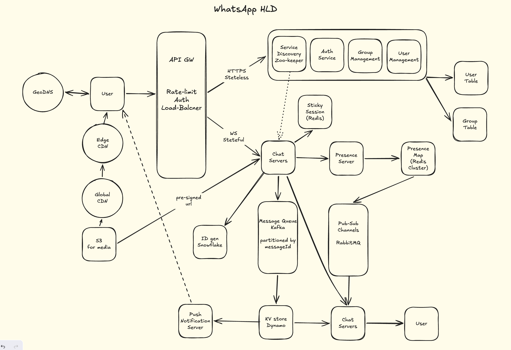

# WhatsApp — System Design

## Table of Contents
1. [Functional Requirements](#1-functional-requirements)
2. [Non-Functional Requirements](#2-non-functional-requirements)
3. [Back-of-Envelope Estimation](#3-back-of-envelope-estimation)
4. [High-Level Architecture](#4-high-level-architecture)
5. [Core Workflows](#5-core-workflows)
6. [Key Design Decisions](#6-key-design-decisions)
7. [Q&A — Interview Style](#7-qa--interview-style)
8. [Important Keywords](#8-important-keywords)
9. [Quick-Reference: NFRs to State Upfront](#9-quick-reference-nfrs-to-state-upfront)
10. [Concepts Checklist](#10-concepts-checklist)

---

## 1. Functional Requirements

### In Scope
- 1:1 real-time messaging (text, up to 64KB per message)
- Group chat (up to 1000 members per group)
- Media attachments — images, videos, documents (up to 100MB per file)
- Online presence and last-seen status
- Push notifications for offline users
- Message delivery receipts (single tick = server received, double tick = device received)
- WhatsApp delivery model: messages stored on server only until delivered, then deleted

### Out of Scope
- Live streaming / real-time video calls — separate media pipeline, out of scope for this design
- Message editing / deletion after send — adds significant versioning complexity, descoped
- End-to-end encryption internals — Signal Protocol is assumed, not designed here
- Backup / message history restore — WhatsApp delegates this to Google Drive / iCloud
- Read receipts (blue ticks) — extension of delivery receipts, straightforward addition, descoped for focus

---

## 2. Non-Functional Requirements

| Requirement | Target |
|---|---|
| Availability | 99.99% (~52 min downtime/year) |
| Message delivery latency | p99 < 500ms end-to-end (sender device → recipient device) |
| Media upload SLO | < 1 second (pre-signed URL generation + S3 write initiation) |
| Presence update latency | 1–2 seconds (online/offline propagation to subscribers) |
| Offline detection threshold | 20 seconds (heartbeat timeout) |
| Message durability | Zero loss — messages survive server crashes before delivery ACK |
| Peak throughput | 600K msg/sec |
| Media TTL | 30 days on CDN/S3 |
| Group size limit | 1000 members |
| Media size limit | 100MB per file |

### Key Consistency Decisions
- **Message delivery**: at-least-once at transport layer + idempotency key = effectively-once at application layer
- **Presence**: eventual consistency acceptable — skipped heartbeats are tolerable, 1–2s staleness is fine
- **Message ordering**: per-conversation ordering guaranteed via Snowflake IDs (monotonically increasing)
- **Storage model**: WhatsApp model — Dynamo is a temporary buffer, not permanent store; client device is source of truth for message history

---

## 3. Back-of-Envelope Estimation

**Given:**
- Registered users: 2 billion
- DAU: 500 million
- Messages per user per day: 40
- Average message size (text): ~70 bytes
- Media messages: ~10% of total
- Average media size: 1MB

**Write QPS (messages):**
```
Total messages/day = 500M DAU × 40 msg/day = 20B messages/day
Average QPS        = 20B / 86,400s          ≈ 231K msg/sec
Peak QPS           = 231K × 3               ≈ 600K msg/sec
```

**Bandwidth (text path):**
```
Peak bandwidth = 600K msg/sec × 70 bytes ≈ 42 MB/sec on chat servers
```

**Bandwidth (media path):**
```
Media messages/sec = 600K × 10%          = 60K media/sec
Media CDN bandwidth = 60K × 1MB          = 60 GB/sec peak on CDN
```

**Storage (temporary — WhatsApp model):**
```
Assume avg offline window = 2 hours
Messages buffered = 231K/sec × 7,200s   ≈ 1.66B messages at any time
Storage           = 1.66B × 70 bytes    ≈ 116 GB in Dynamo at peak
(Deleted after delivery — not permanent storage)
```

**DynamoDB partition capacity check:**
```
Dynamo partition capacity = ~1,000 WCU/sec
Partitions needed (avg)   = 200K / 1000 = 200 partitions minimum
Partitions needed (peak)  = 600K / 1000 = 600 partitions minimum
→ Use on-demand mode to auto-scale; consider Kafka as write buffer for spike absorption
```

---

## 4. High-Level Architecture



### Component Legend

| Component | Technology | Reason |
|---|---|---|
| GeoDNS | Route53 / NS1 | Routes users to nearest healthy region; regional failover |
| API Gateway | Nginx / Envoy | Rate limiting, auth, load balancing — stateless HTTP |
| Chat Servers | Custom (Go/Erlang) | Stateful WebSocket connections; one persistent connection per user |
| Sticky Session | Redis | Maps userId → chatServerId for gRPC routing to correct server |
| Service Discovery | Zookeeper | Ephemeral nodes track live chat servers; triggers cleanup on crash |
| Message Store | DynamoDB (on-demand) | Low-latency KV store; temporary buffer; auto-scales partitions |
| Group Fan-out | Kafka | Topic-per-group pub-sub; exactly-once delivery; high throughput |
| Presence Pub-Sub | RabbitMQ | Lightweight heartbeat fan-out; best-effort, fire-and-forget |
| Presence Map | Redis Cluster | userId → last_seen_timestamp; microsecond reads |
| Media Store | S3 | Blob storage for media; pre-signed URL pattern bypasses chat servers |
| Edge CDN | CloudFront (regional) | Pull-through caching; serves media from nearest PoP |
| Global CDN | CloudFront (global) | Origin CDN; Edge CDN pulls from here on cache miss |
| Push Notifications | APNs / FCM | Offline user notifications; same signal as WebSocket but via OS |
| ID Generation | Snowflake | Distributed monotonically increasing IDs; guarantees message ordering |

---

## 5. Core Workflows

### 5.1 — 1:1 Message Delivery (Online Recipient)

```
Sender → Chat Server A → DynamoDB (PENDING) → ACK sender
                       → Redis lookup: "which server is recipient on?"
                       → gRPC to Chat Server B
                       → Chat Server B → Recipient device via WebSocket
                       → Chat Server B ACKs back
                       → DynamoDB: mark DELIVERED (or delete)
```

**Step-by-step:**

1. Sender sends message over WebSocket to Chat Server A
2. Chat Server A generates a Snowflake ID for the message
3. **Atomic write to DynamoDB** with status = `PENDING` — this is the outbox entry. ACK is sent to sender (single tick) only after this write succeeds
4. Chat Server A queries **Redis sticky session**: `GET session:{recipientId}` → returns `chatServerB`
5. Chat Server A makes a **gRPC call to Chat Server B**
6. Chat Server B delivers to recipient's WebSocket connection
7. Recipient device persists message and sends ACK back to Chat Server B
8. Chat Server B ACKs Chat Server A → **DynamoDB record updated to `DELIVERED`** (or deleted)
9. Sender's client receives double tick

> **Why write to DynamoDB before attempting gRPC?**
> This is the outbox pattern. If Chat Server A crashes after writing to Dynamo but before gRPC delivery, a retry worker can pick up all `PENDING` messages past a threshold and re-attempt. Without this write-first ordering, a crash = message loss.

> **Why delete after ACK, never by time alone?**
> Cron-based deletion risks deleting a message that was written as delivered but never actually reached the device (network blip between Chat Server B and the device). The client's last-ACK-messageId is the true delivery confirmation.

**Failure safety:**

| Failure point | Recovery |
|---|---|
| Chat Server A crashes after Dynamo write | Retry worker finds PENDING record, re-attempts via new server |
| gRPC times out (Chat Server B dead) | Zookeeper detects crash, cleans Redis sticky session, retry worker routes to new server |
| Device crashes before client ACK | Client persists lastAckedMessageId; on reconnect, fetches all messages since that ID from Dynamo |
| DynamoDB write fails | Chat Server A does not ACK sender; sender retries |

---

### 5.2 — 1:1 Message Delivery (Offline Recipient)

```
Sender → Chat Server A → DynamoDB (PENDING)
                       → Redis lookup: recipient offline (no session entry)
                       → Push Notification Server → APNs/FCM
                       → Recipient comes online → WebSocket reconnect → Zookeeper
                       → Client sends lastAckedMessageId to new Chat Server
                       → Chat Server queries DynamoDB: messageId > lastAckedMessageId
                       → Re-delivers all pending messages
                       → Client ACKs each → DynamoDB cleanup
```

> **Why is the client's lastAckedMessageId the source of truth?**
> In the WhatsApp model, the server deletes messages after delivery. If a message was "delivered" to a server but the device never confirmed receipt (app backgrounded, battery died), the client's local last-ACK timestamp catches this gap and triggers a re-fetch on next open.

---

### 5.3 — Group Message Delivery

```
Sender → Chat Server A → Kafka topic: group:{groupId}
                       → All chat servers subscribed to this topic consume the event
                       → Each consuming server fans out locally to connected group members via WebSocket
                       → For offline members: DynamoDB write (groupId + messageId)
                       → Offline members pull from DynamoDB on reconnect
```

**Step-by-step:**

1. Sender's Chat Server publishes one message to Kafka topic `group:{groupId}`
2. All chat servers that have at least one member of this group connected have **subscribed to this topic at connection time** (not per-user — one server-level subscription per topic)
3. Each subscribing chat server receives the event and fans out locally to all connected group members via WebSocket — O(local members) not O(1000)
4. A Dynamo consumer also reads from Kafka and writes one record per offline member
5. Offline members pull undelivered messages from DynamoDB on reconnect using lastAckedMessageId

> **Why topic-per-group and not per-user?**
> Per-user topics would mean 1000 separate Kafka publishes per group message (O(N) fan-out at the sender's server). Topic-per-group means one publish; the fan-out happens at the consumer layer where it's parallelized across chat servers.

> **Why not gRPC fan-out for groups?**
> A 1000-member group with members spread across 400 chat servers would require 400 synchronous gRPC calls from the sender's server. At 600K msg/sec with large groups, this is O(N×M) work on the hot path — not acceptable.

> **Single-flight for viral group media:**
> When many members of a group on the same chat server request the same media URL simultaneously, the server collapses all requests into one CDN fetch and broadcasts the result to all waiters. Prevents thundering herd on the CDN for popular group media.

---

### 5.4 — Media Upload & Delivery

```
Client → Chat Server → Pre-signed S3 URL (generated, returned to client)
Client → S3 directly (upload, bypasses chat servers entirely)
Message payload contains CDN URL only (not bytes)
S3 → triggers replication to Global CDN
Recipient requests media URL → hits Edge CDN
Edge CDN miss → pulls from Global CDN (pull-through caching)
After 30 days → S3/CDN object expires → URL becomes dead link
(Client has already downloaded and stored locally on first view)
```

> **Why pre-signed URLs?**
> Chat servers handle 600K msg/sec of text. If media bytes also flowed through chat servers, you'd need 60 GB/sec of additional bandwidth on the chat tier. Pre-signed URLs offload media entirely to S3 and CDN, keeping chat servers lean.

> **Why lazy CDN propagation (pull-through) vs push?**
> Push (eager replication to all edge nodes) wastes bandwidth for media that most users never request. Pull-through only fetches media to a regional Edge CDN when a user in that region actually requests it — far more efficient for WhatsApp's global, sparse access patterns.

---

### 5.5 — Presence Update Flow

```
User device → heartbeat every 5s → Chat Server → Presence Server
Presence Server → write last_seen_timestamp to Redis Cluster
Presence Server → publish event to RabbitMQ topic: presence:{userId}
Chat servers monitoring this user → subscribed to RabbitMQ topic → push update to watching clients

On heartbeat timeout (20s):
Presence Server detects stale timestamp → marks user OFFLINE in Redis
Presence Server closes RabbitMQ topic for this user
Watching clients receive no further events → client marks user offline
```

> **Why RabbitMQ for presence and Kafka for messages?**
> Presence events are fire-and-forget — a skipped heartbeat is tolerable since the next one arrives in ~5 seconds. RabbitMQ excels at low-latency transient fan-out. Messages cannot be skipped — exactly-once delivery is required. Kafka's durable offset-based model is the right tool for that contract.

> **Why a separate Presence Server and not the Chat Server?**
> Presence logic (timeout detection, Redis writes, pub-sub fan-out) is a distinct concern from message routing. Separating it allows independent scaling — presence is read-heavy (many users watching few users), while messaging is write-heavy.

---

### 5.6 — Chat Server Crash Recovery

```
Chat Server X crashes
→ Zookeeper detects via expired ephemeral node
→ Zookeeper triggers cleanup: removes all Redis sticky session entries for Server X
→ Connected clients detect WebSocket drop → exponential backoff reconnect
→ Client reconnects → API GW → Zookeeper (service discovery) → healthy Chat Server Y
→ Client sends lastAckedMessageId to Chat Server Y
→ Chat Server Y queries DynamoDB: all messages where toUserId = me AND messageId > lastAckedMessageId
→ Re-delivers pending messages
→ Outbox retry worker also detects failed gRPC calls to dead server → retries via new server mapping
```

---

## 6. Key Design Decisions

### 6.1 — WhatsApp Model vs Instagram Model

| Property | WhatsApp Model | Instagram Model |
|---|---|---|
| Message storage | Temporary — delete after delivery | Permanent — never delete |
| Source of truth | Client device | Server DB |
| DB scaling | Not a primary concern (small buffer) | Primary concern (all messages forever) |
| Chat server state | Stateful (sticky sessions needed) | Stateless (no sticky sessions needed) |
| Delivery path (online) | gRPC direct → fast | Always via DB → slightly slower |
| Delivery path (offline) | Dynamo buffer → pull on reconnect | Same |
| WebSocket role | Carries full message payload | Carries signal only ("fetch new messages") |
| Latency | Lower (~50–150ms) | Higher (~150–300ms) |
| Complexity | Higher (outbox, sticky sessions) | Lower (stateless, one write path) |

**Verdict:** WhatsApp model chosen. Optimizes for latency and storage cost at the expense of architectural complexity. Appropriate for a primary-mobile, latency-sensitive product.

---

### 6.2 — Kafka vs Dynamo-as-Outbox for 1:1 Offline Delivery

| Property | Server → Kafka → Dynamo | Server → Dynamo (outbox) |
|---|---|---|
| Components | Chat Server + Kafka + Consumer + Dynamo | Chat Server + Dynamo |
| Write latency | Two hops (Kafka + Dynamo) | One hop (Dynamo) |
| Spike absorption | Kafka absorbs bursts before hitting Dynamo | Dynamo on-demand mode handles spikes |
| Ordering | Kafka partition ordering | Snowflake ID ordering in Dynamo |
| Failure modes | Kafka consumer lag, offset management | Dynamo write failure (rare) |
| Operational cost | Higher (Kafka cluster) | Lower |
| When Kafka wins | Unpredictable viral spikes, pre-provisioned Dynamo | — |

**Verdict:** Dynamo-as-outbox for 1:1 path. Kafka reserved for group fan-out where it genuinely earns its place. If traffic spikes are severe and unpredictable, Kafka as a write buffer in front of Dynamo is justified — not for ordering, purely for spike absorption.

---

### 6.3 — Partition Key for Message Store

| Option | Partition Key | Tradeoff |
|---|---|---|
| By messageId | messageId | Even distribution, but can't efficiently query "all messages for user X" |
| By recipientId | toUserId | Query-efficient for recipient fetch; hot partition risk if one user gets spammed |
| By recipientId + date | toUserId + date | Avoids hot partition; adds query complexity |

**Verdict:** Partition key = `toUserId`, sort key = `messageId` (Snowflake). This enables the core query pattern: "give me all messages for user X with messageId > lastAckedMessageId" as an efficient range scan. Hot partition risk is mitigated by Dynamo's on-demand mode and the temporary nature of stored messages.

---

### 6.4 — Group Fan-out Strategy

| Option | Approach | Tradeoff |
|---|---|---|
| O(N) gRPC | Sender's server calls all N recipient servers | Simple, but O(N×M) work at scale; blocks sender's server |
| Topic-per-group Kafka | One publish; consumer servers fan out locally | One network hop from publisher; server-level subscription multiplexing |
| Topic-per-user | Publish to each member's topic | Isolated per user, but O(N) publishes per message |

**Verdict:** Topic-per-group Kafka. One publish per message. Chat servers subscribe at the server level (not per-user), so a server with 50 members of the same group holds one subscription. Multiplexing is the key efficiency gain.

---

### 6.5 — Presence: RabbitMQ vs Kafka

| Property | RabbitMQ | Kafka |
|---|---|---|
| Delivery guarantee | Best-effort | At-least-once / exactly-once |
| Latency | Very low (~1ms) | Low (~5–10ms) |
| Persistence | Optional, short-lived | Durable, replayed |
| Fan-out pattern | Native pub-sub with routing keys | Consumer groups + topic subscriptions |
| Right for presence? | Yes — skipped heartbeat is tolerable | Overkill — durability not needed |

**Verdict:** RabbitMQ for presence. Kafka for messages. Different delivery contracts; don't conflate them.

---

## 7. Q&A — Interview Style

### Q1 — Clarifying Questions

**Question:** What clarifying questions do you ask before designing the system?

**Answer:** Start with scale: registered users (2B), DAU (500M), geographic reach (global). Then features: 1:1 and group chat (max group size?), media support (types, size limits), text message size limit, online presence and last-seen, push notifications. Most critically: ask about the delivery model — WhatsApp (server stores until delivered, then deletes) vs Instagram (permanent store). This single question changes your entire storage and DB scaling strategy. Also confirm primary client (mobile with web support).

---

### Q2 — NFRs

**Question:** State your non-functional requirements with concrete SLOs before touching the architecture.

**Answer:** Availability 99.99% (~52 min/year). Message delivery p99 < 500ms end-to-end. Media upload < 1 second. Presence update 1–2 seconds. Offline detection at 20 seconds. Zero message loss (messages survive server crashes before ACK). Peak 600K msg/sec. These SLOs must be stated before any architecture begins — they justify every component choice that follows.

---

### Q3 — Back-of-Envelope

**Question:** Estimate messages per second and bandwidth at peak load.

**Answer:** 500M DAU × 40 msg/day = 20B/day ÷ 86,400s ≈ 231K avg QPS. Peak = 3× = 600K msg/sec. Text bandwidth: 600K × 70B ≈ 42 MB/sec on chat servers. Media: 60K media/sec × 1MB = 60 GB/sec on CDN — separate path entirely. This separation justifies keeping media off chat servers via pre-signed URLs.

---

### Q4 — Dynamo Schema

**Question:** How do you model messages in DynamoDB for 1:1 and group chat?

**Answer:**
- 1:1: partition key = `toUserId`, sort key = `messageId` (Snowflake). Fields: messageId, content, fromUserId, toUserId, timestamp, attachmentLink, status (PENDING/DELIVERED). Core query: `toUserId = me AND messageId > lastAckedMessageId` — efficient range scan.
- Group: partition key = `groupId`, sort key = `messageId`. Fields: groupId, messageId, content, sentBy, timestamp, attachmentLink.
- Sent history lives on the client device — never queried from DB in the WhatsApp model.
- Cleanup: delete only after explicit delivery ACK, never by time alone. A retry worker scans for PENDING records past a threshold to catch failures.

*Follow-up — What's the risk with time-based deletion?*
Cron-based deletion risks removing a message marked as delivered by the server but never confirmed by the device (network blip, device crash). Delete only on explicit ACK. Use client's lastAckedMessageId as the true delivery confirmation.

---

### Q5 — Snowflake ID Internals

**Question:** How does Snowflake ID guarantee chronological ordering across distributed servers?

**Answer:** A Snowflake ID is a 64-bit integer: 41 bits for millisecond timestamp (~69 years from epoch), 10 bits for machine/node ID (1024 nodes), 12 bits for per-millisecond sequence counter (4096 IDs per node per ms). Timestamp in the most significant bits means IDs sort chronologically as integers. Within the same millisecond on the same node, the sequence counter ensures uniqueness. Clock skew is the main risk — mitigated by NTP and by blocking ID generation if the clock moves backward.

---

### Q6 — Kafka vs RabbitMQ

**Question:** You have both Kafka and RabbitMQ. What is each doing and why not just one?

**Answer:** Kafka handles group message fan-out and offline message buffering — exactly-once delivery is required, message loss is unacceptable. RabbitMQ handles presence pub-sub — heartbeat events are fire-and-forget, a skipped heartbeat is tolerable since the next arrives in ~5 seconds. These are fundamentally different delivery contracts: durable exactly-once (Kafka) vs best-effort real-time (RabbitMQ). Using Kafka for presence is overkill; using RabbitMQ for messages is unsafe.

---

### Q7 — Delivery Failure & Outbox Pattern

**Question:** Chat Server A finds Chat Server B's address and makes a gRPC call. Server B crashes mid-flight. How do you guarantee the message isn't lost?

**Answer:** Transactional outbox pattern: when a message arrives, atomically write to DynamoDB with status = PENDING. ACK the sender. Attempt gRPC delivery to Chat Server B. On success, Chat Server B ACKs back, outbox entry marked DELIVERED or deleted. If gRPC times out, a retry worker polls for PENDING records past a threshold and retries — either to a new server (Zookeeper has cleaned up the sticky session) or via the offline path. Chat Server B checks messageId idempotency in Redis before forwarding to prevent double delivery on retry.

*Follow-up — What if the outbox delete fails after successful gRPC delivery?*
The retry worker re-sends the message. Chat Server B receives a duplicate but the Redis idempotency check on messageId drops it before it reaches the client. At-least-once transport + idempotency = effectively-once at the application layer. The Redis idempotency store needs a TTL matching the maximum retry window.

---

### Q8 — End-to-End Delivery Guarantee

**Question:** Server B delivered to the device. The device never ACKed — phone died mid-delivery. How do you prevent message loss?

**Answer:** The client is the source of truth for delivery state. On every successful message receipt, the client persists lastAckedMessageId locally on device. On reconnect after any interruption, the client sends its lastAckedMessageId to the server. The server queries DynamoDB for all messages with messageId > lastAckedMessageId and re-delivers. This maps directly to WhatsApp's tick system: single tick = server received (outbox write ACK), double tick = device received and client persisted the ACK.

---

### Q9 — Group Message Fan-out

**Question:** A user sends a message to a 1000-member group. How does it reach all members?

**Answer:** Publish one message to a Kafka topic `group:{groupId}`. Chat servers subscribe to group topics at the server level — when any user connects, the server subscribes to all groups that user belongs to asynchronously. One subscription per (server, group) pair regardless of how many group members are connected to that server. Consuming servers fan out locally to connected members via WebSocket. For offline members, a Dynamo consumer writes one record per offline member keyed by (groupId, messageId). For viral group media, apply single-flight request collapsing — one CDN fetch per server, broadcast to all waiting members.

*Follow-up — When does a chat server subscribe to a group topic?*
At the time a user establishes a WebSocket connection, the server subscribes asynchronously to all groups that user belongs to. Server-level multiplexing means a server with 50 members of GroupA holds one subscription — not 50. Subscription count scales with (server, group) pairs, not (user, group) pairs.

---

### Q10 — Media Upload Flow

**Question:** User A sends a video to User B. Walk through the exact media flow.

**Answer:** Client requests a pre-signed S3 URL from the chat server. Chat server generates and returns the URL without touching media bytes. Client uploads directly to S3 — bypasses chat servers entirely, critical for not saturating them with 60 GB/sec of media bandwidth. The message payload contains only the CDN URL. S3 triggers replication to Global CDN. Recipient requests the URL → hits regional Edge CDN. On cache miss, Edge CDN pulls from Global CDN (pull-through caching). Media has 30-day TTL on S3/CDN. Clients download and store locally on first view — after TTL expiry the URL is dead but the local copy persists. For viral group media, single-flight collapsing prevents thundering herd on the CDN.

---

### Q11 — Presence End-to-End

**Question:** User A sees User B is online. How does that work end to end?

**Answer:** Both clients send heartbeats every ~5 seconds to their chat servers. Chat servers forward to the Presence Service, which writes last_seen_timestamp to Redis Cluster and publishes to a RabbitMQ topic `presence:{userId}`. User A's chat server subscribes to User B's presence topic and pushes updates to User A's client via WebSocket. If User B's phone dies, heartbeats stop. After 20 seconds, the Presence Service detects the stale timestamp, marks User B offline in Redis, closes the RabbitMQ topic. User A's server receives no further events; client transitions User B to offline. For last-seen, User A's server queries Redis directly for User B's last_seen_timestamp.

---

### Q12 — Chat Server Crash Recovery

**Question:** A chat server crashes. What happens to all connected users?

**Answer:** WebSocket connections drop immediately. Clients detect disconnect and initiate exponential backoff reconnection. The request goes through Zookeeper (service discovery), which has already removed the dead server's ephemeral node and triggered cleanup of all Redis sticky session entries for that server. Client connects to a new healthy server, sends lastAckedMessageId, and receives all pending messages from DynamoDB. The outbox retry worker also detects failed gRPC calls to the dead server and re-routes via the new server mapping.

*Follow-up — Who cleans up stale Redis sticky session entries?*
Zookeeper detects the crash via ephemeral node expiry (crashed server stops sending keepalives). Zookeeper's watch mechanism triggers a cleanup handler that invalidates all Redis sticky session entries pointing to the dead server. Without this, the outbox retry worker continuously times out on stale entries before falling back.

---

### Q13 — GeoDNS

**Question:** Why GeoDNS at the entry point instead of a regular load balancer?

**Answer:** A regular load balancer distributes traffic within a single region — it can't route across regions. GeoDNS operates at the DNS layer and routes users to the nearest healthy regional API Gateway based on IP geolocation. Two purposes: latency optimization (Bangalore user hits Mumbai region, not us-east-1) and regional failover (entire region goes down, GeoDNS TTL-based update redirects to next nearest healthy region). GeoDNS for regional routing + LB within each region = two-tier routing handling both performance and disaster recovery at global scale.

---

### Q14 — DynamoDB Write Capacity at Scale

**Question:** You have 200K average QPS writes to DynamoDB. Will 20–50 partitions be enough?

**Answer:** No. A DynamoDB partition handles ~1,000 WCU/sec. At average 200K msg/sec you need 200 partitions minimum; at peak 600K you need 600. With 20–50 partitions you're 4–12x short. Solution: use on-demand mode and let AWS auto-scale partitions. Traffic is spiky (3× average) so pre-provisioning for peak wastes 70% of capacity most of the time. If traffic spikes are severe and unpredictable (viral events), Kafka as a write buffer in front of DynamoDB absorbs bursts and lets Dynamo consume at its own pace — not for ordering, purely for spike absorption.

---

## 8. Important Keywords

### Delivery & Reliability
- **Transactional outbox pattern** | In this system: writing a message to DynamoDB with status=PENDING before attempting gRPC delivery, so a retry worker can recover any undelivered message after a server crash. The DB write happens in the same atomic operation as the sender ACK.
- **Idempotency key** | In this system: messageId (Snowflake ID) checked in Redis on Chat Server B before forwarding to the client. Ensures a retried message from the outbox worker is dropped as a duplicate, not delivered twice.
- **At-least-once + idempotency = effectively-once** | The standard pattern in this system: transport layer guarantees at-least-once (retry on failure), application layer enforces exactly-once via idempotency check.
- **lastAckedMessageId** | The client-side cursor that marks the last message the device successfully persisted. On reconnect, the server queries DynamoDB for everything after this ID. The source of truth for end-to-end delivery.
- **Single tick / double tick** | Single tick = server received and wrote to DynamoDB (outbox ACK). Double tick = device received and client persisted lastAckedMessageId. Maps directly to the delivery guarantee chain.

### Messaging & Fan-out
- **Topic-per-group** | In this system: each WhatsApp group has one Kafka topic. The sender publishes once; all chat servers with connected members subscribe and fan out locally. O(1) publishes vs O(N) gRPC calls.
- **Server-level subscription multiplexing** | Chat servers subscribe to group Kafka topics once per (server, group) pair, not per user. A server with 50 members of GroupA holds one subscription. Key efficiency in group fan-out.
- **Single-flight / request collapsing** | In this system: when multiple members on the same chat server request the same group media URL simultaneously, the server collapses into one CDN fetch and broadcasts to all waiters. Prevents CDN thundering herd for viral group media.
- **FunXMPP** | WhatsApp's binary-compressed variant of XMPP. Compresses XML tokens into byte sequences — a typical message shrinks from ~80 bytes to ~20 bytes. Used in the real WhatsApp, not in this design but worth knowing.

### Storage & Data Model
- **WhatsApp model** | Server stores messages only until delivery is confirmed, then deletes. Client device is the permanent store. Contrasts with Instagram model (server as permanent store). Drives the temporary-buffer nature of DynamoDB in this design.
- **DynamoDB on-demand mode** | Auto-scales partitions to handle traffic spikes without pre-provisioning. Critical for this system where peak QPS (600K) is 3× average — pre-provisioning for peak wastes capacity 70% of the time.
- **Snowflake ID** | 64-bit: 41 bits timestamp + 10 bits node ID + 12 bits sequence counter. Monotonically increasing → messages naturally sort chronologically. 4096 unique IDs per node per millisecond. Used as sort key in DynamoDB for efficient range scans.

### Presence & Routing
- **Sticky session** | Redis mapping of userId → chatServerId. Enables Chat Server A to find which server Chat Server B's recipient is connected to for gRPC routing. Cleaned up by Zookeeper on server crash.
- **Ephemeral node (Zookeeper)** | A Zookeeper node that auto-expires when the registering server stops sending keepalives. Used to detect chat server crashes and trigger Redis sticky session cleanup.
- **Heartbeat timeout** | In this system: 20 seconds. If a user's last_seen_timestamp in Redis hasn't updated within this window, the Presence Service marks them offline and closes their RabbitMQ presence topic.
- **Presence Map (Redis Cluster)** | userId → last_seen_timestamp. Written by the Presence Service on every heartbeat. Read directly for last-seen queries. Sharded across a Redis Cluster for scale.

### Media & CDN
- **Pre-signed URL** | S3-generated time-limited URL that allows the client to upload directly to S3 without routing bytes through chat servers. Critical for keeping the 60 GB/sec media bandwidth off the chat tier.
- **Pull-through caching (CDN)** | Edge CDN fetches media from Global CDN only when a user in that region first requests it. Lazy propagation — far more efficient than eager push replication for WhatsApp's sparse global access patterns.
- **Media TTL** | 30 days on S3/CDN. After expiry the URL in the message becomes a dead link. Mitigated by clients downloading and storing media locally on first view — consistent with the WhatsApp model (device as source of truth).

### Architecture Patterns
- **GeoDNS** | DNS-layer routing that directs users to the nearest healthy regional API Gateway based on IP geolocation. Provides both latency optimization (nearest region) and regional failover (dead region → next nearest).
- **Two-tier routing** | GeoDNS (cross-region) + Load Balancer (within region). Handles both global performance and intra-region distribution.
- **Signal + fetch pattern** | Instagram model's delivery approach: WebSocket carries only a lightweight "new message available" signal; client fetches actual messages from DB. Enables stateless chat servers at the cost of one extra DB read per delivery.

---

## 9. Quick-Reference: NFRs to State Upfront

```
Availability         → 99.99%   (~52 min downtime/year)
Message delivery     → p99 < 500ms  (sender device → recipient device, end-to-end)
Media upload SLO     → < 1s     (pre-signed URL generation + S3 write initiation)
Presence update      → 1–2s     (online/offline propagation to all subscribers)
Offline detection    → 20s      (heartbeat timeout threshold in Presence Service)
Message durability   → zero loss (survive server crashes before delivery ACK)
Peak throughput      → 600K msg/sec  (3× average QPS, 500M DAU × 40 msg/day)
Group size limit     → 1000 members per group
Media size limit     → 100MB per file; 64KB for text messages
Media TTL            → 30 days on CDN/S3  (client downloads locally on first view)
Storage model        → WhatsApp model: temporary buffer only, delete after delivery ACK
```

---

## 10. Concepts Checklist

- [ ] WhatsApp model vs Instagram model — delivery semantics and storage implications
- [ ] Client as source of truth — lastAckedMessageId for end-to-end delivery guarantee
- [ ] Transactional outbox pattern — write-first ordering for crash-safe delivery
- [ ] Idempotency key on messageId — exactly-once at application layer
- [ ] At-least-once + idempotency = effectively-once
- [ ] Snowflake ID — bit layout, monotonic ordering, clock skew handling
- [ ] DynamoDB schema — partition key by recipientId, sort key by messageId (Snowflake)
- [ ] DynamoDB on-demand mode — auto-scaling partitions for spiky workloads
- [ ] Kafka for group fan-out — topic-per-group, server-level subscription multiplexing
- [ ] RabbitMQ for presence — best-effort, fire-and-forget, low-latency
- [ ] Kafka vs RabbitMQ — different delivery contracts, not interchangeable
- [ ] Kafka as spike buffer — justified for unpredictable write spikes, not for ordering
- [ ] Single-flight / request collapsing — thundering herd prevention for viral group media
- [ ] Pre-signed S3 URL — offload media bytes from chat servers
- [ ] Pull-through CDN caching — lazy propagation for sparse global media access
- [ ] Media TTL + local client storage — 30-day expiry, device as permanent media store
- [ ] Sticky session in Redis — userId → chatServerId for gRPC routing
- [ ] Zookeeper ephemeral nodes — crash detection + Redis cleanup trigger
- [ ] Presence Service — heartbeat → Redis write + RabbitMQ publish pipeline
- [ ] Heartbeat timeout (20s) — offline detection threshold
- [ ] GeoDNS — DNS-layer regional routing + failover
- [ ] Two-tier routing — GeoDNS (cross-region) + LB (within region)
- [ ] Signal + fetch pattern — Instagram model's stateless chat server approach
- [ ] Real WhatsApp stack — Ejabberd + Mnesia + BEAM (Erlang) — Mnesia as co-located routing table + message queue, eliminating need for Kafka