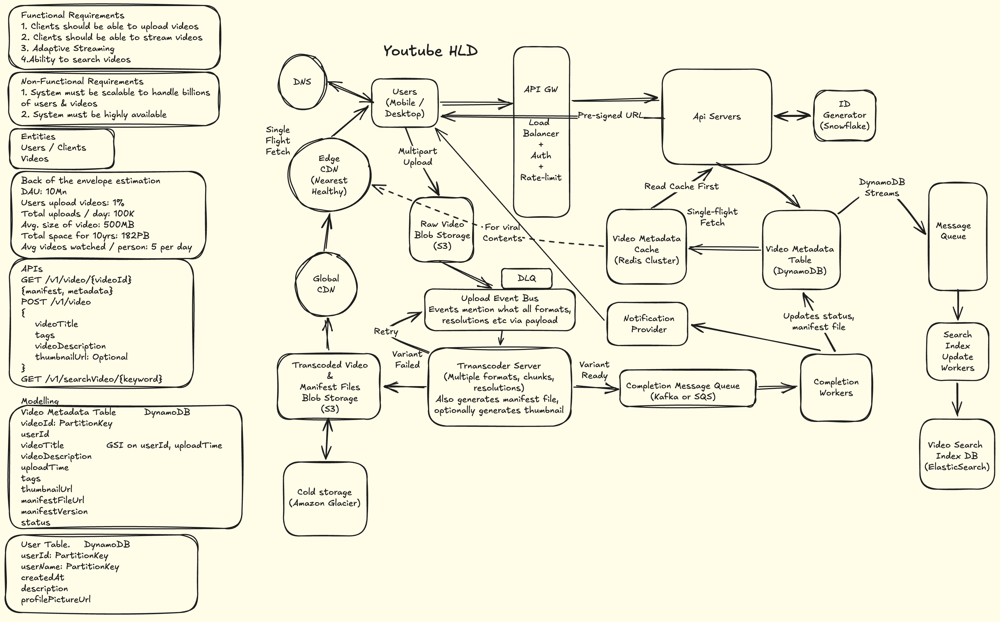

# YouTube — System Design

## Table of Contents
1. [Functional Requirements](#1-functional-requirements)
2. [Non-Functional Requirements](#2-non-functional-requirements)
3. [Back-of-Envelope Estimation](#3-back-of-envelope-estimation)
4. [High-Level Architecture](#4-high-level-architecture)
5. [Core Workflows](#5-core-workflows)
6. [Key Design Decisions](#6-key-design-decisions)
7. [Q&A — Interview Style](#7-qa--interview-style)
8. [Important Keywords](#8-important-keywords)
9. [Quick-Reference: NFRs to State Upfront](#9-quick-reference-nfrs-to-state-upfront)
10. [Concepts Checklist](#10-concepts-checklist)

---

## 1. Functional Requirements

### In Scope
- Users can upload videos (up to 10 GB per video)
- System transcodes uploaded videos into multiple resolutions (240p, 480p, 720p, 1080p, 4K) and formats
- Adaptive bitrate streaming — client selects resolution based on network condition
- Users can search for videos by title, description, and tags
- Each user has one channel
- Engagement: views, likes, comments, subscriber counts
- Video status tracking — VIDEO_UPLOADING → VIDEO_PROCESSING → VIDEO_PROCESSED
- Thumbnail generation (optional, during transcoding)
- Cold storage tiering for old/unpopular videos

### Out of Scope
- Recommendations and personalized feed (requires separate ML pipeline)
- Payments and monetisation (separate billing system)
- Ads serving (separate ad platform)
- Live streaming (separate real-time pipeline)
- Multiple channels per user
- Comments moderation / hate speech detection

---

## 2. Non-Functional Requirements

| Requirement | Target |
|---|---|
| Availability | 99.99% (~52 min downtime/year) |
| Durability | 99.999999999% (11 nines) — no video loss after upload confirmed |
| Upload confirmation latency | < 5s to receive pre-signed URL |
| Transcode SLA p90 | < 5 min for 1080p |
| Transcode SLA p99 | < 15 min |
| Playback start time p90 | < 1s (first chunk delivered) |
| Playback start time p99 | < 3s |
| Search lag | < 30s from publish to searchable |
| Consistency model | Eventual — views, likes, comments, search index, subscriber count |
| Peak stream egress | ~75 Gbps via CDN |
| Peak upload RPS | 15 uploads/sec |
| Peak stream RPS | 75K concurrent streams |

### Key Consistency Decisions
- **Video metadata** (title, description, status) — strong consistency required. Reads after write must reflect latest state. DynamoDB with consistent reads.
- **Engagement counts** (views, likes, subscribers) — eventual consistency acceptable. 30-second aggregation window via Flink. Approximate display (e.g., "5.1M views") masks lag.
- **Search index** — eventual consistency acceptable. DynamoDB Streams → Elasticsearch with ~30s propagation delay.
- **Transcode state** — strong consistency required per resolution. DynamoDB outbox table as source of truth.

---

## 3. Back-of-Envelope Estimation

### Given
- 500M DAU, 1.5B total registered users
- Users watch 5 videos/day on average
- 500K video uploads/day
- Average raw video size: 500 MB
- Transcoded storage multiplier: 0.5× (multiple resolutions + compression nets out below raw)
- 10-year retention horizon
- Average streaming resolution: 720p at 2 MB per 2-second chunk

### Read QPS (stream requests)
```
Average stream QPS  = 500M × 5 / 100,000 sec     = 25,000 QPS
Peak stream QPS     = 25,000 × 3                  = 75,000 QPS
```

### Write QPS (uploads)
```
Average upload QPS  = 500,000 / 100,000 sec       = 5 QPS
Peak upload QPS     = 5 × 3                       = 15 QPS
```

### Storage
```
Raw video storage (10 years)
  = 500K uploads/day × 500 MB × 365 days × 10 years
  = 500K × 500MB × 3,650
  ≈ 912 PB raw

Transcoded storage
  = 912 PB × 0.5 (compression + multi-resolution factor)
  ≈ 450 PB

User DB
  = 1.5B users × 0.5 KB/user
  = 750 GB

Channel DB
  = 1.5B × 10% (assume 10% create channels) × 0.5 KB
  = 75 GB
```

### Bandwidth
```
Peak egress
  = 75,000 concurrent streams × (2 MB / 2 sec)
  = 75,000 × 1 MB/s
  = 75 GB/s = ~75 Gbps
```
→ CDN is mandatory. No origin can serve 75 Gbps directly.

---

## 4. High-Level Architecture

### Component Legend

| Component | Technology | Reason |
|---|---|---|
| API Gateway | Kong / AWS API GW | Auth, rate limiting, routing in one layer |
| Geo DNS | AWS Route53 / GeoDNS | Routes user to nearest healthy region |
| API Servers | Stateless horizontally scaled | Handle metadata CRUD, pre-signed URL generation |
| ID Generator | Snowflake | Time-ordered, globally unique video IDs without coordination |
| Raw Video Store | Amazon S3 | Durable blob storage, multipart upload support, pre-signed URLs |
| Transcoded Video Store | Amazon S3 | Separate bucket — different lifecycle policies, CDN-optimised |
| Video Metadata Table | DynamoDB | Key-value access by videoId, high write throughput, atomic updates |
| Video Metadata Cache | Redis Cluster | Sub-millisecond manifest + metadata reads for 75K RPS stream path |
| Upload Event Bus | Kafka (key=videoId) | Ordered, durable event delivery for transcode pipeline |
| Transcoder Server | Custom worker pool | Multi-resolution, multi-format, chunked transcoding with manifest generation |
| Resolution Outbox Table | DynamoDB | Per-resolution completion state — crash-safe retry source of truth |
| Completion Queue | Kafka / SQS | Signals downstream systems (metadata update, notification, search) |
| Global CDN | CloudFront / Fastly | Push-based — all transcoded content guaranteed available globally |
| Edge CDN | CloudFront edge | Pull-based — only popular content reaches edge, cost-efficient |
| Search Index | Elasticsearch | Inverted index on title, description, tags, channel name |
| Search Index Workers | Kafka consumers | Consume DynamoDB Streams, upsert ES documents |
| Flink | Apache Flink | Stateful stream processing — 30s tumbling window aggregation |
| Aggregated Counts DB | DynamoDB | High write throughput, atomic ADD for delta increments |
| Cold Storage | Amazon Glacier | Videos with < N views/month tiered down automatically |
| Notification Provider | Firebase / APNs / Email | Delivery of upload-complete notifications |

---

## 5. Core Workflows

### 5.1 Upload Path

1. User clicks upload → request hits **API Gateway** (auth + rate limit) → routed to **API Servers**
2. API server generates `videoId` via **Snowflake ID Generator** (time-ordered, globally unique)
3. API server creates a record in **Video Metadata Table** with status `VIDEO_UPLOADING`
4. API server generates a **pre-signed S3 URL** (TTL: 12–24 hours) and returns it to the client
   - *Why pre-signed URL?* Client uploads directly to S3 — bypasses API servers entirely, no bandwidth bottleneck at origin
5. Client performs **multipart upload** to S3 raw video bucket
   - Chunks sized dynamically (larger on fast connections, smaller on slow)
   - Failed chunks are retried individually — S3 preserves multipart state across retries
   - If pre-signed URL expires mid-upload → client requests URL refresh → retries only the failed chunk
6. On S3 upload completion, upload service publishes event to **Upload Event Bus** (Kafka, partitioned by `videoId`)
7. Kafka consumer reads the event → writes `VIDEO_PROCESSING` to DynamoDB
   - *Why Kafka for state transition?* Ordering guarantee via partition prevents race conditions from multiple writers
8. **Transcoder Server** picks up the event and begins transcoding:
   - Breaks video into chunks, processes multiple resolutions and formats in parallel
   - Writes per-resolution status to **Resolution Outbox Table** `(videoId, resolution, status)` as each completes
   - Generates manifest file (.m3u8 for HLS) with chunk locations
   - Optionally generates thumbnail
   - Progressive availability: 240p/480p can be served to users before 1080p/4K complete
9. Transcoded chunks + manifest written to **Transcoded Video S3** → pushed to **Global CDN**
10. On full completion, **Completion Queue** (Kafka) receives event → **Completion Workers**:
    - Update DynamoDB metadata to `VIDEO_PROCESSED` + write manifest URL
    - Invalidate Redis cache entry for this videoId
    - Send upload-complete notification via **Notification Provider**
    - DynamoDB Streams triggers **Search Index Workers** → upsert document in Elasticsearch

#### Failure Safety — Upload Path

| Failure Scenario | Recovery Mechanism |
|---|---|
| Client upload stalls / network drop | Client retries failed chunks individually via multipart. Pre-signed URL refresh if expired. |
| Transcoder crashes mid-job | Cron job polls Resolution Outbox every 5 min for stuck IN_PROGRESS jobs. Emits retry event with only pending resolutions. |
| Kafka consumer evicted (long transcode) | Offset committed early on job start. Retry owned by cron + outbox — not Kafka redelivery. |
| Completion Worker fails | Kafka at-least-once delivery. Completion write is idempotent on videoId. |
| S3 upload confirms but Kafka event lost | S3 event notification as backup trigger. DLQ catches failed events after retries exhausted. |

---

### 5.2 Stream / Read Path

1. User clicks play → **API Gateway** → **Playback Service**
2. Playback service checks **Redis Metadata Cache** for `videoId` (manifest URL + metadata)
   - Cache hit: returns manifest URL directly
   - Cache miss: reads from **DynamoDB** → populates cache → returns manifest URL
   - *Why single-flight fetch?* At 75K RPS, a cache miss storm on a viral video would collapse DynamoDB. Single-flight collapses N concurrent misses into 1 DB read.
3. Client receives manifest URL → fetches **.m3u8 manifest** from **Edge CDN**
   - Manifest contains ordered list of chunk URLs with resolution variants
4. Client performs **adaptive bitrate streaming (ABR)**:
   - Reads network bandwidth estimate + CDN chunk availability
   - Selects resolution tier dynamically (e.g., starts at 480p, upgrades to 1080p as buffer fills)
   - Downloads chunks sequentially from **Edge CDN**
   - If edge node doesn't have chunk → pulls from **Global CDN** → caches at edge for subsequent viewers

#### Failure Safety — Stream Path

| Failure Scenario | Recovery Mechanism |
|---|---|
| Edge CDN node down | Geo DNS + CDN health checks reroute to nearest healthy edge |
| Cache miss storm on viral video | Single-flight fetch collapses concurrent misses to 1 DB read |
| Chunk not at edge | CDN pull-through from Global CDN — transparent to client |
| Metadata DB overload | Redis cache absorbs >99% of read traffic at peak |

---

### 5.3 Search Path

1. User submits search query → **API Gateway** → **Search Service**
2. Search Service queries **Elasticsearch** with the query string
   - Elasticsearch performs tokenized, analyzed match over title, description, tags, channel name
   - Returns ranked results by relevance score (TF-IDF + BM25)
3. Search Service applies filtering (e.g., status = VIDEO_PROCESSED only), pagination, and optional re-ranking signals (view count, recency, channel authority)
4. Returns video metadata list to client

#### Index Update Flow (async)
- Creator publishes / edits video → DynamoDB write → **DynamoDB Streams** event
- **Search Index Workers** consume stream → upsert document in Elasticsearch by `videoId`
- Both INSERT and UPDATE operations fire streams — edits to title/tags propagate automatically
- Lag: < 30 seconds from publish to searchable (acceptable per NFRs)

---

### 5.4 Engagement Pipeline

1. User action (view, like, subscribe, comment) → **API Gateway** → **Engagement Service**
2. Engagement service publishes event to **Kafka** (partitioned by `videoId`)
3. Two parallel consumers:
   - **Individual event writer** → writes raw event to engagement DB (for deduplication — same user can't like twice)
   - **Apache Flink** stream processor:
     - 30-second tumbling window, partitioned by `videoId`
     - Aggregates delta counts per window (e.g., +1,240 views in 30s)
     - Writes delta to **Aggregated Counts DB** (DynamoDB) via atomic `ADD` operation
     - *Why 30s window?* YouTube shows approximate counts ("5.1M views") — 30s lag is imperceptible. Smaller windows increase compute cost with no user-visible benefit.
4. Aggregated counts synced to video metadata on read (or via cron for periodic refresh)

---

### 5.5 Video Deletion Flow

1. Creator deletes video → API server marks `status = DELETED` in DynamoDB
2. Redis cache entry for `videoId` invalidated immediately
3. DynamoDB Streams fires → Search Index Worker removes document from Elasticsearch
4. Async: CDN purge API called to evict chunks from all edge nodes
5. Async: Manifest file in S3 marked as deleted / access-denied

**Why layered?**  
- Immediate metadata invalidation ensures no new clients receive a manifest URL  
- CDN purge covers clients who request chunks directly via cached manifest URLs  
- Clients with locally cached manifests: manifest carries version/ETag — re-validation returns 404. Clients that never re-validate are covered by CDN chunk purge returning 404 on chunk requests.

---

## 6. Key Design Decisions

### 6.1 Transcode Retry — Kafka Redelivery vs Cron + Outbox

| Property | Kafka Redelivery (commit last) | Cron + Outbox (commit early) |
|---|---|---|
| Retry trigger | Kafka consumer group rebalance | Cron polls DynamoDB every 5 min |
| Long job handling | Fails — max.poll.interval.ms (5 min default) evicts consumer at 10–20 min transcode | Works — job lifecycle decoupled from Kafka liveness |
| Partial retry | Full re-transcode on every retry | Only pending resolutions retried via outbox delta |
| Complexity | Low | Medium — outbox table required |
| Recommended for | Short jobs (< 1 min) | Long jobs (transcoding, ML inference) |

**Verdict:** Cron + Outbox. Transcode jobs run 10–20 minutes — Kafka redelivery causes consumer group rebalances and duplicate full re-transcodes. The outbox table adds moderate complexity but enables precise partial retries and decouples job lifecycle from message broker liveness.

---

### 6.2 CDN Strategy — Push vs Pull

| Property | Push (proactive) | Pull (on-demand) |
|---|---|---|
| Content availability | Guaranteed — all content pre-loaded | Only content that has been requested |
| Cache hit rate | 100% at origin | Depends on popularity |
| Storage cost | High — all content at all edges | Low — only hot content cached |
| Best for | Global CDN tier (guarantees) | Edge CDN tier (cost optimisation) |

**Verdict:** Two-tier hybrid. Push to Global CDN on transcode completion for guaranteed availability. Pull to Edge CDN on-demand so only popular content occupies edge storage. Most viewers hit edge for popular videos; rare/old videos served from Global CDN with slightly higher latency.

---

### 6.3 Engagement Aggregation — DB Write Per Event vs Flink Window

| Property | Write per event to DB | Flink 30s tumbling window |
|---|---|---|
| Write throughput | 75K writes/sec to DB | 1 delta write per videoId per 30s window |
| DB cost | Extremely high — row-level locking or optimistic retry storms | Low — single atomic ADD per window |
| Staleness | Real-time | Up to 30 seconds |
| Race conditions | High — concurrent increments need CAS or transactions | None — videoId-partitioned Flink owns each window |
| Recommended | Low-traffic systems | High-traffic at scale |

**Verdict:** Flink 30-second tumbling window. At 75K peak stream RPS, direct DB writes per view event would generate unsustainable write amplification. 30-second staleness is invisible at YouTube's display granularity.

---

### 6.4 Search Index Update — Dual Write vs Change Data Capture (CDC)

| Property | Dual Write (API server writes to both DB + ES) | CDC via DynamoDB Streams |
|---|---|---|
| Consistency risk | High — partial failure leaves DB and ES out of sync | Low — stream is derived from DB commits |
| Coupling | API server must know about ES | API server only writes to DB |
| Update coverage | Manual — developer must remember to update ES on every DB write path | Automatic — all DynamoDB writes fire stream events |
| Recommended | Small systems | Any production system |

**Verdict:** DynamoDB Streams (CDC). Dual write introduces a consistency gap on partial failure and requires every write path to explicitly push to Elasticsearch. CDC is automatic, decoupled, and covers all write operations including updates — critical for title/tag edits propagating to search.

---

## 7. Q&A — Interview Style

### Q1 — State Machine Transitions

**Question:** Who updates each state transition — VIDEO_UPLOADING → VIDEO_PROCESSING → VIDEO_PROCESSED — and exactly how?

**Answer:**  
State machine lives in the Video Metadata Table (DynamoDB). On record creation, the API server writes `VIDEO_UPLOADING` directly. On successful client upload to S3, the upload service publishes an event to the Upload Event Bus (Kafka, partitioned by `videoId`). A Kafka consumer reads this event and writes `VIDEO_PROCESSING` to DynamoDB. When all resolutions complete transcoding, the Completion Queue (Kafka) delivers an event consumed by Completion Workers, which write `VIDEO_PROCESSED` and update the manifest file URL.

Using Kafka as the intermediary for state transitions — rather than direct DB writes from multiple services — ensures ordering via partition and prevents race conditions from concurrent writers. All events for a given `videoId` are consumed in order by the same consumer instance.

> **Follow-up:** If the consumer writing VIDEO_PROCESSING fails after the DynamoDB write, is there a race condition with the transcoder?  
> **Answer:** No. Kafka is partitioned by `videoId` — all events for a video are processed in order by one consumer. The transcoder only picks up the event after the state-write consumer commits offset. The real risk is at-least-once delivery causing a duplicate state write — idempotency on `(videoId, targetStatus)` in DynamoDB prevents double-writes cleanly.

---

### Q2 — Crash Recovery + Partial Transcode Retry

**Question:** The transcoder crashes mid-job. How do you recover without reprocessing already-completed resolutions?

**Answer:**  
A per-resolution status table in DynamoDB acts as a durable outbox. Schema: `(videoId, resolution, status, updatedAt)`. Written atomically by the transcoder as each resolution completes — before emitting to the completion queue.

Since Kafka offset is committed early (see Q3), retry is owned outside Kafka. A cron job runs every 5 minutes querying the outbox for `videoId` records in `IN_PROGRESS` state beyond a timeout threshold. It reads completed resolutions, computes the delta (pending resolutions), and emits a new Kafka event containing only those remaining resolutions. This avoids reprocessing 240p and 480p if they already succeeded.

Progressive availability: the manifest file is updated incrementally as resolutions complete — users can start watching at 240p/480p while 1080p/4K are still transcoding.

> **Follow-up:** Why not rely on Kafka's max.poll.interval.ms for retry?  
> **Answer:** Kafka's default `max.poll.interval.ms` is 5 minutes. Transcoding a 10 GB video takes 10–20 minutes. If the consumer holds the partition without polling, Kafka evicts it from the consumer group and triggers a rebalance — other consumers pick up the partition and restart the job from the last committed offset, causing a full re-transcode. The fix: commit offset early when the job starts, then own the retry lifecycle outside Kafka via the outbox table + cron. This decouples long-running jobs from Kafka's consumer liveness model entirely.

---

### Q3 — Per-Resolution Durable State

**Question:** Where do you durably store completion state for each resolution so you can reconstruct retry events reliably?

**Answer:**  
DynamoDB outbox table with schema `(videoId, resolution, status, updatedAt)`. Written by the transcoder as each resolution completes — before emitting to the completion queue. This is the single source of truth that survives transcoder crashes, Kafka rebalances, and network failures.

On retry: query this table for `videoId` where `status != COMPLETED`, compute remaining resolutions, emit a targeted retry event with only those resolutions. The manifest file reflects completed resolutions for playback progressively — it is a separate artifact, not a state store for retry logic. Logs are not a substitute — they can be lost, truncated, or out of order.

---

### Q4 — CDN Strategy + Cache Invalidation

**Question:** How does content move from Transcoded S3 to CDN — push or pull? How do you handle video deletion across edge nodes globally?

**Answer:**  
Two-tier CDN strategy:
- **Push to Global CDN** on transcode completion — all content guaranteed available globally regardless of demand
- **Pull to Edge CDN** on-demand — only popular content reaches edge nodes, saves cost at the edge tier

On deletion:
1. Mark `status = DELETED` in DynamoDB
2. Invalidate Redis cache entry immediately — API servers stop returning manifest URLs for new requests
3. Asynchronously call CDN purge API — evicts chunks from all edge nodes within seconds
4. DynamoDB Streams fires → Search Index Worker removes document from Elasticsearch

Layered defense: even if CDN purge takes a few seconds, the metadata layer ensures no new client receives a manifest. Clients with stale locally-cached manifests are covered by manifest versioning (re-validation returns 404) and CDN chunk purge (direct chunk requests return 404).

> **Follow-up:** What about clients who have the manifest cached locally and never re-validate?  
> **Answer:** The CDN purge removes the actual chunk objects. When those clients request chunks from embedded CDN URLs, they receive 404. The combination of manifest versioning + CDN chunk purge covers all client states. The async purge window (seconds) is an acceptable eventual consistency tradeoff for a delete operation — not a safety-critical path.

---

### Q5 — Elasticsearch Index + Update Propagation

**Question:** What's your Elasticsearch index structure for a video? How do title or tag edits by a creator propagate to the search index?

**Answer:**  
Elasticsearch index on video documents with inverted indexes over title, description, tags, and channel name — tokenized and analyzed for keyword matching, partial matching, and fuzzy search. Document identified by `videoId`.

DynamoDB Streams fire on both INSERT and UPDATE operations. Search Index Workers consume the stream and upsert the full document in Elasticsearch by `videoId`. Creator edits (title change, tag update) propagate automatically — no additional publish step required. The stream event contains the full new item, so the worker does a full document replace. Eventual consistency is acceptable — search lag target is < 30 seconds from publish to searchable.

For search result ranking, signals include: Elasticsearch relevance score (BM25), view count, recency, and channel authority — applied at the Search Service layer before returning results to the client.

---

### Q6 — Flink Aggregation + Staleness

**Question:** What window size for Flink? How do you aggregate view counts at 75K RPS without race conditions across workers?

**Answer:**  
30-second tumbling window, partitioned by `videoId` in Flink. Within each window, Flink aggregates all view/like/subscribe events per video and writes a delta to DynamoDB via atomic `ADD` operation (e.g., `+1,240 views`).

Partitioning by `videoId` means only one Flink worker instance owns each video's aggregation window — no cross-worker race conditions possible.

30 seconds is the right tradeoff because YouTube displays approximate counts ("5.1M views") — a 30-second lag on a 5M count is imperceptible. Smaller windows increase Flink compute and DynamoDB write cost with no user-visible benefit. For viral videos with rapidly changing counts, approximate display also smooths visual jitter.

---

### Q7 — Pre-Signed URL TTL + Mid-Upload Expiry

**Question:** What's the expiry time on your pre-signed URL, and what happens if a user is uploading a 10 GB video and the URL expires mid-upload?

**Answer:**  
Three-layer defense:
1. **TTL set to 12–24 hours** — long enough for any 10 GB upload on a reasonable connection
2. **Dynamic chunk sizing** — larger chunks on fast connections, smaller on slow — to complete within the window
3. **Client-side refresh flow** — if a chunk upload fails with HTTP 403 (expired URL), the client requests a new pre-signed URL from the API server and retries only that failed chunk

S3 multipart upload state persists independently of the pre-signed URL — partial progress is never lost on expiry. Only the failed chunk is retried, not the full upload. This keeps recovery cheap even at 10 GB scale.

---

## 8. Important Keywords

### Upload & Transcoding
| Keyword | What it means in YouTube |
|---|---|
| **Pre-signed URL** | Time-limited S3 URL returned to the client so video bytes upload directly to S3 — API servers never touch the video bytes, eliminating an origin bandwidth bottleneck at 15 peak uploads/sec |
| **Multipart Upload** | S3 mechanism that splits a 10 GB video into parallel chunks — each chunk retried independently on failure, no full re-upload required |
| **Transcoding** | Converting raw uploaded video into multiple formats (H.264, H.265, VP9) and resolutions (240p → 4K) so adaptive streaming can serve the right quality per device and network |
| **Manifest file (.m3u8)** | HLS playlist that maps resolution variants to CDN chunk URLs — the client fetches this first, then selects which resolution tier to download |
| **Progressive manifest** | Manifest updated incrementally as each resolution completes transcoding — 240p/480p are served to users before 1080p/4K finish |
| **Resolution Outbox Table** | DynamoDB table `(videoId, resolution, status)` — durable per-resolution completion state used to reconstruct partial retry events after a transcoder crash |
| **Thumbnail generation** | Optional step inside the transcoder — extracts a key frame from the video and stores it alongside transcoded content |

### State Machine & Reliability
| Keyword | What it means in YouTube |
|---|---|
| **State machine pattern** | VIDEO_UPLOADING → VIDEO_PROCESSING → VIDEO_PROCESSED stored in DynamoDB — prevents playback of incomplete videos and drives UI status display |
| **Transactional outbox** | Per-resolution DynamoDB table used as a durable job log — on crash, cron reads the table to compute exactly which resolutions need retry |
| **max.poll.interval.ms** | Kafka consumer config (default 5 min) — if a consumer doesn't poll within this window, Kafka evicts it and rebalances the group. Transcoding at 10–20 min exceeds this, requiring early offset commit + cron-based retry |
| **Idempotency (state transitions)** | State writes to DynamoDB are idempotent on `(videoId, targetStatus)` — at-least-once Kafka delivery can't cause double state transitions |

### Streaming & CDN
| Keyword | What it means in YouTube |
|---|---|
| **Adaptive bitrate streaming (ABR)** | Client-side algorithm that monitors network bandwidth and buffer health, switching resolution tiers mid-stream to maintain smooth playback — powered by the HLS manifest |
| **Two-tier CDN** | Global CDN (push, guarantees all content available) + Edge CDN (pull, only hot content at edge) — balances availability guarantee with storage cost at edge |
| **CDN push** | Transcoded video chunks and manifests are proactively pushed to Global CDN on transcode completion — no cache miss latency for any video |
| **CDN pull** | Edge CDN fetches content from Global CDN only when first requested by a user in that region — popular videos naturally warm up edge caches |
| **Single-flight fetch** | Cache miss pattern that collapses N concurrent requests for the same key into 1 DB read — critical at 75K RPS when a viral video causes a cache miss storm |
| **CDN purge API** | Called on video deletion to evict chunks from all edge nodes globally — ensures deleted content is not served even to clients with cached manifest URLs |

### Search & Engagement
| Keyword | What it means in YouTube |
|---|---|
| **Inverted index** | Elasticsearch's core data structure — maps each token (word, tag) to the list of videoIds containing it — enables sub-second full-text search across 500K+ new videos/day |
| **DynamoDB Streams (CDC)** | Change data capture on the Video Metadata Table — fires on every INSERT and UPDATE, consumed by Search Index Workers to keep Elasticsearch in sync without dual writes |
| **Flink tumbling window** | 30-second non-overlapping time window per videoId — Flink aggregates all view/like events within the window and writes one delta to DynamoDB, reducing write amplification from 75K/s to a manageable rate |
| **Atomic ADD (DynamoDB)** | DynamoDB's `ADD` update expression — increments a numeric attribute by a delta value atomically without read-modify-write cycles — used to merge Flink window deltas into running counts |
| **Approximate counts** | YouTube displays "5.1M views" not exact counts — this design choice makes 30-second Flink window lag invisible to users and justifies eventual consistency for engagement data |

### Architecture Patterns
| Keyword | What it means in YouTube |
|---|---|
| **Snowflake ID** | Time-ordered, globally unique video ID generator — encodes datacenter, worker, and timestamp — no coordination required, sortable by creation time |
| **Geo DNS** | Routes users to the nearest healthy region before any request reaches origin — reduces latency for stream start and upload initiation |
| **DLQ (Dead Letter Queue)** | Kafka topic where events land after N failed retries — allows manual inspection and replay of failed transcode events without blocking the main pipeline |

---

## 9. Quick-Reference: NFRs to State Upfront

```
Upload confirmation : < 5s to receive pre-signed URL
Transcode SLA       : p90 < 5 min for 1080p, p99 < 15 min
Playback start      : p90 < 1s, p99 < 3s (first chunk delivered to client)
Availability        : 99.99% (~52 min downtime/year)
Consistency         : Eventual — views, likes, comments, search index, subscriber count
Durability          : 99.999999999% (11 nines) — no video loss after upload confirmed
Peak stream RPS     : 75K concurrent streams (~75 Gbps egress via CDN)
Peak upload RPS     : 15 uploads/sec (peak)
Storage             : ~450 PB transcoded + manifests over 10 years
Search lag          : < 30s from publish to searchable (DynamoDB Streams → ES)
Max video size      : 10 GB per upload
```

---

## 10. Concepts Checklist

- [ ] Pre-signed URL generation for direct client-to-S3 upload
- [ ] Multipart upload with per-chunk retry and dynamic chunk sizing
- [ ] Pre-signed URL TTL sizing + client-side refresh flow on expiry
- [ ] Snowflake ID generation for globally unique, time-ordered video IDs
- [ ] State machine pattern: VIDEO_UPLOADING → VIDEO_PROCESSING → VIDEO_PROCESSED
- [ ] Kafka partitioned by videoId for ordered state transitions
- [ ] Offset commit ordering — commit early for long jobs, own retry via outbox
- [ ] max.poll.interval.ms problem for long-running Kafka consumers
- [ ] DynamoDB per-resolution outbox table for crash-safe partial retry
- [ ] Cron-based retry poll for stuck IN_PROGRESS transcode jobs
- [ ] Progressive manifest — serve lower resolutions before all transcoding completes
- [ ] Thumbnail generation as optional transcoder step
- [ ] Two-tier CDN: push Global CDN + pull Edge CDN
- [ ] Adaptive bitrate streaming (ABR) via HLS manifest
- [ ] Single-flight fetch for cache miss storm prevention at 75K RPS
- [ ] Redis Cluster for sub-millisecond metadata + manifest cache
- [ ] Video deletion: layered invalidation (metadata → cache → CDN purge → search)
- [ ] Manifest versioning + CDN chunk purge for stale client manifest handling
- [ ] DynamoDB Streams as CDC for Elasticsearch sync (no dual write)
- [ ] Elasticsearch inverted index on title, description, tags, channel name
- [ ] Search ranking signals: relevance score, view count, recency, channel authority
- [ ] Kafka → Flink 30-second tumbling window → DynamoDB atomic ADD for engagement counts
- [ ] Flink partitioned by videoId — no cross-worker race conditions
- [ ] Approximate count display ("5.1M views") justifying eventual consistency
- [ ] Cold storage tiering to Amazon Glacier for low-traffic videos
- [ ] Geo DNS for regional routing to nearest healthy CDN / origin
- [ ] DLQ for failed transcode events after N retries